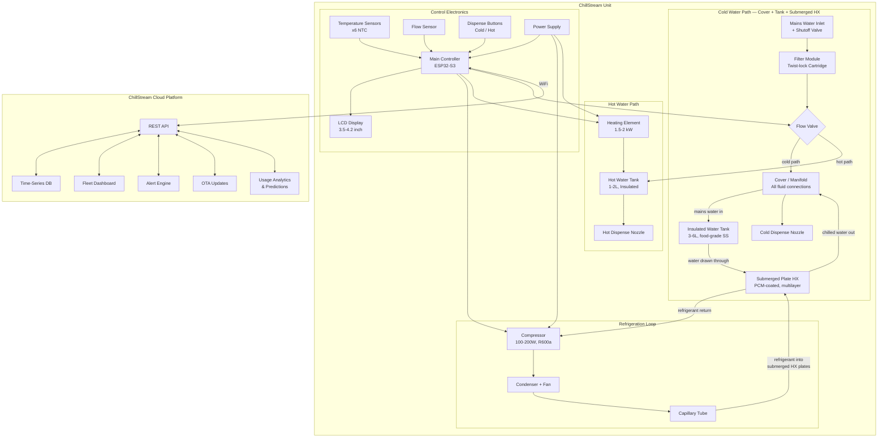

# System Description: ChillStream

| Field | Value |
|-------|-------|
| Version | 0.1 |
| Date | 2026-02-19 |
| Author | |
| Status | Draft |
| Related docs | |

*Working name. Replace "ChillStream" with final brand name when decided.*

---

## 1. Product Vision and Context

**Product statement:**
For facility operators managing high-throughput water dispensing (schools, offices, clinics, hospitality), ChillStream is a plumbed-in countertop water dispenser that uses a phase-change thermal battery to deliver instant cold water at scale. Unlike reservoir-based coolers that warm up during peak demand and take 20-40 minutes to recover, ChillStream pre-stores cold energy in a sub-zero thermal mass and transfers it to water on demand — maintaining 4°C output even when 50 people pour consecutively during a lunch break.

**Problem:**
In high-throughput environments — school intermissions, office lunch breaks, clinic waiting areas — traditional water coolers fail at the moment of peak demand. A standard cooler holds 2-5 liters of pre-chilled water. After 10-15 pours, the reservoir is depleted. Incoming mains water at 20-25°C mixes with the remaining cold water, and output temperature climbs rapidly. The compressor cannot keep up in real-time; recovery to target temperature takes 20-40 minutes. The result: the first users get cold water, everyone else gets lukewarm water.

This is a solved problem in theory (add a bigger tank, a bigger compressor) but not in practice for countertop form factors with reasonable cost and energy consumption. Existing solutions either sacrifice form factor (large floor-standing units), sacrifice cold capacity (small countertop units), or sacrifice cost (high-end commercial chillers).

**Deployment context:**
- Environment: Indoor, climate-controlled spaces (18-30°C ambient)
- Setting: Schools, offices, coworking spaces, clinics, hospitality venues, corporate kitchens
- User type: Professional — facility operators (procurement, fleet management), end users (staff, students, patients) interact with the dispensing interface only
- Installation: Professional install — plumbed into mains water, requires cold water line and electrical outlet
- Expected lifespan: 7-10 years (compressor lifecycle), with replaceable filter modules and serviceable thermal battery

---

## 2. User Scenarios

### Scenario 1: School Lunch Break — Peak Demand
**Persona:** 60 middle school students, 12:00-12:05 PM
**Situation:** Lunch bell rings. Students line up at two ChillStream units in the cafeteria. Within 5 minutes, 40+ students fill 300 mL cups.
**Action:** Each student presses the cold water button and fills their cup. Mains water enters the tank and displaces water through the submerged PCM-coated HX plates, exiting at 4-6°C. The unit's display shows a "cold capacity" gauge declining from full to ~30%.
**Outcome:** All 40+ students get cold water. The thermal battery handles the burst. By the time the next class break arrives (50 min later), the compressor has recharged the thermal mass back to full capacity.

### Scenario 2: Office Kitchen — Steady Use
**Persona:** 30-person office, usage spread across the day
**Situation:** Throughout the day, staff fill bottles and cups — roughly 3-5 pours per hour, occasionally a cluster of 8-10 around coffee break times.
**Action:** Users alternate between cold (4°C) and hot (85-95°C) dispensing. The unit easily handles the load. The thermal battery rarely drops below 80% capacity.
**Outcome:** Cold water is always available at target temperature. The hot tank refills and reheats in ~3 minutes between pours. The facility manager sees steady usage on the fleet dashboard and knows the 5L thermal module is correctly sized for this office.

### Scenario 3: Filter Replacement Alert
**Persona:** Rachel, facilities coordinator managing 12 ChillStream units across 3 office floors
**Situation:** The fleet dashboard shows Unit #7 (3rd floor kitchen) has reached 90% filter cartridge life. Estimated 5 days until replacement needed.
**Action:** Rachel receives an email alert. She orders a replacement carbon filter through the dashboard (or from the supplier). When the cartridge arrives, she swaps it — twist-lock, no tools, takes 15 seconds. She taps "Confirm Filter Change" on the unit's display.
**Outcome:** Filter lifecycle resets. The event is logged in the fleet dashboard. No service call needed.

### Scenario 4: Thermal Battery Depleted Mid-Rush
**Persona:** Students at a large school, unexpectedly hot day, higher than normal water demand
**Situation:** The thermal battery is fully depleted — the cold capacity gauge shows 0%. The compressor is running at full power but cannot recharge fast enough.
**Action:** The display shows "Cold Water Recharging — Est. 15 min" with a blue pulsing indicator. If a user presses cold water, water still flows but at a higher temperature (~12-15°C instead of 4°C). The unit does not refuse to dispense — it serves what it can, with the display showing the current output temperature.
**Outcome:** Users get cool (not cold) water rather than nothing. The system is transparent about its state. The fleet dashboard flags this unit as "undersized for demand" and recommends the next thermal module size up.

### Scenario 5: Installation and First Use
**Persona:** Mike, plumbing contractor hired by the facilities team
**Situation:** A new ChillStream 10L unit arrives for the school cafeteria. Mike has a cold water line stub and a 15A outlet at the install location.
**Action:** Mike mounts the unit on the counter, connects the braided stainless hose to the water stub (3/8" compression fitting), and plugs in the power cord. The unit boots in ~8 seconds. The display shows "Setup Mode — Connect to WiFi." Mike connects his phone to the "ChillStream-A3F7" hotspot, opens the captive portal, enters the school's WiFi credentials, and taps "Connect." The display shows "Connected — Cooling Down" with a progress bar as the compressor begins charging the PCM for the first time. Initial charge takes ~45 minutes. Mike labels the unit "Cafeteria-East" on the settings screen and leaves.
**Outcome:** Rachel (facilities coordinator) receives an email: "New unit Cafeteria-East is online." She opens the fleet dashboard, sees the unit in setup state, assigns it to the "Lincoln Middle School" site, and sets the cold target to 4°C. Within an hour the unit shows "Ready" with a full capacity gauge. Total install time: ~20 minutes of active work.

### Scenario 6: Predictive Maintenance — Compressor Anomaly
**Persona:** Rachel, facilities coordinator
**Situation:** The IoT platform detects that Unit #3 is taking 35% longer to recharge its thermal battery than its baseline (established over the first month of operation). Compressor current draw is slightly elevated.
**Action:** The dashboard flags "Unit #3 — Cooling Performance Degraded — Schedule Service." Rachel schedules a technician visit.
**Outcome:** The tech finds a clogged condenser. Cleaning restores performance. The issue is caught before it becomes a compressor failure — avoiding a $400+ repair and multi-day downtime.

---

## 3. System Architecture

**Architecture narrative:**

ChillStream has two independent thermal systems sharing one water inlet and one control board.

**The cold path** is the product's core innovation. It uses a three-part assembly: an insulated water tank, a submerged multilayer plate heat exchanger with PCM-coated surfaces, and a removable cover that handles all fluid routing.

The insulated tank (3-6L depending on model) holds drinking water at rest. Submerged in the tank is a multilayer brazed plate heat exchanger. Refrigerant from the compressor loop flows through the HX plates, freezing a PCM coating on the plate surfaces to -5°C to -10°C during idle periods. This PCM layer is the thermal battery — it stores cold energy as latent heat.

When the user opens the cold tap, mains pressure pushes fresh water into the tank through the cover manifold (entering at the top). This displaces water at the bottom, forcing it *up through the submerged HX plates* where it contacts the frozen PCM surfaces. The water chills as it passes through, and exits via the cover manifold to the tap. The PCM absorbs heat and gradually melts with each pour.

The cover is the only mechanically complex part. It sits on top of the tank and routes: (1) mains water in, (2) chilled water out to the tap, and (3) refrigerant lines down to the submerged HX. Lifting the cover removes the HX assembly with it, leaving the tank accessible for cleaning and descaling.

**Why this architecture:**
- The HX is a standard brazed plate component (suppliers: Kaori, Danfoss, SWEP) — not a custom double-wall tank. Manufacturing complexity is in the cover manifold, not the thermal components.
- The tank is just an insulated food-grade container. No pressure rating, no embedded channels.
- Water only moves when the tap is open (mains pressure driven). No circulation pump needed.
- Modularity is in the plate count: 5L capacity = 4-plate HX in a shorter tank. 10L = 8-plate HX in a taller tank. Same cover design, same refrigeration loop.
- Serviceability: lift the cover to access the tank for cleaning. The HX/PCM assembly comes out with the cover.

**Security boundaries:**
- **Unit ↔ Cloud:** All traffic over TLS 1.2/1.3 with mutual authentication. Each unit holds a unique X.509 device certificate provisioned at factory. The cloud validates the device cert; the device validates the server cert. No plaintext telemetry leaves the unit.
- **AP mode (setup):** The captive portal is served over HTTPS with a self-signed cert. WiFi credentials entered during setup are stored encrypted in ESP32 NVS (flash encryption enabled). AP mode auto-disables after setup completes; can only be re-entered via physical button hold (5 seconds) — prevents remote re-provisioning.
- **Operator dashboard ↔ Cloud:** Standard web auth (email + password + MFA). Role-based access: fleet admin, site manager, read-only viewer. API tokens for webhook integrations.
- **On-unit settings:** PIN-protected (4-digit). Factory default PIN must be changed on first access. PIN protects: temperature targets, WiFi config, factory reset, diagnostics. Dispense buttons are always accessible (no PIN for water).

**The hot path** is conventional. Water enters a small insulated tank (1-2L) heated by a 1.5-2 kW element to 85-95°C. A thermostat and the MCU manage the heating cycle. This is proven, low-risk technology — the same as any instant hot water dispenser.

**The control electronics** are built around an ESP32-S3 with integrated WiFi. The MCU reads temperature sensors (PCM plate temperature, tank water temperature, cold outlet temperature, hot tank temperature, ambient, condenser), a flow sensor (total water dispensed and instantaneous flow rate), and dispense button inputs. It controls the compressor (on/off or inverter speed), the heating element (relay-switched), the flow valve (diverting between cold and hot paths), and the display. WiFi connects to the ChillStream cloud platform for fleet management, usage telemetry, alerts, and OTA firmware updates.

---

## 4. Subsystem Descriptions

### 4.1 Hardware Layer

**Cold Assembly: Insulated Tank + Submerged PCM Plate HX + Cover (the core innovation):**

This is the defining subsystem. Three components:

**1. Insulated water tank:**
- Food-grade stainless steel (304 or 316) inner vessel, PU foam insulation, ABS outer shell
- 5L model: ~15cm diameter × 30cm tall (inner volume ~3.5L water + HX volume)
- 10L model: ~15cm diameter × 50cm tall (inner volume ~7L water + HX volume)
- Open top, sealed by the cover with a food-grade silicone gasket
- Mains water inlet (via cover) at top. Water drawn from bottom through HX.
- Serviceable: cover lifts off, tank can be wiped/descaled

**2. Submerged multilayer plate heat exchanger with PCM coating:**

The HX is a stack of brazed stainless steel plates submerged in the water tank. It has two independent fluid paths:
- **Refrigerant channels:** R600a flows through alternating plate gaps, connected to the compressor loop via lines that run up through the cover
- **Water channels:** Tank water is drawn through the remaining plate gaps on its way to the cold tap

The plate surfaces facing the water channels are coated with encapsulated PCM (-5°C to -10°C phase change). During idle, the refrigerant freezes this PCM layer. During pours, water flowing past the PCM surfaces melts the coating and chills in the process.

**PCM coating candidates:**

| PCM Candidate | Phase Change Temp | Latent Heat | Cost | Notes |
|---------------|------------------:|------------:|------|-------|
| Salt hydrate (e.g., calcium chloride hexahydrate) | -10 to -5°C | 170-190 kJ/kg | Low | Tunable, non-toxic, well-studied. Must be macro-encapsulated to prevent dissolution in water. |
| Paraffin blend | -5 to -10°C | 150-200 kJ/kg | Moderate | Stable cycling, no supercooling. Good for encapsulation. Lower thermal conductivity. |
| Glycol/water eutectic | -10 to -20°C | ~200 kJ/kg | Low | Must be in sealed capsules/coating. Used in commercial cold storage. |

The PCM is encapsulated (sealed polymer micro/macro-capsules bonded to plate surfaces) — it never contacts the drinking water directly. Food-safety certified encapsulation material required.

**HX scaling by model:**
| Model | Plate Count | PCM Mass | Water Channel Area | Cold Capacity |
|-------|------------:|---------:|-------------------:|--------------:|
| 5L   | 4 plates    | ~3 kg    | ~1,200 cm²         | 5L @ 25→4°C   |
| 10L  | 8 plates    | ~6 kg    | ~2,400 cm²         | 10L @ 25→4°C  |

**Sizing calculation (5L capacity):**
- Water to cool: 5L = 5 kg
- Temperature drop: 25°C → 4°C = 21°C ΔT
- Energy to absorb: 5 kg × 4.18 kJ/kg·°C × 21°C = **439 kJ**
- If PCM latent heat = 180 kJ/kg, need: 439 / 180 = **~2.4 kg of PCM**
- Add 30% margin for HX inefficiency and thermal losses: **~3.2 kg PCM**

For 10L capacity: ~6.4 kg PCM.

**3. Cover / manifold:**

The cover sits on top of the tank and is the single point of all fluid connections:
- **Mains water inlet:** enters through the cover, drops into the tank (top)
- **Cold water outlet:** water drawn from tank bottom through HX plates, exits through cover to cold tap
- **Refrigerant lines:** two small copper tubes (liquid line + suction line) pass through the cover down to the submerged HX plates
- **Sensor pass-throughs:** wires for NTC thermistors on the HX plates and in the tank water
- **Seal:** food-grade silicone gasket, secured by clamp or twist-lock

The cover is the only mechanically complex part. It is injection-molded (body) with brazed copper fittings (refrigerant) and press-fit stainless fittings (water). When lifted, the HX assembly comes out with it — leaving the tank empty and accessible for service.

**Refrigeration system:**

| Component | Specification | Notes |
|-----------|--------------|-------|
| Compressor | Small hermetic reciprocating or rotary, ~100-200W input, R600a or R290 refrigerant | Same class as a mini-fridge compressor |
| Condenser | Fin-and-tube with DC fan, air-cooled | Mounted at rear/bottom of unit, needs ventilation clearance |
| Evaporator | The submerged plate HX itself — refrigerant evaporates in the plate channels | Not a separate component; the HX is the evaporator |
| Expansion device | Capillary tube or TXV | Capillary for simplicity at this scale |
| Refrigerant | R600a (isobutane) or R290 (propane) | Low GWP, common in small appliances. Charge <150g per IEC 60335-2-24 |
| Refrigerant routing | Liquid + suction lines run through the cover down to the submerged HX | Copper tubes, brazed connections at cover and HX |

**Recharge time estimate (5L module):**
- Energy to extract from PCM: ~440 kJ (same as cooling 5L of water)
- Compressor COP ~1.5 at these temperatures, input power 150W
- Cooling power: 150W × 1.5 = 225W = 225 J/s
- Time: 440,000 J / 225 J/s = **~1,950 s ≈ 33 minutes** for full recharge from fully depleted
- In practice, the compressor runs between pours too, so partial depletion recharges much faster

**Hot water tank:**

| Spec | Value |
|------|-------|
| Capacity | 1.5 L (adjustable by model) |
| Heating element | 1.5 kW (office) / 2.0 kW (high-throughput) |
| Target temperature | 85-95°C (user configurable) |
| Recovery time | ~3 min for full tank reheat from 25°C |
| Insulation | Vacuum or polyurethane foam, <0.5°C/hr heat loss |
| Safety | Thermal fuse, overheat cutoff, child lock on dispense |

**Controller:**
- Part: ESP32-S3-WROOM-1 module
- Rationale: Integrated WiFi (no separate module), dual-core 240 MHz (sufficient for control loop + networking), built-in USB for factory programming, low cost (~$3), large ecosystem, FreeRTOS support, OTA via ESP-IDF
- Key specs: Dual Xtensa LX7 240 MHz, 512 KB SRAM, 8 MB flash (external), WiFi 802.11 b/g/n, BLE 5.0

**Sensors:**

| Sensor | Measures | Interface | Sample Rate | Purpose |
|--------|----------|-----------|-------------|---------|
| NTC thermistor (x2) | PCM core temperature (2 points) | ADC | 1 Hz | Track PCM charge state (frozen vs. melted) |
| NTC thermistor | Cold water outlet temperature | ADC | 10 Hz | Verify output temp, display to user |
| NTC thermistor | Hot water tank temperature | ADC | 1 Hz | Thermostat control |
| NTC thermistor | Condenser temperature | ADC | 1 Hz | Compressor protection, fault detection |
| NTC thermistor | Ambient temperature | ADC | 0.1 Hz | Baseline for efficiency calculations |
| Flow sensor (Hall-effect pulse) | Water flow rate and total volume | GPIO pulse count | Pulse per mL | Dispense metering, filter life tracking, capacity calculation |
| Current sensor (CT or shunt) | Compressor current draw | ADC | 1 Hz | Predictive maintenance (degradation detection) |

**Display:**
- 3.5" or 4.2" color TFT LCD (320x240 or 480x320)
- Shows: cold capacity gauge (% remaining), water temperature, filter life, WiFi status, dispense mode
- Capacitive touch or physical buttons for dispense selection

**Physical UI:**
- Buttons: 2x illuminated push buttons (Cold — blue LED ring, Hot — red LED ring) or capacitive touch zones on display
- LED indicators: Power, WiFi connected, filter alert (amber), fault (red)
- Child safety lock: Physical switch or display-activated, disables hot water dispense
- Drip tray: Removable, dishwasher-safe

**Enclosure:**
- Countertop form factor: approximately 30cm W × 40cm D × 45cm H (varies with thermal module size)
- Material: ABS/PC outer shell, stainless steel dispense area (food contact zones)
- Ventilation: Rear and/or bottom grilles for condenser airflow
- Rear connections: Mains water inlet (3/8" or 1/2" BSP), power cord (IEC C14 inlet)
- Modular bay: Front or top-access bay for filter cartridge (twist-lock, no tools)

**PCB strategy:**
- Single board, ~100mm × 80mm, 2-layer FR4
- Mounts inside the enclosure top section (away from water and condensation), secured with standoffs
- Layout zones: ESP32-S3 module + flash (center), analog front-end for NTC thermistors (grouped, with ground plane isolation from digital noise), relay/SSR driver section (edge, near power entry), display connector (edge, ribbon cable to front panel), USB-C (edge, accessible behind service panel)
- Power section: AC-DC PSU is a separate off-the-shelf module (enclosed, safety-rated) connected to the control board via a cable harness. The control board operates at 3.3V (ESP32) and 12V (relay coils, solenoids). A 5V rail powers the display.
- Conformal coating recommended for the control board given proximity to water and condensation in a food-service environment

### 4.2 Firmware Subsystem

**Architecture:**
- OS/framework: ESP-IDF with FreeRTOS (native ESP32 development framework)
- Rationale: ESP-IDF provides WiFi stack, OTA framework, NVS (non-volatile storage), and HTTPS client out of the box. FreeRTOS handles concurrent tasks (control loop, display, networking).

**Major modules:**

| Module | Responsibility | Inputs | Outputs |
|--------|---------------|--------|---------|
| Thermal controller | PID control of compressor (on/off or speed), manage PCM charge/discharge, compute remaining capacity | PCM temps, ambient temp, flow sensor | Compressor relay/inverter, capacity estimate |
| Hot water controller | Thermostat for heating element, overheat protection | Tank temp sensor | Heater relay |
| Dispense manager | Handle button presses, activate flow valve, meter dispense volume, display feedback | Buttons, flow sensor | Flow valve, display updates |
| Capacity estimator | Model PCM state (% charged) based on temperatures, pour history, and recharge rate | PCM temps, pour history, compressor runtime | Capacity % for display and cloud |
| Display driver | Render UI screens: capacity gauge, temperature, filter life, status, alerts | All system state | SPI display frames |
| Network manager | WiFi connection, MQTT/HTTPS to cloud, telemetry push, OTA pull | WiFi stack | Telemetry messages, config updates |
| Filter lifecycle | Track total water volume through filter, estimate remaining life, trigger alert | Flow sensor cumulative | Filter % remaining, alert flag |
| Safety monitor | Watchdog, overheat protection, leak detection, compressor fault detection | All sensors | Emergency shutoffs, fault alerts |
| OTA updater | Download, verify, and apply firmware updates | Network manager | Boot partition management |

**Control loop (thermal):**
- The compressor runs in duty-cycle mode (small compressors, on/off) or variable-speed mode (inverter compressor, if used)
- Target: keep PCM below its freezing point during idle. When PCM core temperature rises above the phase-change threshold (indicating partial melt from recent pours), increase compressor duty cycle.
- The capacity estimator uses a thermal model: it knows the PCM mass, latent heat, current temperature profile (2 sensors at different positions in the PCM), and recent pour history to estimate how many liters of cold water remain before the PCM is fully "discharged."

**Boot-to-ready:** <10 seconds (WiFi connect may take longer but dispensing works immediately)

**OTA:**
- Method: A/B partition (ESP-IDF native support)
- Delivery: HTTPS pull from ChillStream cloud, triggered by cloud notification or manual check
- Rollback: Automatic if new firmware fails health check within 60s
- Signing: ECDSA-signed firmware images

### 4.3 Interface Layer

**On-unit display — user-facing:**

| Screen Element | Information | Update Rate |
|----------------|------------|-------------|
| Cold capacity gauge | Visual bar or ring: 100% (full) to 0% (depleted) | Per-pour |
| Output temperature | Current cold water temp during pour (e.g., "4°C") | Real-time during dispense |
| Hot water ready | Indicator: ready / heating | On state change |
| Filter life | Bar: 100% → 0%, with "Replace Soon" at 10% | Daily |
| WiFi status | Connected / disconnected icon | On state change |
| Recharge ETA | When capacity is low: "Full in ~20 min" | Every 60s |
| Error/fault | Plain-language message: "Service Needed — Cooling Issue" | On fault |

**On-unit display — operator-facing (PIN-protected settings):**

| Setting | Options |
|---------|---------|
| Cold target temperature | 2-10°C (default: 4°C) |
| Hot target temperature | 75-98°C (default: 90°C) |
| Child lock | On/Off (disables hot dispense without button hold) |
| WiFi configuration | SSID, password, static IP / DHCP |
| Unit ID / location label | Free text for fleet identification |
| Factory reset | Wipe config, re-enter setup mode |
| Diagnostics | Raw sensor readings, compressor runtime, error log |

**Cloud fleet dashboard — operator/facilities manager:**

| View | Content |
|------|---------|
| Fleet map | All units, location, status (green/yellow/red), capacity gauge |
| Unit detail | Real-time: temperatures, capacity, compressor state, pour count today. Historical: graphs over days/weeks/months. |
| Usage analytics | Pours per day/hour, peak times, cold vs. hot ratio, average demand vs. capacity |
| Sizing recommendations | "Unit #7 exceeded capacity 3x this week — recommend upgrade to 10L module" |
| Filter management | All units: filter life %, estimated replacement date, order link |
| Alerts | Low capacity (pattern), filter due, fault detected, offline unit, compressor anomaly |
| Maintenance log | Service history per unit, parts replaced, technician notes |
| OTA management | Firmware versions, staged rollout, rollback |
| Reports | Exportable: water consumption (sustainability reporting), uptime, maintenance compliance |

**Notifications:**
- Email and/or push to mobile app (or webhook to facilities management system)
- Configurable per alert type: filter due (email), fault (email + SMS), unit offline (email)

### 4.4 Cloud / Backend Subsystem

**Infrastructure:**
- Platform: AWS IoT Core (device connectivity) + AWS Lambda + DynamoDB/Timestream (telemetry storage) + S3 (OTA firmware hosting) + CloudFront (dashboard CDN)
- Alternative: Azure IoT Hub ecosystem — decision depends on hospital/enterprise IT preferences
- Dashboard: Web application (React or similar), responsive for tablet/desktop

**Device provisioning:**
- Factory: Each ESP32 is flashed with a unique X.509 device certificate at production
- Activation: On first WiFi connect, the unit registers with the cloud and appears in the fleet dashboard as "Unclaimed"
- The operator assigns the unit to a site and location via the dashboard

**Data model:**

| Data Type | Source | Rate | Retention | Purpose |
|-----------|--------|------|-----------|---------|
| Telemetry (temps, capacity, compressor state) | Unit sensors | Every 60s | 1 year raw, 5 year aggregated | Analytics, predictive maintenance |
| Pour event | Flow sensor | Per pour | 5 years | Usage patterns, capacity sizing |
| Alert event | Firmware | On event | Indefinite | Audit trail, compliance |
| Config snapshot | Dashboard/unit | On change | Indefinite | Configuration management |
| Firmware version | Unit | On boot/update | Indefinite | Fleet management |

**Remote management commands (from dashboard → unit):**

| Command | What it does | Use case |
|---------|-------------|----------|
| Reboot | Restart ESP32, re-initialize all modules | Recover from firmware hang |
| Update config | Push new temperature targets, child lock state, display brightness | Fleet-wide policy changes |
| Force OTA | Trigger immediate firmware update check and install | Critical security patch |
| Request diagnostics | Unit sends full sensor dump + error log to cloud | Remote troubleshooting before dispatching a tech |
| Enter maintenance mode | Disable dispensing, show "Maintenance in Progress" on display | Scheduled service, prevent use during cleaning |
| Factory reset | Wipe config, re-enter AP setup mode | Redeployment to a new site |

All commands require fleet admin role. Commands are queued via MQTT and executed on the unit's next heartbeat (within 60s). The unit acknowledges execution back to the dashboard.

**Offline behavior:**
The unit operates fully standalone when WiFi is down. Cooling, heating, dispensing, display — all work locally. Telemetry is buffered in flash (ESP32 NVS, circular buffer ~7 days of data) and synced when connectivity is restored.

---

## 5. Interfaces

### Internal Interfaces

| Interface | From | To | Protocol | Data | Notes |
|-----------|------|----|----------|------|-------|
| Temperature (x6) | NTC thermistors | ESP32 ADC | Analog (voltage divider) | Temperature readings | 10-bit or 12-bit ADC, calibrated per unit |
| Flow | Hall-effect flow sensor | ESP32 GPIO | Pulse count | mL per pulse | Interrupt-driven |
| Compressor | ESP32 GPIO | Compressor relay / inverter | GPIO → relay (on/off) or PWM (inverter) | On/Off or speed | Optically isolated relay |
| Heater | ESP32 GPIO | SSR (solid-state relay) | GPIO → SSR | On/Off | SSR for silent switching, zero-cross type |
| Flow valve | ESP32 GPIO | Solenoid valve(s) | GPIO → MOSFET → solenoid | Cold/Hot path selection | 12V solenoid, food-grade |
| Display | ESP32 SPI | TFT LCD | SPI | UI frames | 10-20 MHz SPI clock |
| Buttons | Dispense buttons | ESP32 GPIO | Digital input | Press events | Debounced, with LED ring drive |
| Current sense | CT/shunt on compressor line | ESP32 ADC | Analog | RMS current | For predictive maintenance |

### External Interfaces

| Interface | From | To | Protocol | Data | Notes |
|-----------|------|----|----------|------|-------|
| WiFi | ESP32 | Hospital/office network | 802.11 b/g/n, WPA2/WPA3 | Telemetry, OTA, config | 2.4 GHz |
| Mains water | Building plumbing | Unit inlet | Mechanical (3/8" BSP) | Cold water, 1-4 bar | Includes inline shutoff valve |
| Mains power | Wall outlet | Unit PSU | IEC C14 inlet | 110-240V AC, 50/60 Hz | Universal input PSU |

### Physical Connectors

| Connector | Purpose | Type | Notes |
|-----------|---------|------|-------|
| Water inlet | Mains water supply | 3/8" BSP compression fitting | Braided stainless steel hose included |
| Power | AC mains | IEC C14 with detachable cord | Standard kettle-style cord |
| Filter bay | Filter cartridge | Twist-lock bayonet (proprietary) | Quarter-turn, no tools, water shutoff on removal |
| Drip tray | Overflow collection | Slide-out tray | Removable, dishwasher safe |
| Service port | Firmware debug, factory test | USB-C (ESP32 native USB) | Recessed, behind service panel |

---

## 6. Power Architecture

**Power source:**
- Type: Mains AC (110-240V, 50/60 Hz universal)
- Peak power draw: ~2,200W (heating element + compressor + electronics simultaneously)
- Typical steady-state: ~200-350W (compressor duty-cycling + standby electronics)
- Idle (hot tank at temp, PCM fully charged): ~50W

**Power budget:**

| Component | Idle | Compressor Running | Heating | Peak (all active) | Unit |
|-----------|-----:|-------------------:|--------:|-------------------:|------|
| ESP32 + sensors + display | 2 | 2 | 2 | 2 | W |
| Compressor | 0 | 100-180 | 0 | 180 | W |
| Condenser fan | 0 | 5 | 0 | 5 | W |
| Heating element | 0 | 0 | 1,500-2,000 | 2,000 | W |
| Solenoid valves | 0 | 0 | 0 | 5 | W |
| PSU losses (10%) | 0.2 | 19 | 200 | 219 | W |
| **Total** | **~2** | **~200** | **~1,900** | **~2,400** | **W** |

**Note:** 2,400W peak requires a 15A outlet (standard in US commercial) or 10A at 240V (standard in EU/UK). Most jurisdictions — no special wiring needed.

**Power states:**
This is always-on when plugged in. No sleep modes.

| State | Description | Power |
|-------|-------------|------:|
| Idle | PCM charged, hot tank at temp, display dimmed | ~2W + hot tank maintenance (~50W avg) |
| Recharging | Compressor running to recharge PCM | ~200W |
| Heating | Hot tank reheating after pour | ~1,900W |
| Peak | Compressor + heater simultaneously | ~2,400W |
| Dispensing | Water flowing, display active | Adds ~5W to current state |

---

## 7. Connectivity Architecture

**Primary connectivity:**
- Technology: WiFi 802.11 b/g/n (2.4 GHz), integrated in ESP32-S3
- Rationale: Every target venue (office, school, clinic) has WiFi. No additional hardware cost (built into the MCU module). Sufficient bandwidth for telemetry (~1 KB/min) and OTA (~2 MB firmware). 2.4 GHz for better range through walls.

**Protocol stack:**

| Layer | Technology |
|-------|-----------|
| Physical | WiFi 2.4 GHz |
| Transport | TCP |
| Application | MQTT (telemetry) + HTTPS (OTA, config) |
| Security | TLS 1.2/1.3, X.509 device certificates |

**Data transmission:**
- Telemetry: Every 60 seconds — temperatures, capacity %, compressor state, pour count (~200 bytes JSON)
- Events: On occurrence — pour complete, alert triggered, fault detected (~300 bytes JSON)
- Daily volume: ~300 KB per unit
- OTA: ~2 MB, infrequent (monthly at most)

**Provisioning:**
1. Unit powers on with no WiFi config → enters AP mode (broadcasts "ChillStream-XXXX" SSID)
2. Installer connects phone/laptop to the AP, opens captive portal
3. Enters venue WiFi credentials (SSID + password) and optional static IP config
4. Unit connects to venue WiFi, registers with cloud, appears in fleet dashboard
5. Installer assigns unit to site and location in the dashboard

**Offline behavior:**
Full standalone operation. Dispensing, cooling, heating, display — all local. Telemetry buffered in flash (~7 days). Auto-reconnects when WiFi returns. Dashboard shows "Offline since [timestamp]."

---

## 8. Key Technical Decisions and Trade-offs

**Redesign-critical decisions (ranked by impact if reversed):**
1. **Decision 1** — Tank + submerged PCM plate HX. Reversing this changes every mechanical component, the thermal model, and the firmware control logic.
2. **Decision 3** — Proprietary twist-lock filter. Reversing this changes the filter bay mechanical design, removes NFC integration, and eliminates recurring revenue.
3. **Decision 4** — Fixed-speed compressor. Reversing to inverter changes the power electronics, firmware control (PWM vs. relay), noise profile, and BOM cost.

### Decision 1: Submerged PCM Plate HX in Tank vs. Flow-Through PCM vs. Large Cold Reservoir
- **Options:** (A) Conventional large insulated cold water tank (10-20L, no PCM), (B) PCM-only with flow-through heat exchanger (no tank — water cools in a single pass), (C) Insulated tank with submerged PCM-coated plate HX (water drawn through HX on its way to tap)
- **Chosen:** C — Tank + submerged PCM plate HX
- **Rationale:** Option A fails at peak demand — the tank warms as mains water replaces cold water, and the compressor can't keep up in real-time. Option B requires a heat exchanger that achieves a 21°C ΔT in a single pass at 1 L/min — an extremely demanding thermal design with high fouling risk and flow-rate-dependent output temperature. Option C combines the benefits: the tank holds a volume of water being continuously cooled by the PCM-coated HX plates, and when the user pours, water is forced *through* the HX on its way out — getting a final chill boost from direct PCM contact. The submerged HX is a standard brazed plate component (not a custom double-wall tank), the tank is a simple insulated vessel, and water moves only on mains pressure (no pump).
- **Consequences:** The cover/manifold is the most complex manufactured component — it routes mains water in, chilled water out, and refrigerant lines to the submerged HX. PCM encapsulation on plate surfaces must be food-safe and durable across 10,000+ freeze-thaw cycles. The tank must be serviceable (descaling).
- **Risks:** PCM encapsulation integrity over time — capsules must not crack, leach, or detach from plates. Mitigated by material testing and accelerated life cycling at prototype stage. Mineral fouling on HX plates — mitigated by upstream filter and periodic descaling (accessible via cover removal).

### Decision 2: ESP32-S3 vs. STM32 + Separate WiFi Module
- **Options:** (A) STM32 MCU + ESP32 as WiFi coprocessor, (B) ESP32-S3 as sole controller
- **Chosen:** B — ESP32-S3 standalone
- **Rationale:** The control task is not computationally demanding — PID loops, sensor reading, display driving, and WiFi. The ESP32-S3 handles all of this at ~$3 for the module. Adding an STM32 + separate WiFi module adds $8-12, a second firmware codebase, and inter-processor communication complexity. The ESP32-S3 has sufficient GPIO, ADC channels, and processing power.
- **Consequences:** Single firmware codebase (ESP-IDF/FreeRTOS). ESP32 ADC is 12-bit but has known linearity issues — may need external ADC for precision temperature measurement if calibration is insufficient.
- **Risks:** ESP32 ADC accuracy may require per-unit calibration or an external ADC ($1-2 addition). ESP32 WiFi stack is less deterministic than a dedicated MCU + coprocessor — but the control loop is not timing-critical at 1 Hz.

### Decision 3: Proprietary Twist-Lock Filter vs. Standard Filter Interface
- **Options:** (A) Use an industry-standard filter connection (e.g., John Guest push-fit, compatible with third-party filters), (B) Proprietary twist-lock bayonet with ChillStream-branded filters
- **Chosen:** B — Proprietary twist-lock
- **Rationale:** Recurring filter revenue is a key part of the business model for fleet operators. A proprietary connection ensures filter quality (untested third-party filters could compromise water safety or clog the heat exchanger) and enables the NFC/RFID tag in the filter cartridge for automatic lifecycle tracking. The twist-lock is easier for non-technical staff (quarter-turn vs. push-fit which requires more force).
- **Consequences:** Must manufacture or contract-manufacture filter cartridges. Filter pricing must be fair enough to avoid customer resentment. Creates lock-in (both a business advantage and a customer friction point).
- **Risks:** Customer pushback on proprietary consumables. Mitigation: competitive filter pricing ($15-25 per cartridge, 3-6 month life), and the NFC lifecycle tracking adds genuine value that third-party filters cannot replicate.

### Decision 4: Compressor Type — Fixed Speed vs. Inverter
- **Options:** (A) Fixed-speed compressor (on/off cycling), (B) Inverter (variable-speed) compressor
- **Chosen:** A — Fixed-speed for V1
- **Rationale:** Fixed-speed compressors are $15-25 vs. $40-80 for inverter types at this scale. The PCM thermal battery acts as a buffer, so the compressor doesn't need to modulate — it just runs until the PCM is fully frozen, then cycles off. An inverter adds cost and complexity with limited benefit when the load is a thermal battery rather than a direct-cool reservoir.
- **Consequences:** Slightly higher noise during compressor run cycles (on/off vs. continuous quiet). Slightly lower energy efficiency (no part-load optimization).
- **Risks:** If noise is a problem in quiet office environments, V2 could offer an inverter compressor as a premium option.

---

## 9. Constraints

### Regulatory
- **Food contact:** NSF/ANSI 42 and 53 (drinking water treatment units). All water-contact materials must be FDA food-grade or EU 10/2011 compliant.
- **Electrical safety:** UL 399 (drinking water coolers) or UL 60335-2-15 (appliances for heating liquids). CE (LVD + EMC). IEC 60335 series.
- **Refrigerant:** EPA SNAP approved (R600a, R290 are approved). EU F-gas regulation compliant. Charge <150g per IEC 60335-2-24 for flammable refrigerants.
- **EMC:** FCC Part 15 (US), CE RED (EU) for WiFi radio.
- **Plumbing:** Compliance with local plumbing codes for connection to mains water. Backflow prevention (vacuum breaker or check valve).
- Target markets: US first, then EU, UK, Australia, Middle East (high demand for water cooling in hot climates).

### Environmental
- Operating ambient temperature: 10°C to 38°C (affects condenser performance at high ambient)
- Mains water inlet temperature: 5°C to 30°C (affects PCM cooling demand)
- Mains water pressure: 1-6 bar (0.5-6 bar with optional pressure regulator)
- Humidity: 20-90% RH, non-condensing
- Noise: <45 dB(A) at 1m during compressor operation (office-acceptable)

### Cost

| Item | Target | Notes |
|------|-------:|-------|
| BOM — 5L model | $250-390 | See BOM breakdown below |
| BOM — 10L model | $300-445 | Larger HX (more plates), taller tank and enclosure |
| Filter cartridge COGS | $5-8 | Sells at $18-25 |
| Retail / list price — 5L | $600-800 | |
| Retail / list price — 10L | $800-1,100 | |
| Target gross margin (hardware) | 55-65% | |
| Target gross margin (filters) | 65-75% | Recurring revenue |
| Cloud platform cost per unit | $1-2/month | AWS IoT + storage + compute |

### Manufacturing
- Target annual volume: 5,000-20,000 units (years 1-3)
- Assembly: Mixed — SMT for PCBs, manual assembly for refrigeration brazing, PCM filling, enclosure assembly
- Test requirements: Water path leak test (pressure test), refrigeration leak test (nitrogen + vacuum), electrical safety (hipot), functional test (cooling performance, hot water, WiFi, sensors), 24-hour burn-in
- Critical process: Refrigeration brazing and charging (requires certified HVAC technician or automated brazing line)
- Filter cartridge manufacturing: outsource to existing water filter manufacturer, with custom housing and NFC tag integration

### Schedule
- Key milestones: PCM + heat exchanger prototype (M3), Full functional prototype (M6), EVT (M9), DVT (M12), Pilot fleet (M14), PVT (M16), Production (M18)
- Critical path: Heat exchanger design and PCM material validation (M1-M6)
- Certification timeline: UL/NSF (~4-6 months), FCC/CE (~2-3 months)

### Dependencies
- PCM material supplier (specialty chemical supplier — e.g., Phase Change Energy Solutions, Microtek Laboratories, or Rubitherm)
- Heat exchanger manufacturer (custom brazed or stamped plate — outsource to thermal solutions company)
- Compressor supplier (Secop, Embraco/Nidec, Huayi — standard catalog compressors)
- Filter cartridge contract manufacturer
- NFC tag supplier (for filter cartridges)

---

## 10. High-Level BOM and Cost

### 5L Model — Unit BOM

| Category | Components | Est. Cost | % |
|----------|-----------|----------:|--:|
| **Cold assembly: tank + HX + cover** | Insulated SS tank, brazed plate HX (4-plate, PCM-coated), cover/manifold (injection-molded + brazed fittings), gasket, PCM material (~3.2 kg) | $75 | 30% |
| **Refrigeration** | Compressor (fixed-speed, R600a), condenser + fan, capillary tube, copper lines through cover, service valve, refrigerant charge | $50 | 20% |
| **Hot water system** | Insulated tank (1.5L SS), heating element (1.5 kW), thermal fuse, thermostat backup | $25 | 11% |
| **Water path** | Inlet valve, solenoid valves (x2), flow sensor, food-grade tubing, fittings, filter housing (twist-lock) | $20 | 9% |
| **Electronics** | ESP32-S3 module, PCB, NTC thermistors (x6), current sensor, relay/SSR, power supply (multi-rail), connectors | $25 | 11% |
| **Display + UI** | 3.5" TFT LCD, buttons (x2) with LED rings, buzzer | $15 | 7% |
| **Enclosure** | ABS/PC outer shell (injection molded), stainless steel dispense area, drip tray, ventilation grilles | $25 | 11% |
| **Packaging** | Box, foam, install kit (hose, fittings, manual), power cord | $10 | 4% |
| **Misc** | Wiring harness, labels, screws, insulation, thermal paste | $8 | 3% |
| | | | |
| **Subtotal — materials** | | **$253** | |
| **Assembly labor** | ~2.5 hours @ $30/hr loaded | $75 | |
| **Refrigeration charge + brazing** | Specialized step, includes cover-to-HX brazing | $25 | |
| **Test + burn-in** | Leak test, functional test, 24-hr burn-in | $15 | |
| **Scrap / yield (5%)** | | $18 | |
| | | | |
| **Total COGS — 5L unit** | | **$386** | |

### 10L Model — Delta from 5L

| Change | Cost Delta |
|--------|----------:|
| 8-plate HX (vs 4-plate) + more PCM coating (~6 kg vs 3.2 kg) | +$35 |
| Taller insulated tank | +$10 |
| Taller enclosure | +$8 |
| Heavier packaging | +$3 |
| **10L Total COGS** | **~$442** |

### Filter Cartridge

| Component | Cost |
|-----------|-----:|
| Filter media (activated carbon block) | $3.00 |
| Plastic housing (twist-lock bayonet) | $1.50 |
| NFC tag (NTAG213 or similar) | $0.30 |
| Assembly + packaging | $1.20 |
| **Total COGS** | **$6.00** |
| **Sell price** | **$20.00** |
| **Gross margin** | **70%** |

### Pricing and Margin Summary

| Item | COGS | Sell Price | Gross Margin |
|------|-----:|----------:|-----------:|
| 5L unit | $386 | $749 | 48% |
| 10L unit | $442 | $999 | 56% |
| Filter cartridge | $6 | $20 | 70% |
| Installation (by partner) | — | $150-300 | Service |
| Cloud platform (optional SaaS) | $1.50/mo | $10/mo per unit | 85% |

### Recurring Revenue Model (per unit, per year)

| Revenue Stream | Amount |
|----------------|-------:|
| Filter replacements (2-3 per year) | $40-60 |
| Cloud SaaS (optional) | $120 |
| **Total recurring per unit** | **$160-180/yr** |

At a fleet of 100 units, that's **$16,000-$18,000/year** in recurring revenue on top of hardware sales.

---

## 11. Open Questions and Risks

| # | Question / Risk | Category | Impact | Owner | Target Date | Status |
|---|----------------|----------|--------|-------|-------------|--------|
| 1 | PCM encapsulation on HX plates — can we bond durable, food-safe PCM capsules to stainless steel plate surfaces that survive 10,000+ freeze-thaw cycles and water immersion? Requires material science partnership and prototype testing. | Technical | H | Materials Lead | M3 | Open |
| 2 | Submerged HX thermal performance — what is the achievable output temperature at 1 L/min flow through a 4-plate PCM-coated HX? Requires thermal simulation and bench prototype. | Technical | H | Thermal Lead | M3 | Open |
| 3 | Cover manifold design — routing mains water, chilled water, and refrigerant lines through a single removable cover with a reliable seal. Requires industrial design + mechanical prototyping. | Technical | H | Mechanical Lead | M4 | Open |
| 4 | Mineral fouling on submerged HX plates — plates are always immersed in water. Filter mitigates but doesn't eliminate scaling. Need descaling protocol (accessible via cover removal) and accelerated fouling test. | Technical | M | HW Lead | M6 | Open |
| 5 | Noise level — compressor + condenser fan must stay below 45 dB(A) for office environments. Need acoustic testing of candidate compressors in the enclosure. | Technical | M | Mechanical Lead | M5 | Open |
| 6 | NSF/ANSI 42/53 certification for the filter cartridge — timeline and cost. Using a contract manufacturer with existing NSF certification may accelerate this. | Regulatory | M | Quality Lead | M4 | Open |
| 7 | Proprietary filter cartridge customer acceptance — will fleet operators accept the lock-in? Need customer discovery interviews. | Business | M | Product Lead | M2 | Open |
| 8 | ESP32 ADC accuracy — 12-bit ADC with known nonlinearity. May need per-unit calibration or external ADC for temperature precision. Prototype will determine. | Technical | L | FW Lead | M4 | Open |

---

## Appendix

### Glossary

| Term | Definition |
|------|-----------|
| PCM | Phase-Change Material — a substance that stores/releases large amounts of energy at its melting/freezing point (latent heat). Used here as a thermal battery. |
| Thermal battery | The PCM-coated HX plate assembly submerged in the water tank. Stores "cold energy" when the PCM is frozen, releases it to water flowing through the HX plates. |
| Latent heat | Energy absorbed or released during a phase change (e.g., freezing/melting) at constant temperature. Much higher than sensible heat for the same mass. |
| Sensible heat | Energy that changes a material's temperature without a phase change. Water: 4.18 kJ/kg·°C. |
| Cover manifold | The removable top assembly that sits on the tank. Routes all fluid connections: mains water in, chilled water out, refrigerant lines to the submerged HX, and sensor wires. Lifts off for tank service. |
| Brazed plate HX | A heat exchanger made of corrugated stainless steel plates brazed together, forming alternating channels for two fluids. Standard industrial component (suppliers: Kaori, Danfoss, SWEP). In ChillStream, one set of channels carries refrigerant, the other carries drinking water. |
| HX | Heat exchanger — shorthand used throughout this document for the submerged brazed plate heat exchanger. |
| COP | Coefficient of Performance — ratio of cooling power to electrical input power for a refrigeration system. Typical COP 1.2-2.0 at these temperatures. |
| R600a | Isobutane refrigerant. Low GWP (3), commonly used in household refrigerators and small appliances. Flammable — charge limits apply (<150g per IEC 60335-2-24). |
| SSR | Solid-State Relay — an electronic switch with no moving parts. Used to switch the heating element on/off silently. Zero-cross type prevents EMI from inductive switching. |
| NVS | Non-Volatile Storage — ESP32's built-in key-value flash storage. Used for WiFi credentials, unit config, telemetry buffer, and calibration data. Supports encryption. |
| NFC | Near-Field Communication — short-range wireless tag (13.56 MHz). Used in filter cartridges for automatic identification and lifecycle tracking. |
| NSF/ANSI 42/53 | Water treatment standards. 42 covers aesthetic effects (taste, odor, chlorine). 53 covers health effects (lead, cysts, VOCs). |
| Twist-lock bayonet | A quarter-turn mechanical connection. Push in and rotate 90° to lock. Used for the filter cartridge — tool-free, takes ~15 seconds. |
| Conformal coating | A thin protective film applied to the PCB to protect against moisture, dust, and condensation. Important in food-service environments with humidity. |

### Reference Documents

| Document | Relevance |
|----------|-----------|
| NSF/ANSI 42 — Drinking Water Treatment Units (Aesthetic Effects) | Filter cartridge certification |
| NSF/ANSI 53 — Drinking Water Treatment Units (Health Effects) | Filter cartridge certification |
| UL 399 — Drinking Water Coolers | Product safety certification |
| IEC 60335-2-24 — Refrigerating Appliances | Refrigerant safety, compressor requirements |
| IEC 60335-2-15 — Appliances for Heating Liquids | Hot water system safety |
| EPA SNAP Program — Acceptable Refrigerant List | R600a/R290 approval status |

### Revision History

| Version | Date | Author | Changes |
|---------|------|--------|---------|
| 0.1 | 2026-02-19 | | Initial draft |
