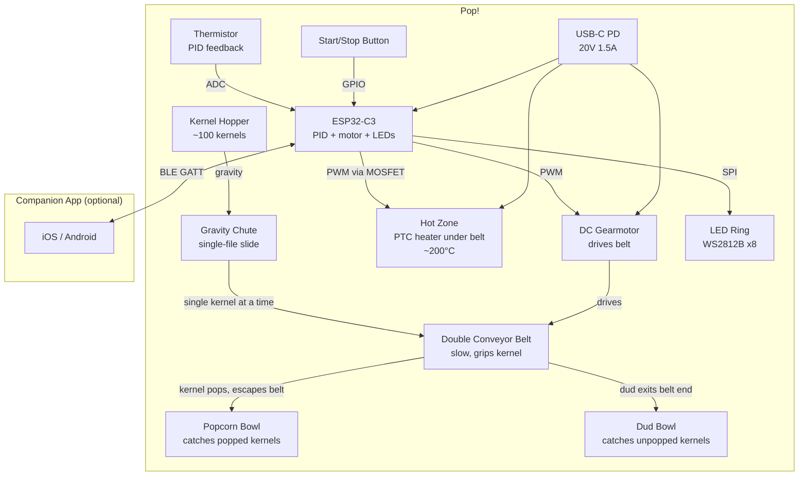
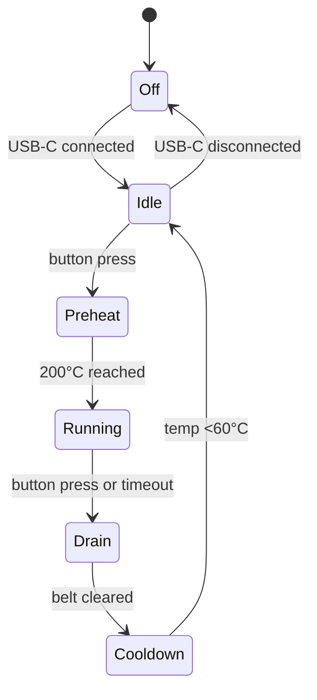

# System Description: Pop!

| Field | Value |
|-------|-------|
| Version | 0.2 |
| Date | 2026-02-24 |
| Author | |
| Status | Draft |
| Related docs | high_level_design.md, explore_notes.md |

---

## 1. Product Vision and Context

**Product statement:**
For desk workers, dorm dwellers, and gadget lovers, Pop! is a desktop popcorn machine that pops kernels one at a time using a slow conveyor belt through a hot zone. Kernels that pop escape the belt into a snack bowl; duds ride the belt to a waste bowl. No sensors, no software sorting — physics does it. USB-C powered, mesmerizing to watch, fresh popcorn without effort.

**Problem:**
Making popcorn is either mindless (microwave bag, done in 3 minutes, nothing to see) or overkill (stovetop, pot, oil, attention, cleanup). There's nothing that turns popcorn-making into a visible, meditative, desk-scale experience — something you watch happen kernel by kernel while you work. Pop! fills the space between snack and spectacle.

**Deployment context:**
- Environment: Indoor — desks, dorm rooms, kitchens, break rooms
- Setting: Any surface near a USB-C PD power source
- User type: Consumer — gadget enthusiasts, gift recipients, ages 14+
- Installation: None — place on desk, fill hopper, plug in USB-C cable
- Expected lifespan: 2-3 years

---

## 2. User Scenarios

### Scenario 1: Afternoon Desk Snack (MVP)
**Persona:** Mika, works from home, wants popcorn without leaving the desk.
**Situation:** 3 PM. Mika reaches for Pop! sitting next to the monitor.
**Action:** Lifts the hopper lid, pours in two tablespoons of kernels. Plugs in the USB-C cable (or it's already plugged in). Presses the start button. The LED ring glows amber as the hot zone preheats (~45 seconds). When the ring turns green, the conveyor belt begins moving slowly. Kernels slide down the gravity chute one at a time, landing on the belt. The belt carries each kernel through the hot zone — a few seconds of heat, and: pop! The kernel explodes, breaks free of the belt, and tumbles into the clear popcorn bowl. The next kernel is already approaching the hot zone. One pop every few seconds. Duds that don't pop ride the belt all the way to the end and drop silently into the small dud bowl. After 8-10 minutes, the hopper is empty. The belt runs for another 30 seconds to clear the last kernels, then the heater shuts off, the belt stops, and the LED ring pulses slow blue. Mika lifts the popcorn bowl, seasons, eats. Duds go in the trash.
**Outcome:** Fresh popcorn, kernel by kernel. No monitoring, no intervention. The popping and the passive sorting just happen. The whole process was visible and satisfying through the clear enclosure.

---

## 3. System Architecture



**Architecture narrative:**

The device is a linear pipeline: hopper → chute → conveyor belt → hot zone → sorted output. There are two key insights that simplify the design:

**Passive singulation.** The gravity chute is angled and narrowed so that kernels naturally single-file as they slide down. No motor, no rotating disc, no active mechanism. The chute width (~9mm at the outlet) allows one kernel at a time to pass. The belt's slow speed (~5-10 mm/s) determines the spacing between kernels on the belt — each kernel enters the hot zone individually.

**Physics-based sorting.** When a kernel pops, it expands 10-15x its original size and releases stored pressure. The double conveyor belt grips the un-popped kernel (small, hard, ~6mm) between two belts, but can't contain the popped kernel (large, irregular, ~20-30mm). The popped kernel breaks free and escapes into the popcorn bowl positioned alongside the belt. Kernels that don't pop remain small, stay gripped, and ride the belt to the end where they drop into the dud bowl. No mic, no sensor, no firmware logic — the belt gap and kernel physics do the sorting.

The firmware's job is simple: PID temperature control on the hot zone, constant-speed motor drive on the belt, and LED effects. The MCU reads a thermistor via ADC, drives the PTC heater via PWM through a MOSFET, and drives the belt motor via PWM through a motor driver. An LED ring provides ambient visual feedback. BLE is available for an optional companion app but adds no core functionality.

Power comes from USB-C PD at 20V/1.5A (30W). A dedicated PD controller IC handles voltage negotiation. A buck regulator steps 20V to 3.3V for the MCU and LEDs. The heater and motor run from the 20V rail.

---

## 4. Subsystem Descriptions

### 4.1 Hardware Subsystem

**MCU / SoC:**
- Part: ESP32-C3-MINI-1 (4MB flash)
- Selection rationale: The firmware is simple (PID loop + motor PWM + LED control), but BLE is a nice-to-have for app connectivity. ESP32-C3 is the cheapest ESP32 variant (~$1.50) with integrated BLE 5.0, sufficient ADC channels (thermistor), and LEDC PWM (motor + heater). A simpler MCU (ATtiny, STM32G0) would work if BLE is dropped.
- Key specs: 160 MHz RISC-V, 400 KB SRAM, 4 MB flash, 12-bit ADC × 6, LEDC PWM, BLE 5.0

**Sensors:**

| Sensor | Measures | Interface | Sample Rate | Key Spec |
|--------|----------|-----------|-------------|----------|
| NTC thermistor (100K, B=3950) | Hot zone temperature | ADC via voltage divider | 10 Hz | 0-300°C range, ±2°C at 200°C, mounted in thermal contact with the heater plate |

No microphone. No pop detection sensor. The mechanism is purely mechanical/thermal — firmware doesn't need to know when a kernel pops.

**Actuators:**

| Actuator | Function | Interface | Key Spec |
|----------|----------|-----------|----------|
| PTC ceramic heater (~20W) | Heat the belt path to ~200°C | PWM via N-channel MOSFET on 20V rail | Self-regulating, flat element ~40×15mm, mounted under the belt path |
| DC gearmotor (micro, ~6V rated) | Drive the conveyor belt at constant slow speed | PWM via DRV8837 motor driver, 20V rail with PWM duty limiting | ~30 RPM output, ~50 mA, drives belt via small pulley/roller |
| Piezo buzzer | Alert tones — preheat done, cycle complete | GPIO | Brief chirps, not continuous |

**Physical UI elements:**
- Buttons: 1x tactile push button (silicone cap, top-mounted). Press = start/stop. Long press (3s) = BLE pairing mode.
- LEDs: 8x WS2812B addressable RGB LEDs in a ring. Amber breathe = preheating. Green = running (popping). Slow blue pulse = idle/done. Red flash = thermal fault.
- Display: None.
- Speaker: Small piezo buzzer for functional chirps.

**Conveyor belt assembly:**
- Two parallel belts (PTFE-coated fiberglass mesh, ~8mm wide) running on small stainless steel rollers.
- Belt gap: ~4mm at rest. Belts are tensioned by spring-loaded rollers to grip kernels (~6mm) with light pressure. When a kernel pops and expands to ~25mm, the belt compliance can't contain it — the kernel pushes the belts apart (spring-loaded) and escapes.
- Belt path: ~80mm through the hot zone. At 5-8 mm/s, a kernel spends 10-16 seconds in the hot zone.
- Drive: one roller is driven by the DC gearmotor via a small O-ring belt. Both top and bottom belts are driven (geared together or friction-coupled).
- Temperature tolerance: PTFE-coated fiberglass survives continuous 260°C. Food-safe (PTFE is FDA-approved for food contact).
- Belt length: ~200mm loop per belt (80mm hot zone + rollers + return path).

**Gravity chute:**
- Angled slide (~30-40° from horizontal) from hopper outlet to belt intake.
- Width narrows from ~20mm (hopper throat) to ~9mm (outlet) — sized for single-file kernel flow.
- Material: polished stainless steel or food-safe Tritan. Low friction surface so kernels slide freely.
- Anti-bridging: the chute has a slight V-groove cross-section that naturally centers and aligns kernels. A small vibration coin motor (optional, mounted on the hopper) pulsed every few seconds to prevent bridging.

**PCB strategy:**
- Single board, 4-layer, rectangular ~50×40mm
- Components: ESP32-C3-MINI-1, STUSB4500 PD controller, USB-C connector, buck regulator (20V→3.3V), MOSFET (heater), DRV8837 (motor), thermistor connector, motor connector, piezo, button, WS2812B LED connectors
- Mounted in the base, below and to the side of the hot zone. No thermal exposure.
- SWD test pads for factory programming.

**Enclosure:**
- Shape: Rectangular-ish with rounded edges, ~150mm wide × 180mm deep × 140mm tall
- Structure:
  - **Hopper** (top-rear): Clear Tritan funnel with lid. Holds ~100 kernels.
  - **Mechanism window** (center): Clear PC or Tritan panel on the front face so the belt, chute, and hot zone are visible. The main attraction — watching kernels ride the belt and pop.
  - **Popcorn bowl** (front-left): Clear Tritan, removable, ~300ml. Positioned alongside the hot zone to catch popped kernels that escape the belt sideways/upward.
  - **Dud bowl** (front-right): Small clear Tritan cup at the belt exit. Removable for emptying.
  - **Base**: Opaque ABS, contains PCB, USB-C port (rear), rubber feet.
  - **Hot zone enclosure**: Internal, around the heater and belt path. Insulated with ceramic fiber gasket and air gap from outer enclosure.
  - **LED ring**: 8 WS2812B LEDs visible through a translucent band on the front/base.
- Thermal isolation: double-wall around the hot zone with air gap. Outer surface target: <45°C at all touch points.
- Weight: ~400g total

### 4.2 Firmware Subsystem

**Architecture:**
- OS/framework: ESP-IDF with FreeRTOS
- Rationale: PID loop and BLE benefit from task separation. Overkill for the simplicity of this firmware, but ESP-IDF is the native framework for ESP32-C3 and includes FreeRTOS by default.

**Major modules:**

| Module | Responsibility | Inputs | Outputs |
|--------|---------------|--------|---------|
| Cycle FSM | Master state machine: Off → Idle → Preheat → Running → Drain → Cooldown → Idle. Button press starts/stops. | Button GPIO, thermistor temp | Commands to heater and motor modules |
| Temperature controller | PID loop targeting 200°C on the hot zone. 10 Hz sample rate. Ramp during preheat, hold during running, off during cooldown. | Thermistor ADC (10 Hz) | MOSFET PWM duty cycle |
| Motor controller | Constant-speed PWM drive to the belt motor. Speed set by config (default ~6mm/s belt speed). Off during preheat and cooldown. | FSM state, config | PWM to motor driver |
| LED controller | Drive WS2812B ring. Amber breathe = preheat. Green steady with subtle pulse = running. Blue slow pulse = idle/done. Red = fault. | FSM state | SPI data to LEDs |
| Safety watchdog | Hard thermal cutoff at 230°C (firmware) + independent hardware thermal fuse at 240°C. Max cycle timer: 20 minutes. If thermistor reads open-circuit (wire break), shut down heater immediately. | Thermistor ADC, timer | Emergency shutdown |
| BLE service (optional) | GATT server: temperature (read/notify), belt speed (read/write), cycle state (notify), run time (read). | App commands | Stats, config |
| Config store | NVS: target temp (190-210°C), belt speed, LED brightness. Sensible defaults. | BLE writes | Stored config |

**States:**

```
Off → [USB-C connected] → Idle → [button press] → Preheat → [200°C reached] →
Running → [button press or 20-min timeout] → Drain (belt runs, heater off, 30s to clear remaining kernels) →
Cooldown (heater off, belt off, wait for <60°C) → Idle
```

**OTA update strategy:**
- A/B partition scheme (ESP-IDF native).
- Delivery via companion app over BLE.
- Rollback: automatic on boot failure.
- Signing: Secure Boot v2 (RSA-3072).

**On-device processing:**
Minimal. PID temperature control (simple P+I, 10 Hz). Constant motor PWM. LED animation. No audio processing, no pop detection, no sorting logic. The firmware is intentionally dumb — the mechanism is smart.

**Boot-to-ready:** ~2 seconds to idle. ~45 seconds preheat before belt starts.

### 4.3 Mobile / Companion App Subsystem

**Platform:** iOS + Android — Flutter

Optional. The device works perfectly standalone.

**Core screens:**
1. **Pairing** — BLE scan, tap to pair.
2. **Live view** — Hot zone temperature, belt speed, cycle state, run timer. Simple, satisfying dashboard.
3. **Settings** — Target temperature (190-210°C), belt speed (slow/medium/fast), LED brightness.
4. **Stats** — Total run time, sessions count. Light fun, nothing critical.

**Device communication:**

| Service | Purpose | Direction |
|---------|---------|-----------|
| Temperature | Hot zone temp (1 Hz) | Device → App (notify) |
| Cycle State | FSM state | Device → App (notify) |
| Config | Target temp, belt speed, LED brightness | App → Device (write) |
| Run Time | Current session and lifetime | Device → App (read) |

### 4.4 Cloud / Backend Subsystem

**Not applicable.** OTA firmware images hosted on a static HTTPS endpoint (GitHub Releases). No accounts, no telemetry.

---

## 5. Interfaces

### Internal Interfaces (within device)

| Interface | From | To | Protocol | Data | Rate | Notes |
|-----------|------|----|----------|------|------|-------|
| Thermistor | NTC on heater plate | ESP32-C3 ADC | Analog (voltage divider) | Temperature | 10 Hz | 100K NTC + 100K divider |
| Heater drive | ESP32-C3 LEDC | N-ch MOSFET gate | PWM (1 kHz) | Heater power | Continuous | Switches 20V to PTC heater |
| Motor drive | ESP32-C3 LEDC | DRV8837 input | PWM | Motor speed | Continuous | ~50 mA, constant speed |
| LED ring | ESP32-C3 SPI | WS2812B × 8 | WS2812B protocol | RGB data | 30 Hz animations | 24 bytes per update |
| Button | Tactile switch | ESP32-C3 GPIO | Active-low, pull-up | Press events | Event-driven | Debounced 20ms |
| Buzzer | ESP32-C3 LEDC | Piezo | PWM (frequency) | Alert tones | Event-driven | Brief chirps |
| Power (20V) | PD controller | Heater + motor | Direct rail | — | — | Fused 2A |
| Power (3.3V) | Buck regulator | MCU + LEDs | Regulated | — | — | ~500 mA max |

### External Interfaces

| Interface | From | To | Protocol | Data | Rate | Notes |
|-----------|------|----|----------|------|------|-------|
| BLE | ESP32-C3 | Companion app | BLE 5.0 GATT | Stats, config | Event-driven | Optional |
| USB-C | PD source | STUSB4500 | USB PD 2.0 | 20V negotiation | One-time | Power only |

### Physical Connectors

| Connector | Purpose | Type | Notes |
|-----------|---------|------|-------|
| USB-C (rear of base) | Power input | USB-C receptacle, PD | Negotiates 20V via STUSB4500 |
| Heater connector | PTC heater | 2-pin JST-PH | Internal |
| Motor connector | Belt motor | 2-pin JST-PH | Internal |
| SWD pads | Factory programming | 4-pad test points | Internal, pogo-pin |

---

## 6. Power Architecture

**Power source:**
- Type: USB-C Power Delivery
- Negotiated: 20V @ 1.5A (30W max)
- No battery.

**Power states:**



| State | MCU | Heater | Motor | LEDs | Duration |
|-------|-----|--------|-------|------|--------:|
| Off | Off | Off | Off | Off | — |
| Idle | Low power | Off | Off | Blue pulse | Minutes-hours |
| Preheat | Active | Full ramp (~25W) | Off | Amber breathe | 30-45s |
| Running | Active | PID (~17W avg) | On (~0.3W) | Green | 5-15 min |
| Drain | Active | Off | On | Amber | 30s |
| Cooldown | Active | Off | Off | Amber fade | 30-60s |

**Power budget (Running):**

| Component | Power | Notes |
|-----------|------:|-------|
| PTC heater (PID, ~70% duty at steady state) | ~17W | Maintains 200°C |
| DC gearmotor (constant speed) | ~0.3W | ~50 mA @ 6V effective (PWM from 20V) |
| ESP32-C3 | ~0.15W | Active, ADC + PWM + LED |
| WS2812B LEDs | ~0.8W | 8 LEDs, moderate brightness |
| Buck regulator losses | ~0.5W | ~85% efficiency |
| **Total** | **~19W** | 11W headroom under 30W PD |

---

## 7. Connectivity Architecture

**Primary connectivity:**
- Technology: BLE 5.0 (ESP32-C3 integrated)
- Rationale: Optional app. Low power. No cloud.

**Offline behavior:**
The device IS the offline experience. All core functionality is mechanical + thermal. Firmware controls temperature and motor speed. BLE adds convenience, not capability.

**Provisioning:** Long-press button → BLE advertising → app pairs. Bonded for auto-reconnect.

---

## 8. Key Technical Decisions and Trade-offs

### Decision 1: Double Conveyor Belt vs. Rotary Disc Singulation
- **Options considered:** (A) Stepper-driven rotary disc with pocket (active singulation, one kernel at a time). (B) Double conveyor belt through hot zone (passive sorting by physics).
- **Chosen:** B — Conveyor belt
- **Rationale:** The conveyor belt eliminates the need for pop detection, dud handling logic, and jam recovery firmware. The mechanism does the sorting: popped kernels are too big for the belt gap and escape; duds stay gripped and ride to the end. This removes the MEMS mic, the pop detection algorithm, the dud timer, and the dump mechanism. The firmware becomes trivially simple: PID + motor speed. The experience is also more compelling — a visible stream of kernels moving through a hot zone with periodic pops is more entertaining than a one-at-a-time rotary mechanism.
- **Consequences:** No precise kernel count (firmware doesn't know when a kernel pops). The chute must passively single-file kernels without an active mechanism — relies on geometry. Belt design and material are now the critical path.
- **Risks:** If the belt can't reliably sort (popped kernels get stuck, or duds escape), the core concept fails. Must prototype belt gap and tension carefully.

### Decision 2: Passive Gravity Chute vs. Active Feed Mechanism
- **Options considered:** (A) Passive gravity chute (angled slide, geometry does the singulation). (B) Vibrating bowl feeder. (C) Rotary hopper with metering gate.
- **Chosen:** A — Passive gravity chute
- **Rationale:** Simplest possible. No motor, no electronics, no firmware control. The chute is an angled, narrowing channel that lets kernels slide single-file under gravity. Vibrating feeders and rotary hoppers work but add cost, complexity, and noise. The passive chute has zero moving parts.
- **Consequences:** Feed rate depends on chute angle, surface friction, and kernel size. Not perfectly metered — some variation in spacing. A small vibration coin motor on the hopper (pulsed every few seconds) may be needed to prevent bridging.
- **Risks:** Bridging and jamming in the chute. If kernels arch across the narrowing section, flow stops. Mitigation: V-groove cross-section, polished surface, optional vibration motor, testing with multiple kernel brands.

### Decision 3: USB-C PD (30W) vs. Wall Adapter
- **Options considered:** (A) USB-C PD 20V/1.5A. (B) 12V barrel jack. (C) 24V barrel jack.
- **Chosen:** A — USB-C PD
- **Rationale:** Universal cable, no proprietary adapter. 30W is sufficient (system draws ~19W steady state). "Plug in a USB-C cable" is the simplest possible setup.
- **Consequences:** Requires a USB-C PD source (not just any USB-C charger). Must detect and reject 5V-only sources gracefully.
- **Risks:** Users try 5V chargers. Mitigation: clear packaging, LED feedback (red flash = insufficient power).

### Decision 4: PTC Contact Heater vs. Hot Air vs. Radiant
- **Options considered:** (A) PTC heater under the belt (contact/conduction through belt). (B) Hot air blown through the belt. (C) IR radiant heater above the belt.
- **Chosen:** A — PTC under belt
- **Rationale:** Simplest. No blower (quieter, fewer parts). PTC self-regulates. Heat transfers through the belt material into the kernel. PTFE-coated fiberglass mesh conducts heat reasonably well. The kernel is also heated by radiation from the hot plate below through the mesh openings.
- **Consequences:** Belt material must survive sustained contact with a 200°C surface. PTFE-coated fiberglass handles this.
- **Risks:** Heat transfer through the belt may be slower than direct contact (kernel in a hot cup). Pop time may be longer. Mitigation: heater on both sides (under lower belt + above upper belt) if needed.

---

## 9. Constraints

### Regulatory
- FCC Part 15 (BLE), CE/RED (EU), IC (Canada), Bluetooth SIG
- UL/ETL for heating appliance (<25W heater simplifies path vs. 1200W kitchen appliance)
- FDA 21 CFR food-contact (belt material, bowls, chute)
- EU 1935/2004 food-contact
- RoHS
- Target markets: US, EU, UK, Canada

### Environmental
- Operating temperature: 10°C to 35°C (indoor)
- Storage: -10°C to 50°C
- No IP rating (indoor desktop device)
- Drop: 0.75m (desk height) — bowls detach on impact rather than cracking

### Cost

| Item | Target | Notes |
|------|-------:|-------|
| BOM (1k units) | <$25 | |
| BOM (5k units) | <$19 | Tooling amortized, volume pricing |
| Retail price | $50-80 | Desk toy / gift |
| Gross margin | 55-65% | |

**BOM estimate (1k units):**

| Component | Est. Cost |
|-----------|----------:|
| ESP32-C3-MINI-1 | $1.50 |
| STUSB4500 PD controller | $1.20 |
| USB-C receptacle | $0.40 |
| Buck regulator (MP2359) | $0.50 |
| N-ch MOSFET (heater) | $0.20 |
| DRV8837 motor driver | $0.80 |
| DC gearmotor (micro, 30 RPM) | $2.00 |
| PTC ceramic heater (20W) | $1.50 |
| NTC thermistor | $0.15 |
| WS2812B LEDs × 8 | $0.80 |
| Piezo buzzer | $0.20 |
| Tactile button | $0.10 |
| Conveyor belt assembly (2x PTFE-fiberglass belt, 4x SS rollers, tensioner springs, mounting frame) | $3.50 |
| Stainless steel chute | $0.80 |
| PCB (50×40mm, 4-layer) | $1.20 |
| Passives + connectors | $0.50 |
| Hopper (Tritan, injection-molded) | $1.20 |
| Mechanism housing + front window (PC) | $1.80 |
| Base (ABS) | $0.80 |
| Popcorn bowl (Tritan) | $0.90 |
| Dud bowl (Tritan) | $0.40 |
| Thermal insulation (ceramic fiber gasket) | $0.30 |
| Packaging + USB-C cable + sample kernels | $1.50 |
| Assembly + test | $2.50 |
| **Total COGS** | **~$24.75** |

At 5k: ~$18.50 (tooling amortized, belt assembly optimized, volume pricing).

### Manufacturing
- Volume: 3,000-15,000 units/year (years 1-2)
- Assembly: SMT for PCB, then manual/semi-automated mechanical assembly (belt assembly, motor mount, chute, heater, enclosure)
- Belt assembly is the most manual step — rollers, belts, tensioners. May benefit from a subassembly jig.
- Test: functional test (preheat → belt runs → heater reaches temp), PD negotiation, BLE. Pop test with actual kernels on sample basis.
- Tooling: 4-5 injection molds (hopper, housing, base, bowls). ~$15-25K. 6-8 weeks.

### Schedule
- M1: Belt mechanism prototype (3D-printed frame, off-shelf belts, PTC heater). Pop timing tests. Chute feed rate tests.
- M2: PCB v1. Firmware PID + motor control. Integrated prototype.
- M3: Enclosure design. Injection mold tooling ordered.
- M4: Pre-production units. Belt assembly optimization.
- M5: Certification submission (FCC, UL, food-contact).
- M6-7: Production.
- Holiday season (Q4) is the ideal launch window.

### Dependencies
- PTFE-coated fiberglass belt sourcing: available from conveyor suppliers (e.g., Techbelt, PTFE Factory) in custom widths. Lead time ~2-4 weeks for samples.
- PTC heater: standard flat elements available. May need custom shape to match belt path width (~15mm × 40mm).
- Stainless steel rollers: precision turned, ~3mm diameter. Available from miniature bearing/roller suppliers.
- Food-safety testing for belt material in contact with food at 200°C: PTFE is generally FDA-approved, but the specific fiberglass-reinforced product needs documentation from the supplier.

---

## 10. Open Questions and Risks

| # | Question / Risk | Category | Impact | Owner | Target Date | Status |
|---|----------------|----------|--------|-------|-------------|--------|
| 1 | Belt grip vs. pop escape: can the belt gap and tension be tuned so that un-popped kernels (~6mm) stay gripped while popped kernels (~25mm) reliably escape? This is the core sorting mechanism. Must prototype with real kernels and real belts. | Technical | H | Mech Lead | M1 | Open |
| 2 | Heat transfer through belt: how long does a kernel take to pop when heated through PTFE-fiberglass mesh from below? If >12 seconds, cadence is boring. May need heater on both sides or direct radiant exposure through mesh openings. | Technical | H | HW Lead | M1 | Open |
| 3 | Gravity chute jamming: does the passive chute reliably single-file kernels across brands (4-8mm, various shapes)? Bridging in the narrowing section is the main risk. V-groove + vibration motor may be needed. | Technical | H | Mech Lead | M1 | Open |
| 4 | Popped kernel escape direction: when a kernel pops between the belts, where does it go? It must reliably exit toward the popcorn bowl, not upward into the hopper or backward. Belt orientation and bowl placement geometry must be tuned. | Technical | M | Mech Lead | M2 | Open |
| 5 | Thermal isolation: outer enclosure <45°C with 200°C heater inside, ~30mm away? Double-wall + ceramic gasket + air gap. May need active cooling (small fan) if passive insulation isn't enough. | Technical | M | HW Lead | M2 | Open |
| 6 | Belt longevity: how many cycles before the PTFE-coated fiberglass belt degrades at 200°C? PTFE tolerates 260°C continuous, but the fiberglass substrate and the coating adhesion may degrade over thousands of cycles. Target: 500+ hours of operation (~2 years of daily use). | Technical | M | Mech Lead | M3 | Open |
| 7 | UL/ETL path for a <25W heating appliance: is this a simplified path compared to a 1200W kitchen appliance? Need pre-assessment from a test lab. | Regulatory | M | Quality Lead | M2 | Open |
| 8 | USB-C PD compatibility across charger brands: does the STUSB4500 reliably negotiate 20V with common PD adapters? Test with 10+ adapters. | Technical | M | HW Lead | M2 | Open |

---

## Appendix

### Glossary

| Term | Definition |
|------|-----------|
| Singulation | Isolating individual kernels from a bulk supply. In Pop!, achieved passively by a narrowing gravity chute. |
| Double conveyor belt | Two parallel belts that grip a kernel between them and transport it through the hot zone. The gap is tuned so un-popped kernels stay gripped and popped kernels break free. |
| Hot zone | The section of the belt path heated by the PTC element to ~200°C. Where kernels receive enough thermal energy to pop. |
| Dud | A kernel that doesn't pop — typically due to low moisture or a cracked hull. Rides the belt to the end and drops into the dud bowl. |
| PTC heater | Positive Temperature Coefficient ceramic heater. Self-regulating: resistance increases with temperature. |
| PTFE-coated fiberglass | Belt material: fiberglass mesh coated with polytetrafluoroethylene (Teflon). Heat-tolerant to 260°C, food-safe, low stick. |
| Gravity chute | An angled, narrowing channel that feeds kernels from the hopper to the belt under gravity alone. No motor or active mechanism. |

### Reference Documents

| Document | Location | Relevance |
|----------|----------|-----------|
| ESP32-C3 Technical Reference | Espressif | MCU specs, ADC, LEDC PWM |
| STUSB4500 datasheet | STMicroelectronics | USB-C PD controller |
| DRV8837 datasheet | Texas Instruments | Motor driver |
| FDA 21 CFR 177.1550 | FDA | PTFE food-contact compliance |

### Revision History

| Version | Date | Author | Changes |
|---------|------|--------|---------|
| 0.1 | 2026-02-24 | | Initial draft (rotary disc mechanism) |
| 0.2 | 2026-02-24 | | Rewritten for conveyor belt mechanism — passive sorting, single MVP scenario |
