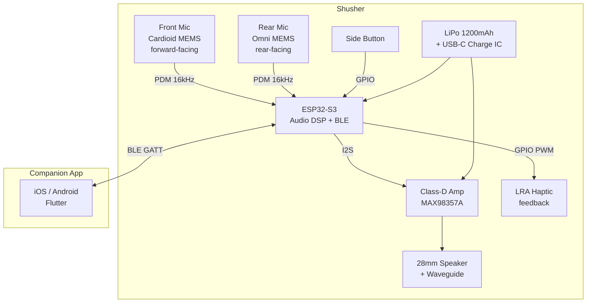
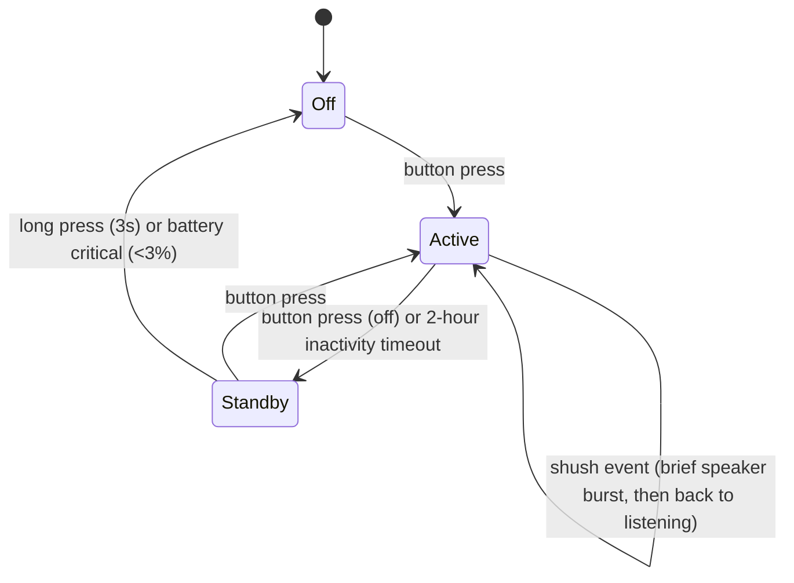

# System Description: Shusher

| Field | Value |
|-------|-------|
| Version | 0.1 |
| Date | 2026-02-23 |
| Author | |
| Status | Draft |
| Related docs | high_level_design.md, explore_notes.md |

---

## 1. Product Vision and Context

**Product statement:**
For remote workers, students, and anyone who values quiet in shared spaces, Shusher is a palm-sized directional device that automatically detects sustained loud speech and fires a brief, human-sounding "shhh" toward the offender. Unlike confronting someone or suffering in silence, it delivers a discreet, plausibly deniable nudge that feels like it came from a nearby stranger.

**Problem:**
Loud talkers and speakerphone users in cafés, coworking spaces, and trains are a universal irritant. Most people tolerate it rather than confront a stranger. The options are: say something (awkward, risks confrontation), move (inconvenient), or endure it (frustrating). There's no passive, low-effort way to signal "you're too loud" without making yourself the center of attention. Shusher provides that — an automated, discreet social nudge aimed at the offender.

**Deployment context:**
- Environment: Indoor (cafés, coworking spaces, libraries, trains, waiting rooms)
- Setting: Public shared spaces — placed on a table, shelf, or armrest
- User type: Consumer — remote workers, students, commuters, introverts, anyone annoyed by loud strangers
- Installation: None — place on surface, aim at noise source, press button
- Expected lifespan: 2-3 years (rechargeable battery, durable enclosure)

---

## 2. User Scenarios

### Scenario 1: The Café Speakerphone
**Persona:** Nadia, freelance designer working from her usual café. Someone at the next table takes a video call on speakerphone.
**Situation:** The speakerphone audio is loud, compressed, and unmistakable. Nadia glances over, but the caller is oblivious.
**Action:** Nadia pulls Shusher from her bag, sets it on the table aimed at the caller, and presses the side button once. A faint green blink under the device confirms it's active. She goes back to work. After 8 seconds of sustained loud speech, Shusher fires a 1-second "shhh" — breathy, natural, quiet enough at Nadia's table but audible at the caller's. The caller pauses, looks around, lowers their voice. If they get loud again after the 45-second cooldown, another shush fires.
**Outcome:** The caller moderates their volume. Nadia didn't say a word, didn't make eye contact, and the device on her table looks like a coaster.

### Scenario 2: The Train Commute
**Persona:** David, daily commuter on a quiet coach. Two passengers behind him are having an animated conversation.
**Situation:** The conversation is sustained, well above the ambient train noise. David is trying to read.
**Action:** David sets Shusher on his armrest, angled toward the seats behind him. The device detects front-mic audio significantly above the rear baseline for 10+ seconds and fires a soft "shhh." The talkers pause — one whispers "did someone just shush us?" — and lower their voices.
**Outcome:** The social signal landed. The talkers self-corrected. David never turned around.

### Scenario 3: First Use — Out of the Box
**Persona:** Someone who just received Shusher as a gift.
**Situation:** Opens the box, finds the puck, a USB-C cable, and a card with three instructions.
**Action:** Presses the side button. A brief double-pulse vibration confirms power-on. The bottom LED glows green for 2 seconds, then goes dark. Device is active. They aim it at their TV playing loud audio. After a few seconds, a "shhh" fires. They laugh. They press the button again — a different shush style. Again — another. They download the app to explore more options.
**Outcome:** Working within 10 seconds. No pairing required for basic operation. App is optional enhancement.

### Scenario 4: False Trigger — Barista Calls an Order
**Persona:** Nadia, café, Shusher active on her table.
**Situation:** The barista shouts "Grande oat latte for Nadia!" — a brief, loud burst from the general direction the device is aimed.
**Action:** The firmware detects a spike on the front mic but the duration is <3 seconds and it doesn't sustain. The trigger threshold requires sustained loud speech (>6 seconds above ambient). The burst is ignored.
**Outcome:** No shush. The device only fires on sustained offenders, not brief loud moments.

### Scenario 5: Low Battery
**Persona:** David, 3 weeks since last charge.
**Situation:** He presses the button to activate. Instead of the normal double-pulse vibration, he feels a single long buzz — the low-battery signal.
**Action:** Plugs in USB-C. An amber LED on the bottom glows during charging, turns green when full (~90 minutes).
**Outcome:** Charges like any other USB-C device. No special cable, no dock.

---

## 3. System Architecture

**Architecture narrative:**

The device has two distinct audio paths — one in (microphones) and one out (speaker). The front MEMS microphone has a cardioid pickup pattern achieved through acoustic porting in the enclosure (front and rear sound ports with a tuned delay path). It captures audio from the aimed direction. The rear MEMS microphone is omnidirectional and captures ambient noise behind the device. Both feed PDM digital audio into the ESP32-S3 at 16 kHz sample rate.

The firmware runs continuous audio analysis on both channels: it computes short-term RMS levels in the speech band (300 Hz – 4 kHz), tracks a rolling ambient baseline from the rear mic, and compares the front-mic level against this baseline. When the front channel exceeds the rear baseline by a configurable threshold (default ~10 dB) for a sustained duration (default ~6 seconds), and speech-band energy is dominant (not broadband noise like an espresso machine), the trigger fires.

On trigger, the MCU selects a shush sample from internal flash (multiple recordings with slight variation), plays it through the I2S interface to a MAX98357A class-D amplifier, which drives a 28mm speaker mounted behind a short waveguide molded into the enclosure front. The waveguide provides modest forward directivity (~±30° at 3 kHz), making the shush louder for the target than for people to the sides. After firing, a cooldown timer prevents re-triggering for 30–60 seconds (configurable).

BLE connectivity is optional — the device works standalone with factory defaults. The companion app (Flutter, iOS + Android) connects via BLE GATT for sensitivity adjustment, shush style selection, cooldown timing, and event log viewing.

---

## 4. Subsystem Descriptions

### 4.1 Hardware Subsystem

**MCU / SoC:**
- Part: ESP32-S3-WROOM-1 (N8 — 8MB flash)
- Selection rationale: Built-in dual-core 240 MHz Xtensa with vector DSP instructions for real-time audio processing. Native PDM microphone interface (I2S peripheral in PDM mode). I2S output for the amplifier. BLE 5.0 integrated. 512 KB SRAM for audio buffers. 8 MB flash for firmware + shush sample library (~20 samples at 16 kHz mono, ~500 KB total). Wi-Fi available but unused — power savings from keeping it off.
- Key specs: 240 MHz dual-core, 512 KB SRAM, 8 MB flash, I2S ×2 (one for mic PDM input, one for amp I2S output), BLE 5.0, deep sleep 10 µA, active audio processing ~80-100 mA

**Sensors:**

| Sensor | Measures | Interface | Sample Rate | Key Spec |
|--------|----------|-----------|-------------|----------|
| Front MEMS mic (ICS-43434 or SPH0645LM4H) | Directional audio (aimed at target) | PDM via I2S | 16 kHz | SNR 65 dB, cardioid via acoustic porting, -26 dBFS sensitivity |
| Rear MEMS mic (ICS-43434 or SPH0645LM4H) | Ambient baseline audio | PDM via I2S | 16 kHz | SNR 65 dB, omnidirectional, mounted with rear-facing port |

**Actuators:**

| Actuator | Function | Interface | Key Spec |
|----------|----------|-----------|----------|
| 28mm dynamic micro speaker | Shush sound output | Driven by MAX98357A class-D amp via I2S | 80-85 dB @ 10cm, 300 Hz – 10 kHz response |
| LRA haptic motor (8mm coin type) | Discrete user feedback — power on/off confirmation, low battery signal | GPIO via DRV2605L driver or direct PWM with flyback diode | Brief vibration pulses, no audible buzz |

**Physical UI elements:**
- Buttons: 1x tactile side button (flush-mount, low profile). Short press = power on/off. Double press = cycle shush style. No other physical controls.
- LEDs: 1x RGB LED on the bottom face (visible only when device is picked up or tilted). Green pulse = power on. Amber = charging. Off during normal operation. Deliberately invisible when the device sits on a table.
- Display: None.
- Speaker: 28mm dynamic, front-facing, behind waveguide.

**PCB strategy:**
- Single board, 4-layer, ~55 mm diameter (circular, matching enclosure)
- Top side: ESP32-S3-WROOM-1 module (18×25.5mm), MAX98357A amp (QFN 3.2×3.2mm), USB-C connector (edge-mount), LiPo charge IC (MCP73831, SOT-23), LRA driver, tactile button, passives
- Bottom side: Front MEMS mic (center, with acoustic port hole through PCB to front enclosure port), rear MEMS mic (center, with acoustic port to rear), RGB LED, test pads
- Acoustic critical: mic placement requires isolation from speaker vibration. Front mic and speaker on opposite ends of the board. Gasket seal between mic port and enclosure.
- Antenna keep-out: ESP32 module antenna at PCB edge, no ground plane or copper within 10mm

**Enclosure:**
- Shape: 70mm diameter × 15mm tall, cylindrical puck with flat bottom
- Material: Matte-finish ABS or PC+ABS, dark gray or black
- Front: Narrow horizontal slot (40mm × 2mm) for speaker waveguide output. No visible grille — the slot looks like a seam line.
- Bottom: Rubber non-slip ring, concealed LED window, USB-C port recessed into the side wall
- Waveguide: Internal horn molded into the front half of the enclosure, expanding from the speaker to the output slot. Short horn (~15mm path length) provides ~4-6 dB front-to-side ratio at 3 kHz.
- Mic ports: Front mic — small port (1.5mm) centered on the front face, disguised as a mold mark. Rear mic — port on the bottom face.
- Weight: ~65g (PCB+components 20g, battery 25g, enclosure 15g, speaker 5g)
- Aesthetic goal: looks like a coaster, a wireless charger, or a minimal desk object. No branding on the top face. Brand/logo on the bottom only.

### 4.2 Firmware Subsystem

**Architecture:**
- OS/framework: ESP-IDF with FreeRTOS (built into ESP-IDF)
- Rationale: ESP32-S3's audio peripherals (I2S, PDM) are best supported through ESP-IDF. FreeRTOS provides task separation between the continuous audio analysis pipeline and the BLE stack. Audio processing runs on core 0; BLE and application logic run on core 1.

**Major modules:**

| Module | Responsibility | Inputs | Outputs |
|--------|---------------|--------|---------|
| Audio capture | Continuous PDM capture from both mics via I2S DMA. Fills ring buffers with 16-bit 16 kHz mono samples. | PDM data from front and rear mics | Audio sample buffers (front, rear) |
| Level analyzer | Computes short-term RMS energy in speech band (300 Hz – 4 kHz) using a bandpass filter + RMS calculation. 50ms analysis windows, updated every 25ms (50% overlap). | Audio sample buffers | Front level (dB), rear level (dB) |
| Ambient tracker | Maintains a rolling baseline of the rear mic level using a slow exponential moving average (tau ~30 seconds). Adapts to the environment: a loud café has a higher baseline than a library. | Rear level (dB) | Ambient baseline (dB) |
| Trigger engine | Compares front level against (ambient baseline + threshold). If front exceeds threshold for >N seconds continuously, and speech-band energy ratio is above a minimum, fires a trigger. Implements cooldown timer (30-60s post-trigger). | Front level, ambient baseline, config params | Trigger event |
| Shush player | On trigger: selects a shush sample from flash (round-robin with slight randomization), plays it via I2S to the amp at a volume calibrated to the detected front-mic level (louder offender → slightly louder shush, within limits). Duration: 0.5-1.5 seconds. | Trigger event, volume level | I2S audio output to amp |
| Haptic driver | Drives the LRA motor for user feedback. Double pulse on power-on, single long buzz for low battery, single short pulse on button press acknowledgment. | System events | PWM to LRA driver |
| BLE service | GATT server with characteristics for: sensitivity threshold, sustain duration, cooldown time, shush style, battery level, event log (last 20 shush events with timestamp + front dB). Bonded pairing. | App commands via BLE | Config updates, status reports |
| Power manager | Monitors battery voltage via ADC. Manages active/standby states. In standby: mics off, BLE advertising only, ~1 mA. Active: full audio pipeline, ~80-100 mA. Transition: button press toggles active/standby. | Battery ADC, button GPIO | Power state, low-battery flag |
| Config store | Persists user settings (sensitivity, cooldown, shush style) in NVS (non-volatile storage on ESP32 flash). Loads on boot. Updated via BLE or button (style cycle). | BLE config writes, button events | Stored config |

**OTA update strategy:**
- Method: A/B partition scheme. ESP32-S3 with 8 MB flash supports two 3 MB app partitions + 1 MB NVS/data.
- Delivery: Push via companion app over BLE. App downloads firmware image from a static HTTPS endpoint, transfers to device over BLE GATT (chunked, ~20 KB/s).
- Rollback: Automatic. If the new firmware fails to boot (watchdog timeout), the bootloader reverts to the previous partition.
- Signing: Secure Boot v2 with RSA-3072 signed firmware images. Prevents unauthorized firmware.

**On-device processing:**
All audio analysis runs on-device. No audio data leaves the device — ever. This is a privacy requirement, not just a preference. The mics capture audio for level analysis only; raw audio is never stored, buffered beyond the 50ms analysis window, or transmitted. The BLE interface exposes only dB levels and event metadata, never audio.

Processing pipeline:
1. PDM → PCM conversion (hardware I2S)
2. Bandpass filter (300 Hz – 4 kHz, 4th-order IIR Butterworth)
3. RMS energy computation (50ms windows)
4. Front-vs-rear differential comparison
5. Sustained-level trigger with hysteresis
6. Shush sample playback via I2S

All steps run in real-time on core 0. CPU utilization: ~30-40% of one core at 240 MHz.

**Boot-to-ready:** ~1.5 seconds (power-on → ESP32 boot → audio pipeline init → active). No calibration step needed — the ambient tracker adapts continuously.

### 4.3 Mobile / Companion App Subsystem

**Platform:** iOS + Android — Flutter (single codebase)

The app is optional. The device works standalone with sensible factory defaults. The app adds personalization and entertainment value.

**Core screens and flows:**
1. **Onboarding / pairing** — App scans for nearby Shusher devices (BLE advertising). Tap to pair. Bonded connection (re-pairs automatically next time).
2. **Main screen** — Real-time noise level from the front mic (displayed as a simple meter, not raw audio). Shush event counter for the current session. Large "manual shush" button (fire on demand, bypassing the auto trigger).
3. **Settings** — Sensitivity slider (how far above ambient triggers a shush: 6-15 dB range). Sustain duration (3-15 seconds). Cooldown time (15-120 seconds). Shush style picker (preview each sound).
4. **Shush log** — History of shush events: timestamp, front dB level, ambient dB level, duration of offense before trigger. Light gamification: "You shushed 4 loud talkers today."
5. **Shush library** — Browse and select from built-in shush sounds. Categories: classic "shhh," throat clear, "ahem," whispered "excuse me," passive-aggressive sigh. Each previews before selection.

**Device communication:**

| Service | Purpose | Direction |
|---------|---------|-----------|
| Noise Level | Real-time front and rear dB levels (1 Hz updates) | Device → App (notify) |
| Shush Event | Notification when a shush fires, with metadata | Device → App (notify) |
| Config | Sensitivity, sustain, cooldown, shush style | App → Device (write) |
| Battery | Battery percentage | Device → App (read/notify) |
| Manual Trigger | Fire a shush on demand | App → Device (write) |
| OTA | Firmware image transfer | App → Device (write, chunked) |

### 4.4 Cloud / Backend Subsystem

**Minimal. Not required for device operation.**

- **Firmware hosting:** Static HTTPS endpoint (S3 bucket or GitHub Releases) for firmware images. The app checks for updates on launch, downloads the image, and transfers it to the device over BLE. No device-to-cloud connection.
- **Shush sound library (future):** A CDN-hosted repository of community-contributed shush sounds. App downloads new sounds and transfers them to device flash over BLE. Not in V1.
- **No telemetry, no accounts, no user data collection.** The device and app work entirely locally. No login required.

---

## 5. Interfaces

### Internal Interfaces (within device)

| Interface | From | To | Protocol | Data | Rate | Notes |
|-----------|------|----|----------|------|------|-------|
| Front mic audio | Front MEMS mic | ESP32-S3 I2S0 | PDM (clock + data) | 16-bit mono audio | 16 kHz continuous | DMA to ring buffer, ~32 KB/s |
| Rear mic audio | Rear MEMS mic | ESP32-S3 I2S0 | PDM (clock + data, 2nd channel) | 16-bit mono audio | 16 kHz continuous | Multiplexed on same I2S peripheral, L/R channels |
| Speaker audio | ESP32-S3 I2S1 | MAX98357A | I2S (BCLK, LRCLK, DIN) | 16-bit mono shush waveform | 16 kHz during playback | Amp auto-powers down when no I2S clock |
| Haptic drive | ESP32-S3 GPIO | LRA motor (via driver) | PWM or I2C (DRV2605L) | Vibration pulses | Event-driven | Brief pulses only — button ack, power on/off, low battery |
| Button input | Tactile switch | ESP32-S3 GPIO | Active-low, internal pull-up | Press events | Event-driven | Debounced in firmware (20ms). Short press = on/off. Double press = style cycle. |
| Battery sense | LiPo via voltage divider | ESP32-S3 ADC | Analog (12-bit ADC) | Battery voltage | 1 Hz polling | Mapped to percentage via LiPo discharge curve |
| Charge status | MCP73831 STAT pin | ESP32-S3 GPIO | Digital (high/low) | Charging / complete | Event-driven | Controls bottom LED amber/green |
| LED control | ESP32-S3 GPIO ×3 | RGB LED (common cathode) | PWM (R, G, B channels) | Color and brightness | As needed | Off during normal operation |
| Power rail | LiPo (3.7V nom) → LDO (3.3V) | All digital components | Direct 3.3V rail | — | — | AP2112K-3.3 or similar, 600mA max |

### External Interfaces (device to outside world)

| Interface | From | To | Protocol | Data | Rate | Notes |
|-----------|------|----|----------|------|------|-------|
| BLE | ESP32-S3 | Companion app | BLE 5.0 GATT | Config, status, events, OTA chunks | Event-driven, ~20 KB/s max for OTA | Bonded pairing, encrypted |
| Audio output | Speaker + waveguide | Environment (target) | Acoustic (sound waves) | Shush sound | 0.5-1.5s bursts, <1 per minute | Forward-biased via waveguide |
| USB-C | Charge IC | USB charger | USB 2.0 (power only) | 5V charging | 500 mA max charge rate | No data lines connected — charge only |

### Physical Connectors

| Connector | Purpose | Type | Notes |
|-----------|---------|------|-------|
| USB-C (side) | Battery charging | USB-C receptacle, power only | Recessed into enclosure side wall. No data — eliminates USB attack surface. |
| SWD pads (internal) | Factory programming + debug | 4-pad test points (SWDIO, SWCLK, 3V3, GND) | Tag-Connect footprint inside enclosure, pogo-pin access during factory test |

---

## 6. Power Architecture

**Power source:**
- Type: LiPo single-cell (3.7V nominal, 4.2V max)
- Capacity: 1200 mAh
- Charging: USB-C, MCP73831 linear charge IC, 500 mA charge rate, ~2.5 hours 0-100%

**Power states:**

| State | MCU | Radio | Mics | Speaker | Haptic | Typical Duration |
|-------|-----|-------|------|---------|--------|----------------:|
| Off | Deep sleep | Off | Off | Off | Off | Hours to days |
| Active (listening) | Running (240 MHz, 1 core active) | BLE advertising (if paired) | Both on, continuous PDM | Off (amp shutdown) | Off | Minutes to hours |
| Active (shushing) | Running | BLE advertising | Both on | Amp on, playing shush (0.5-1.5s) | Off | 0.5-1.5 seconds |
| Standby | Light sleep | BLE advertising only | Off | Off | Off | Hours |

**Power budget (Active — listening, dominant state):**

| Component | Current | Notes |
|-----------|--------:|-------|
| ESP32-S3 (1 core at 240 MHz, audio DSP) | 80 mA | Measured typical for audio processing workload |
| Front MEMS mic (PDM active) | 0.6 mA | ICS-43434 typical |
| Rear MEMS mic (PDM active) | 0.6 mA | ICS-43434 typical |
| MAX98357A (shutdown, no I2S clock) | 0.01 mA | Auto-shutdown when idle |
| BLE advertising (if active) | 2 mA avg | 1-second interval, low-power advertising |
| LDO quiescent + passives | 1 mA | AP2112K quiescent + voltage divider + LED driver |
| **Total (listening)** | **~84 mA** | |

**Power budget (Active — shushing, brief burst):**

| Component | Current | Duration |
|-----------|--------:|----------|
| Speaker + amp (playing shush) | +150 mA peak, ~80 mA avg | 0.5-1.5 seconds |
| Total during shush burst | ~164 mA | |

**Power budget (Standby):**

| Component | Current | Notes |
|-----------|--------:|-------|
| ESP32-S3 (light sleep) | 0.8 mA | RTC + BLE controller active |
| BLE advertising | 1.5 mA avg | Lower rate (2-second interval) |
| **Total (standby)** | **~2.3 mA** | |

**Battery life estimate:**

Usage profile: 4-hour active listening session per day (café workday), standby the rest.

| Mode | Duration | Current | Daily charge |
|------|----------|--------:|------------:|
| Active listening | 4 hours | 84 mA | 336 mAh |
| Shush bursts (~10 events × 1s) | 10 seconds total | 164 mA | 0.46 mAh |
| Standby | 20 hours | 2.3 mA | 46 mAh |
| **Total daily** | | | **~382 mAh** |

Battery life: 1200 mAh / 382 mAh/day = **~3.1 days per charge**

For a 2-hour session: 1200 / (168 + 0.46 + 50.6) = **~5.5 days per charge**

This is adequate for a device charged via USB-C. Users charge it every few days, similar to wireless earbuds. If longer life is needed, the audio processing duty cycle can be optimized (process in bursts: 200ms on / 50ms off, reducing average current by ~20%).

---

## 7. Connectivity Architecture

**Primary connectivity:**
- Technology: BLE 5.0 (ESP32-S3 integrated radio)
- Rationale: Low power for advertising, sufficient bandwidth for config and event data, universal phone support. No Wi-Fi needed — the device has no cloud dependency.

**Fallback:** None. Device operates fully standalone without BLE. BLE is for optional app configuration only.

**Protocol stack:**

| Layer | Technology |
|-------|-----------|
| Physical | BLE 5.0 (2.4 GHz) |
| Link | BLE GATT |
| Application | Custom GATT service (UUID-based) |
| Security | BLE Secure Connections (LE Secure Connections, ECDH key exchange) |

**Data transmission:**
- Frequency: Event-driven (shush events) + 1 Hz level notifications (when app connected)
- Payload: JSON-like attribute values via GATT characteristics. Typical event: 32 bytes (timestamp, front_dB, rear_dB, duration, style).
- Daily volume: Negligible. ~20 events × 32 bytes + config reads = <1 KB/day.

**Provisioning and pairing:**
1. User presses button to power on (device starts BLE advertising with device name "Shusher-XXXX")
2. App scans and discovers device
3. User taps to pair — BLE bonding with numeric comparison or Just Works
4. Bond stored on both sides — automatic reconnection on subsequent use
5. No cloud registration, no accounts, no Wi-Fi setup

**Offline behavior:**
The device IS the offline experience. It doesn't depend on connectivity for any core function. If the app is not connected, the device uses the last-stored configuration. All detection, triggering, and shushing happen locally.

---

## 8. Key Technical Decisions and Trade-offs

### Decision 1: Two Mics (Front/Rear Differential) vs. Mic Array Beamforming
- **Options considered:** (A) 3-4 mic array with DSP beamforming for direction-of-arrival estimation. (B) Two mics — one cardioid front, one omni rear — with simple level comparison.
- **Chosen:** B — Two-mic differential
- **Rationale:** Beamforming requires tightly matched mics, precise geometry, and significant DSP complexity (delay-and-sum or MVDR algorithms). It also needs a larger board for mic spacing. The two-mic approach offloads spatial selectivity to the user (manual aiming) and reduces the DSP to a simple level comparison between channels. The front mic's cardioid pattern provides ~10-15 dB front-to-rear rejection, enough for the differential to work in a café environment. Cost: 2 mics ($1) vs. 4 mics ($2) + more complex PCB.
- **Consequences:** The device must be aimed. It cannot auto-detect the direction of the loudest noise source. If the user aims it wrong, it won't trigger on the offender.
- **Risks:** The cardioid pattern from acoustic porting may not achieve 10-15 dB rejection in practice. Enclosure tolerances and port tuning are critical. Must validate in prototype.

### Decision 2: ESP32-S3 vs. Simpler MCU + Separate BLE
- **Options considered:** (A) ESP32-S3 (~$2.50, integrated BLE + DSP). (B) STM32L4 + external BLE module (~$4.50 total). (C) nRF5340 (~$4, BLE + ARM Cortex-M33 with DSP).
- **Chosen:** A — ESP32-S3
- **Rationale:** Lowest cost with adequate DSP performance. The audio processing workload (bandpass filter + RMS + comparison) is well within the ESP32-S3's capabilities. Built-in I2S peripheral handles both PDM mic input and amp output. 8 MB flash stores the shush sample library. BLE is integrated. The ESP-IDF framework has mature audio processing examples. nRF5340 has better power efficiency but costs 60% more.
- **Consequences:** Higher active power draw than an nRF5340 (~80 mA vs. ~40 mA for equivalent DSP). Battery life is 3-5 days instead of 6-10. Acceptable for a USB-C rechargeable device.
- **Risks:** ESP32-S3 BLE + audio coexistence needs validation. I2S and BLE share radio resources on ESP32. Known workaround: run audio on core 0, BLE on core 1, with task priority separation.

### Decision 3: Pre-recorded Shush Samples vs. Synthesized Sibilance
- **Options considered:** (A) Pre-recorded human shush samples stored in flash. (B) Algorithmically synthesized sibilant noise (filtered white noise with envelope shaping).
- **Chosen:** A — Pre-recorded samples
- **Rationale:** A convincingly human shush is hard to synthesize. The breathy quality, the slight variation in intensity, the natural onset and fade — these are easier to capture by recording a human shushing than to model algorithmically. 20 shush variants at 16 kHz mono × 1.5 seconds = ~960 KB — fits comfortably in 8 MB flash. Randomized selection per trigger adds natural variation.
- **Consequences:** Fixed library at factory (expandable via OTA). Each sample must be carefully recorded and mastered — consistent volume, no room reverb, natural character.
- **Risks:** Limited variety without OTA updates. Mitigation: ship with 20+ variants across 4-5 styles. Users hear a different shush almost every time.

### Decision 4: Waveguide vs. Bare Speaker vs. Parametric Array
- **Options considered:** (A) Parametric ultrasonic speaker array (highly directional, expensive). (B) Small speaker with molded waveguide in enclosure (modest directivity). (C) Bare speaker, no directivity.
- **Chosen:** B — Speaker with waveguide
- **Rationale:** Parametric arrays add $15-25 to BOM and require a larger enclosure — prices the product out of the impulse-buy range and changes the form factor. A bare speaker broadcasts equally in all directions, which defeats the purpose (everyone hears the shush, including the user). A short waveguide molded into the front of the enclosure provides ~4-6 dB front-to-side ratio at 2-4 kHz (the dominant frequency range of a "shhh" sound). Not laser-directional, but enough that the target hears it clearly while it blends into ambient noise for people at 90°.
- **Consequences:** Enclosure mold is more complex (internal horn geometry). Speaker must be precisely positioned against the waveguide throat. Acoustic seal between speaker and waveguide matters.
- **Risks:** 4-6 dB front-to-side ratio may not be enough in a quiet environment. In a noisy café (60+ dB ambient), even modest directivity makes the shush "disappear" for side-facing listeners. In a quiet library, the shush may be audible to more people. The library use case may need a lower volume setting.

---

## 9. Constraints

### Regulatory
- Required certifications: FCC Part 15 (US, intentional radiator — BLE), CE/RED (EU), IC (Canada)
- Bluetooth SIG qualification (required for BLE)
- No special acoustic safety standards for a consumer speaker device at <85 dB
- Target markets: US, EU, UK, Canada, Australia
- RoHS compliant components required

### Environmental
- Operating temperature: 0°C to 45°C (indoor use in temperate environments)
- Storage temperature: -20°C to 60°C
- Ingress protection: None (indoor tabletop device). Enclosure seams should resist casual spills (café table) but no IP rating.
- Drop: Survive 1m drop onto hard floor (falls off table)

### Cost

| Item | Target | Notes |
|------|-------:|-------|
| BOM (at 1k units) | <$18 | |
| BOM (at 5k units) | <$14 | Volume pricing on ESP32, mics, enclosure tooling amortized |
| Retail price | $50-70 | Niche consumer electronics — premium enough to signal quality, accessible enough for impulse/gift |
| Target gross margin | 55-65% | |

**BOM estimate (1k units):**

| Component | Est. Cost |
|-----------|----------:|
| ESP32-S3-WROOM-1 (N8) | $2.80 |
| Front MEMS mic (ICS-43434) | $0.80 |
| Rear MEMS mic (ICS-43434) | $0.80 |
| MAX98357A class-D amp | $1.20 |
| 28mm dynamic speaker | $0.60 |
| LRA haptic motor (8mm) | $0.50 |
| LiPo battery (1200 mAh) | $2.50 |
| MCP73831 charge IC + USB-C connector | $0.80 |
| LDO (AP2112K) + passives | $0.40 |
| RGB LED | $0.10 |
| Tactile button | $0.10 |
| PCB (55mm round, 4-layer) | $1.20 |
| Enclosure (injection-molded, 2-piece + waveguide) | $2.50 |
| Non-slip rubber ring | $0.15 |
| Packaging | $0.80 |
| Assembly + test | $2.00 |
| **Total COGS** | **~$17.25** |

At 5k units: ~$13.50 (ESP32 volume pricing, enclosure tooling amortized, assembly efficiency).

### Manufacturing
- Target annual volume: 2,000-10,000 units (years 1-2)
- Assembly: SMT reflow (top side), selective solder or reflow (bottom side mics + LED), manual battery + enclosure assembly
- Test requirements: Functional test (audio path — play test tone through speaker, verify mic captures it), BLE pairing test, battery voltage check, programming via SWD pogo-pin jig
- Acoustic calibration: Factory test measures front mic sensitivity and adjusts gain offset in NVS to normalize unit-to-unit variation

### Schedule
- Key milestones: Breadboard prototype (M1), PCB v1 + 3D-printed enclosure (M2), Sound recording session (M2), Injection mold tooling (M3), Firmware feature-complete (M3), Pre-production units (M4), Certification submission (M4), Production (M5-6)
- Hard deadlines: None identified
- Certification timeline: FCC + CE + Bluetooth SIG: ~6-10 weeks, ~$8-15K total

### Dependencies
- Sound design: Need 20+ professional shush recordings across 4-5 styles. Recording session with voice actor or sound designer.
- Enclosure acoustic design: Waveguide geometry and mic port tuning require acoustic simulation (COMSOL or similar) or iterative prototyping.
- ESP-IDF audio pipeline: Mature framework, but dual-mic PDM capture + simultaneous I2S playback needs validation on ESP32-S3.
- Flutter BLE plugin: Well-supported (flutter_blue_plus), but BLE GATT performance on both iOS and Android needs testing.

---

## 10. Open Questions and Risks

| # | Question / Risk | Category | Impact | Owner | Target Date | Status |
|---|----------------|----------|--------|-------|-------------|--------|
| 1 | Cardioid mic porting: can the enclosure acoustic design achieve 10-15 dB front-to-rear rejection with a standard MEMS mic? Depends on port geometry, cavity volume, and manufacturing tolerance of the acoustic path. | Technical | H | HW Lead | M2 | Open |
| 2 | False positive rate in real café environments: the front/rear differential + sustained-speech trigger must reject espresso machines, background music, brief shouts, and dish clatter while catching sustained loud talkers. Needs real-world field testing in 5+ environments. | Technical | H | FW Lead | M3 | Open |
| 3 | Waveguide effectiveness: does the short horn provide meaningful directivity (>4 dB front-to-side) at shush-relevant frequencies (2-6 kHz)? Needs acoustic simulation and prototype measurement. | Technical | H | HW Lead | M2 | Open |
| 4 | Shush sound naturalness: do pre-recorded samples played through a 28mm speaker in a plastic enclosure still sound convincingly human? Speaker coloration, waveguide resonances, and enclosure vibration could add an electronic quality. | Technical | M | Product Lead | M2 | Open |
| 5 | ESP32-S3 BLE + audio coexistence: simultaneous PDM mic capture on I2S0 and BLE operation. Known to work in ESP-IDF but needs validation under sustained load (continuous audio + BLE advertising + occasional GATT writes). | Technical | M | FW Lead | M2 | Open |
| 6 | Battery life: 3-day target for 4-hour daily use is workable but not generous. Users accustomed to devices that last weeks may find it annoying. Could the DSP duty cycle be reduced (listen 200ms, sleep 50ms) without degrading trigger responsiveness? | Technical | M | FW Lead | M3 | Open |
| 7 | Social/legal: directing a "shhh" sound at a stranger in a public space. Not illegal (it's a speaker), but could the product be perceived as harassment? Product positioning and marketing must frame it as lighthearted, not aggressive. The cooldown timer (max 1 shush per 30-60s) and natural sound prevent it from being weaponized. | Regulatory/Product | M | Product Lead | M1 | Open |
| 8 | Market positioning: is the target user a remote worker who'd pay $50-70 for a functional tool, or a broader audience who'd pay $30 for a fun gadget? The answer changes BOM budget, feature set, and sound design tone. | Cost | M | Product Lead | M1 | Open |

---

## Appendix

### Glossary

| Term | Definition |
|------|-----------|
| Front mic | The MEMS microphone with cardioid pickup pattern, facing the aimed direction. Captures audio from the target. |
| Rear mic | The MEMS microphone with omnidirectional pickup, facing away from the target. Captures ambient baseline noise. |
| Ambient baseline | A slow-moving average of the rear mic level (tau ~30s) that represents the environment's background noise. The trigger threshold is relative to this baseline. |
| Trigger threshold | The dB level above ambient baseline that the front mic must sustain to fire a shush. Default ~10 dB. Configurable 6-15 dB via app. |
| Sustain duration | The time the front mic must continuously exceed the trigger threshold before a shush fires. Default ~6 seconds. Configurable 3-15 seconds via app. |
| Cooldown | The minimum time between consecutive shush events. Default 45 seconds. Configurable 15-120 seconds via app. Prevents harassment. |
| Waveguide | A short acoustic horn molded into the front of the enclosure that provides modest directivity to the speaker output, making the shush louder for the target than for people to the sides. |
| Cardioid | A microphone pickup pattern that is sensitive to sound from the front and rejects sound from the rear. Achieved in Shusher through acoustic porting in the enclosure, not through an inherently cardioid MEMS element. |
| Plausible deniability | The design goal that the shush should sound human and not be traceable to the device, so the offender wonders if a nearby person shushed them rather than identifying a gadget. |

### Reference Documents

| Document | Location | Relevance |
|----------|----------|-----------|
| ESP32-S3 Technical Reference Manual | Espressif | MCU specs, I2S/PDM configuration, BLE coexistence |
| ICS-43434 datasheet | TDK InvenSense | MEMS mic specs, PDM interface, SNR, sensitivity |
| MAX98357A datasheet | Analog Devices | I2S class-D amp, auto-shutdown, gain settings |
| MCP73831 datasheet | Microchip | LiPo charge IC, USB charging |
| ESP-IDF Programming Guide — Audio | Espressif | I2S driver, DMA configuration, audio pipeline examples |

### Revision History

| Version | Date | Author | Changes |
|---------|------|--------|---------|
| 0.1 | 2026-02-23 | | Initial draft |
