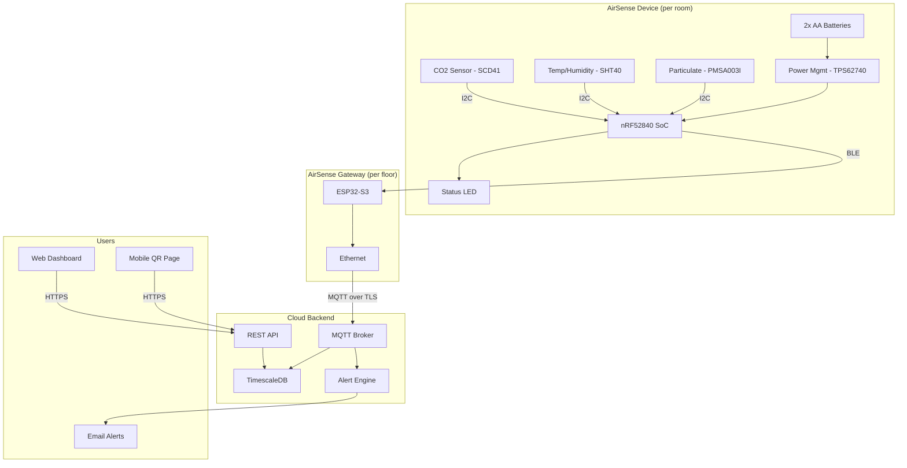
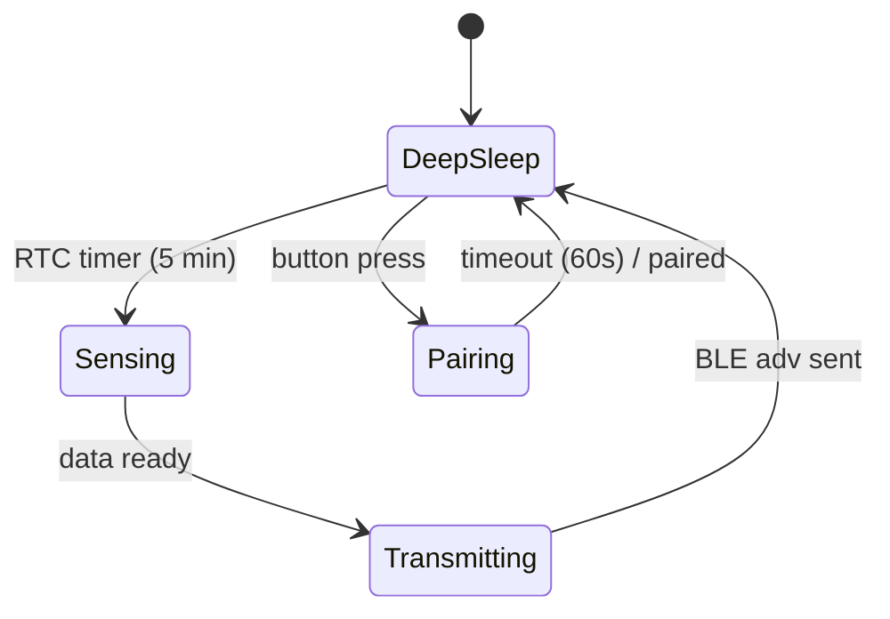

# System Description: AirSense Indoor Environment Monitor

| Field | Value |
|-------|-------|
| Version | 0.1 |
| Date | 2026-02-19 |
| Author | [Example] |
| Status | Draft |
| Related docs | — |

*This is a partial example showing expected depth and format. Sections 1-3 and 6 are filled in. Other sections have stubs.*

---

## 1. Product Vision and Context

**Product statement:**
For office facility managers, AirSense is a wireless indoor environment monitor that tracks air quality, temperature, and humidity across multiple rooms and surfaces insights through a web dashboard. Unlike standalone CO2 meters, it provides building-wide coverage with centralized monitoring and historical trends.

**Problem:**
Indoor air quality directly affects occupant health, comfort, and productivity, but most office buildings have no room-level monitoring. Facility managers rely on complaints rather than data. Standalone consumer sensors provide single-room readings with no aggregation or alerting.

**Deployment context:**
- Environment: Indoor only
- Setting: Commercial offices, 10-200 rooms per building
- User type: Professional (facility managers), with read-only access for occupants
- Installation: Self-installed — magnetic mount, no wiring
- Expected lifespan: 5 years (battery-replaceable)

---

## 2. User Scenarios

### Scenario 1: Morning Air Quality Check
**Persona:** Maria, facility manager at a 50-person office
**Situation:** Arrives at 7:30 AM, before employees. Wants to verify overnight ventilation was adequate.
**Action:** Opens the AirSense web dashboard on her laptop. Sees a floor map with color-coded rooms (green/yellow/red based on CO2 levels).
**Outcome:** Two meeting rooms show elevated CO2 from the previous evening. She adjusts HVAC scheduling for those zones before the day starts.

### Scenario 2: Occupant Checks Room Conditions
**Persona:** David, software engineer in an open-plan area
**Situation:** Feels the office is stuffy after lunch. Scans the QR code on the nearest AirSense device.
**Action:** Sees current temperature (24.2°C), humidity (55%), and CO2 (980 ppm) on a simple mobile-friendly page.
**Outcome:** Confirms the room is above comfort thresholds. Submits a one-tap "too warm" report that logs to the facility manager's dashboard.

### Scenario 3: Low Battery Alert
**Persona:** Maria, facility manager
**Situation:** Device in Conference Room B has reached 10% battery after 11 months.
**Action:** Dashboard shows a yellow battery icon for that device. Maria receives an email notification with device location and battery level.
**Outcome:** Maria replaces the two AA batteries during a routine walk-through. Device resumes reporting within 30 seconds of battery insertion.

---

## 3. System Architecture

**Architecture narrative:**

AirSense uses a two-tier wireless architecture. Individual sensor devices communicate over BLE to a per-floor gateway, which aggregates data and forwards it to the cloud over Ethernet. This avoids putting WiFi radios in battery-powered sensor nodes — a key decision for achieving the 12-month battery life target.

Each device samples three environmental sensors (CO2, temperature/humidity, particulate matter) on a configurable interval (default: 5 minutes). The nRF52840 SoC handles sensor reading, local averaging, and BLE advertisement. The device spends >99% of its time in deep sleep.

The gateway runs on an ESP32-S3 with Ethernet, placed centrally on each floor. It scans for BLE advertisements from sensor devices, parses the payload, and publishes to the cloud MQTT broker over TLS. The gateway is mains-powered and always on.

The cloud backend stores time-series data in TimescaleDB, serves the web dashboard and mobile QR pages through a REST API, and runs an alert engine for threshold violations and device health (low battery, missing reports).

---

## 4. Subsystem Descriptions

### 4.1 Hardware Subsystem

**MCU / SoC:**
- Part: Nordic nRF52840
- Rationale: Best-in-class BLE power consumption, mature SDK (nRF Connect SDK / Zephyr), 256KB RAM sufficient for sensor processing, built-in ARM CryptoCell for secure operations
- Key specs: 64 MHz Cortex-M4F, 256KB RAM, 1MB Flash, BLE 5.3

**Sensors:**

| Sensor | Measures | Interface | Sample Rate | Key Spec |
|--------|----------|-----------|-------------|----------|
| Sensirion SCD41 | CO2, temp, humidity | I2C | 1 / 5 min | ±40 ppm + 5% CO2 accuracy |
| Sensirion SHT40 | Temperature, humidity | I2C | 1 / 5 min | ±0.2°C, ±1.8% RH |
| Plantower PMSA003I | PM1.0, PM2.5, PM10 | I2C | 1 / 5 min | ±10 µg/m³ |

**Physical UI:**
- LEDs: 1x RGB LED (status: green = good, yellow = moderate, red = poor, blue = pairing)
- Buttons: 1x tact switch (recessed, for reset/pairing)
- QR code: Printed on label, links to device-specific mobile page

**PCB strategy:**
Single board, approximately 45mm x 45mm. SCD41 requires airflow exposure — PCB mounted near ventilation slots in enclosure. Antenna keep-out zone on one edge for BLE PCB trace antenna.

### 4.2 Firmware Subsystem
*[To be filled in — Zephyr RTOS, sensor manager, BLE advertiser, power manager, OTA via gateway]*

### 4.3 Mobile / Companion App Subsystem
*[No native app. QR code links to mobile-optimized web page served by the cloud API. Gateway configuration via local web UI.]*

### 4.4 Cloud / Backend Subsystem
*[To be filled in — MQTT ingestion, TimescaleDB storage, REST API, alert engine, fleet management dashboard]*

---

## 5. Interfaces
*[To be filled in]*

---

## 6. Power Architecture

**Power source:**
- Type: 2x AA lithium primary cells (Energizer Ultimate Lithium L91)
- Capacity: ~3000 mAh each, 3.0V nominal (2 cells in series = 6V input, regulated down)
- Charging: N/A — battery replacement
- Rationale: AA cells are universally available, replaceable by facility staff without tools, and avoid LiPo complexity (no charging circuit, no battery management, no UN38.3 concerns)

**Power states:**

| State | MCU | Radio | Sensors | LED | Duration |
|-------|-----|-------|---------|-----|---------|
| Deep Sleep | OFF (RTC only) | OFF | OFF | OFF | ~299 s |
| Sensing | Active | OFF | Sampling | OFF | ~5 s |
| Transmitting | Active | BLE Adv | OFF | Flash | ~0.5 s |
| Pairing | Active | BLE Connectable | OFF | Blue pulse | ≤60 s |

**Power budget (typical 5-minute cycle):**

| Component | Active (5s) | Transmitting (0.5s) | Deep Sleep (294.5s) | Avg over cycle |
|-----------|----------:|--------------------:|--------------------:|---------------:|
| MCU | 3.0 mA | 3.0 mA | 1.5 µA | ~58 µA |
| BLE Radio | — | 8.0 mA | — | ~13 µA |
| SCD41 | 15 mA | — | — | ~250 µA |
| SHT40 | 0.4 mA | — | — | ~7 µA |
| PMSA003I | 25 mA | — | — | ~417 µA |
| Regulator quiescent | — | — | 0.3 µA | ~0.3 µA |
| **Total avg** | | | | **~745 µA** |

**Target battery life:** 12 months at 5-minute sample interval

**Feasibility check:** 3000 mAh / 0.745 mA ≈ 4027 hours ≈ 168 days ≈ 5.6 months. **This does not meet the 12-month target.** The particulate matter sensor (PMSA003I) dominates the budget at 417 µA average. Options: (a) reduce PM sampling to every 30 min, (b) make PM sensor optional/removable, (c) use larger batteries. **This is flagged as Open Question #1.**

---

## 7. Connectivity Architecture
*[To be filled in — BLE 5.3 advertising, passive scanning by gateway, beacon-style one-way data]*

---

## 8. Key Technical Decisions and Trade-offs

### Decision 1: BLE + Gateway vs. WiFi Direct
- **Options considered:** (A) WiFi in each sensor, (B) BLE sensors + Ethernet gateway per floor
- **Chosen:** B — BLE + gateway
- **Rationale:** WiFi draws 100-300 mA during transmission vs. 8 mA for BLE advertising. With 5-minute reporting, WiFi would drain AA batteries in weeks. The gateway adds hardware cost ($30-40 per floor) but enables 12+ month battery life per sensor.
- **Consequences:** Adds a second hardware product (the gateway). BLE range limits gateway placement to ~15m line-of-sight per sensor. Building-wide deployment requires 1 gateway per ~500 m².
- **Risks:** BLE congestion in dense deployments (>50 devices per gateway). Mitigation: coded PHY for extended range, or additional gateways.

### Decision 2: AA Batteries vs. Rechargeable LiPo
*[To be filled in]*

### Decision 3: Cloud-only Processing vs. Edge Analytics
*[To be filled in]*

---

## 9. Constraints
*[To be filled in]*

---

## 10. Open Questions and Risks

| # | Question / Risk | Category | Impact | Owner | Target Date | Status |
|---|----------------|----------|--------|-------|-------------|--------|
| 1 | PM sensor power budget exceeds target — need to reduce sample rate or make PM optional | Technical | H | HW Lead | TBD | Open |
| 2 | BLE range in concrete office buildings — need field testing | Technical | M | FW Lead | TBD | Open |
| 3 | SCD41 requires 15s warmup — does 5s sensing window work? | Technical | H | HW Lead | TBD | Open |
