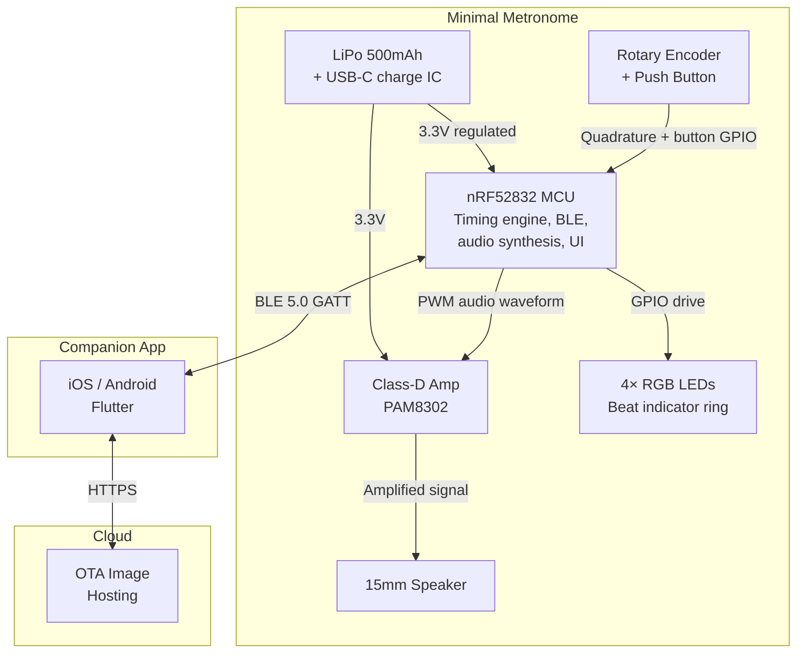
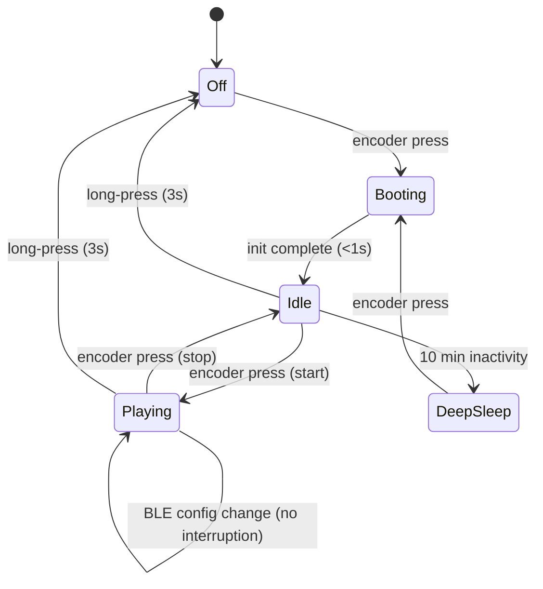

# System Description: Minimal Metronome

| Field | Value |
|-------|-------|
| Version | 0.1 |
| Date | 2026-02-22 |
| Author | |
| Status | Draft |
| Related docs | explore_notes.md, high_level_design.md |

---

## 1. Product Vision and Context

**Product statement:**
For practicing musicians, Minimal Metronome is a pocket-sized hardware metronome that produces a precise, clean click with sub-100 µs timing jitter, controlled by a physical rotary encoder and optionally configured via a BLE companion app. Unlike phone metronome apps, it provides dedicated physical controls usable mid-practice, timing precision unaffected by OS audio latency, and zero screen distraction.

**Problem:**
Phone metronome apps are convenient but flawed for serious practice: audio latency varies by device and OS (5–40 ms on Android, 5–15 ms on iOS), notifications interrupt playback, and the phone's screen is a distraction. Physical metronomes solve these problems but most are either expensive mechanical units or cheap digital ones with poor sound and no connectivity. Musicians want a simple, precise, good-sounding click box that they can adjust without looking, with the option to configure complex time signatures and presets from their phone.

**Deployment context:**
- Environment: Indoor (practice rooms, studios, rehearsal spaces, bedrooms)
- Setting: Home, school music rooms, band rehearsal spaces
- User type: Consumer — instrumentalists, vocalists, music students, teachers
- Installation: None — place on music stand, tabletop, or in pocket
- Expected lifespan: 3–5 years

---

## 2. User Scenarios

### Scenario 1: Daily Practice — Guitar Player
**Persona:** Maya, 17, guitar student preparing for conservatory auditions. Practices scales and etudes 2 hours daily.
**Situation:** Maya sits down to practice, metronome on her music stand. She needs to start at 60 BPM and gradually increase to 120 BPM over the session.
**Action:** She presses the encoder to start the metronome. A sharp click begins at her last-used tempo (displayed on the 4 LEDs as a repeating pattern in 4/4). She rotates the encoder up — each detent adds 1 BPM. She feels the clicks, plays along. After 10 minutes, she rotates up again. No phone, no screen, no looking away from the sheet music.
**Outcome:** Uninterrupted, hands-free tempo adjustment throughout the session. The click is precise and clean. She never touches her phone.

### Scenario 2: Band Rehearsal — Setlist Mode via App
**Persona:** Jake, drummer in a 5-piece cover band. They rehearse a 15-song setlist weekly.
**Situation:** Jake opens the companion app before rehearsal and loads the band's setlist — 15 songs, each with a saved tempo and time signature (e.g., "Hotel California" at 74 BPM in 4/4, "Take Five" at 172 BPM in 5/4).
**Action:** He pushes the setlist to the metronome over BLE. The metronome stores the presets in flash. During rehearsal, he double-taps the encoder to advance to the next song's preset. The LEDs flash briefly to confirm the new time signature, and the click resumes at the new tempo. Between songs, the app shows which preset is active.
**Outcome:** No fumbling with the phone between songs. The metronome handles tempo and time-signature changes with a physical gesture. The app is only used for setup, not during performance.

### Scenario 3: First Use — Unboxing to First Click
**Persona:** A music student who received the metronome as a gift.
**Situation:** Opens the box. Finds the metronome, a USB-C cable, and a quick-start card.
**Action:** The device ships partially charged. The student presses the encoder — 4 LEDs light up in sequence at the default 120 BPM in 4/4. A clean click plays on each beat, with a slightly accented click on beat 1 (LED 1 is a different color). The student rotates the encoder — tempo changes immediately. Presses once to stop. Done.
**Outcome:** Working in under 10 seconds. No app required, no pairing, no setup. The app is optional for advanced features.

### Scenario 4: Silent Practice — Haptic Mode (if haptic motor included)
**Persona:** Maya, practicing late at night in her apartment.
**Situation:** She needs to practice but can't make noise.
**Action:** She long-presses the encoder to toggle to silent mode. The speaker mutes, and the LEDs pulse on each beat. If a haptic motor is included, it taps on each beat — she holds the device or places it against her leg.
**Outcome:** Practice continues without disturbing anyone. Visual and haptic feedback replace audio.

### Scenario 5: Low Battery — Mid-Practice
**Persona:** Jake, during band rehearsal.
**Situation:** The battery drops below 10%. The LED ring briefly flashes red between beats, once per measure.
**Action:** Jake notices the flash. He plugs in the USB-C cable. The metronome continues playing while charging — no interruption.
**Outcome:** No surprise shutdowns. Charging during use is supported. The red flash is subtle enough not to disrupt the beat pattern.

---

## 3. System Architecture

**Architecture narrative:**

The device centers on the nRF52832 MCU, which handles four jobs: precision beat timing via a dedicated hardware timer, audio click synthesis via PWM output, BLE communication with the companion app, and user input from the rotary encoder.

The timing engine is the architectural spine. A 32.768 kHz crystal drives the RTC peripheral or a high-frequency timer (16 MHz HFCLK) to generate beat interrupts with sub-100 µs jitter. The beat ISR triggers two outputs simultaneously: a PWM burst to the class-D amplifier (producing the click) and a GPIO update to the LED ring (showing beat position). The BLE SoftDevice runs at a lower interrupt priority than the beat timer, so radio events never preempt beat generation.

The companion app connects over BLE to configure time signatures, accent patterns, and presets. These are written to the device's flash and persist across power cycles. The app also delivers OTA firmware updates. The device is fully functional without the app — tempo control, start/stop, and basic 4/4 operation work entirely from the rotary encoder.

**Security model:**

The system has two trust boundaries:

1. **BLE link (device ↔ app):** Protected by LESC (LE Secure Connections) with ECDH key exchange and AES-CCM link encryption. Only bonded devices can read or write characteristics. The firmware validates all incoming config values before applying them: BPM is clamped to 20–300, time signature numerator to 1–16, denominator to accepted values (2, 4, 8, 16), volume to 0–100, and preset index to 0–31. Out-of-range writes are rejected with a BLE ATT error. This prevents a malicious or buggy app from putting the device into an undefined state.

2. **OTA firmware boundary (app → bootloader):** The Nordic Secure DFU bootloader accepts only firmware images signed with Ed25519. The public key is burned into the bootloader at factory and cannot be changed without physical SWD access. A CRC check runs after image transfer; a boot validation check runs after the swap. Failure at either stage triggers automatic rollback to the previous bank. This prevents unauthorized firmware from running on the device.

The cloud boundary is minimal — the app downloads firmware images over HTTPS (standard TLS certificate validation). No device-to-cloud authentication exists because the device never contacts the cloud directly.

Physical access (SWD debug port) is available only via the Tag-Connect footprint on the bottom of the PCB, inside the sealed enclosure. For this product class (consumer metronome, no sensitive user data), SWD lockout is not required, but can be enabled via nRF52 APPROTECT fuse if needed for production units.

---

## 4. Subsystem Descriptions

### 4.1 Hardware Subsystem

**MCU / SoC:**
- Part: nRF52832-CIAA (QFN48, 6×6mm)
- Selection rationale: Integrated BLE 5.0 with proven SoftDevice stack, 64 MHz ARM Cortex-M4F, hardware timers with capture/compare for precise beat generation, 512 KB flash (ample for firmware + click samples + presets), 64 KB RAM, mature SDK (nRF5 SDK or nRF Connect SDK). The ~$2.50 price premium over a non-BLE MCU buys wireless configuration, OTA updates, and app integration — worth it for a $35–45 retail product.
- Key specs: 64 MHz Cortex-M4F, 512 KB flash, 64 KB RAM, 3× 32-bit timers (TIMER0/1/2), RTC, PWM (up to 4 channels via EasyDMA), I2C, SPI, 32 GPIO, deep sleep 1.9 µA (with RTC running), BLE 5.0

**Sensors:**

| Sensor | Measures | Interface | Sample Rate | Key Spec |
|--------|----------|-----------|-------------|----------|
| None | — | — | — | This device has no environmental sensors. Input is user-generated (rotary encoder). |

**Actuators:**

| Actuator | Function | Interface | Key Spec |
|----------|----------|-----------|----------|
| 15mm micro speaker (e.g., CUI CMS-151135-078SP or PUI AS01508AO-3-R) | Click/beat audio output | Driven by PAM8302 class-D amp, fed by MCU PWM | 78–82 dB SPL at 10cm, 8Ω, 0.5W max, 3.5mm tall |
| 4× WS2812B-Mini RGB LEDs (2×2mm) | Beat position indicator — 1 LED per beat in 4/4, accent on beat 1 | Single-wire serial data from MCU GPIO (800 kHz protocol) | Individually addressable, 5mA per color channel at full brightness |
| (Optional) LRA haptic motor (e.g., Jinlong Z10C1T8218082) | Silent/haptic beat mode | GPIO → DRV2603 haptic driver | 10mm diameter, 2mm tall, ~60 mA peak |

**Physical UI elements:**
- Rotary encoder: 1× Alps EC11 series (or equivalent), 20 detents/revolution, with integrated push button. Shaft extends through enclosure top panel. Functions: rotate = adjust BPM (±1 per detent), press = start/stop, double-press = next preset, long-press (2s) = toggle silent mode.
- LEDs: 4× WS2812B-Mini RGB in a square or arc pattern around the encoder shaft. Beat 1 = distinct color (white or blue), beats 2–4 = green. Flash on each beat for ~50 ms.
- Display: None for V1. The companion app shows BPM. On-device BPM indication is via beat rate (audible and visible) — musicians set tempo by ear, not by number.
- Speaker: 15mm micro speaker mounted in enclosure with acoustic port.

**PCB strategy:**
- Single board, 4-layer FR4, ~45 × 45 mm (square, centered under the encoder shaft)
- Top side: Rotary encoder (center), 4× WS2812B LEDs (surrounding encoder in arc/square), USB-C connector (edge)
- Bottom side: nRF52832 (QFN48, 6×6mm), PAM8302 amp (SOT-23-5), LiPo charge IC (MCP73831, SOT-23-5), LDO (3.3V, SOT-23), passives, speaker solder pads
- 4-layer for cleaner power planes and BLE antenna routing (PCB trace antenna on top layer, keep-out zone beneath)
- BLE antenna: PCB trace inverted-F antenna on top layer edge, with ground plane keep-out per Nordic reference design
- Test pads: SWD (SWDIO, SWDCLK, VCC, GND) via Tag-Connect TC2030 footprint on bottom side
- Speaker: soldered to PCB edge pads, mounted facing enclosure acoustic port

**Enclosure:**
- Shape: 55 × 55 × 22 mm rounded square (or 50mm diameter cylinder)
- Material: ABS injection-molded, matte black or white
- Top panel: encoder shaft hole (center), LED light pipes or transparent ring, logo
- Bottom: rubber feet (4×) for music stand grip, battery compartment or solid (internal LiPo)
- Side: USB-C port cutout, acoustic port (3–5 slots for speaker output)
- Weight: ~45g (PCB 8g, battery 12g, speaker 2g, encoder 5g, enclosure 15g, misc 3g)

### 4.2 Firmware Subsystem

**Architecture:**
- OS/framework: Bare-metal with nRF5 SDK (or Zephyr RTOS via nRF Connect SDK)
- Rationale: The nRF5 SDK's SoftDevice (S132) handles BLE in a separate protected region with its own interrupt priorities. Application firmware runs alongside it. For V1, bare-metal with the SDK's app_timer and app_scheduler modules is sufficient — the firmware has 3 main tasks (beat timing, BLE, UI input) that are naturally interrupt-driven. If complexity grows (e.g., haptic motor, display), migrating to Zephyr is straightforward on the same hardware.

**Major modules:**

| Module | Responsibility | Inputs | Outputs |
|--------|---------------|--------|---------|
| Beat engine | Generate beat interrupts at the configured BPM with < 100 µs jitter. Uses TIMER1 (16 MHz) in compare mode. On each beat: triggers click playback and LED update. Handles accent patterns and subdivisions. | BPM value, time signature, accent pattern | Beat event (triggers audio + LED modules) |
| Audio driver | On beat event: play a click waveform via PWM. Click is a short (~5–15 ms) burst waveform stored as a sample table in flash. Accented beats use a different/louder waveform. Volume controlled via PWM duty cycle scaling. | Beat event, accent flag, volume level | PWM output to PAM8302 amp |
| LED driver | On beat event: flash the appropriate LED in the beat ring. Beat 1 = accent color, others = standard color. Flash duration ~50 ms, then off. | Beat event, beat position, time signature | WS2812B serial data stream |
| Encoder handler | Read quadrature signals from rotary encoder via GPIO + GPIOTE. Debounce in hardware (RC filter) + software (edge timing). Map rotation to BPM change (±1 per detent, accelerated ±5 per detent if rotated fast). Handle button: press = start/stop, double-press = next preset, long-press = mode toggle. | GPIO interrupts from encoder A/B channels + button | BPM change events, button action events |
| BLE service | Expose a custom GATT service with characteristics for: current BPM (read/write/notify), time signature (read/write), accent pattern (read/write), playback state (read/write/notify), preset list (read/write), volume (read/write), device info (read). Handle bonding and reconnection. | BLE events from SoftDevice | Config changes applied to beat engine; state notifications to app |
| Preset manager | Store up to 32 presets in flash (each: name, BPM, time signature, accent pattern). Load/save via BLE or cycle via double-press. Each preset is ~32 bytes → 1 KB total. Uses nRF5 FDS (Flash Data Storage) for wear-leveled writes. | Preset commands from BLE or encoder | Active preset applied to beat engine |
| Power manager | Monitor battery via ADC (SAADC). Enter System ON low-power mode when stopped (RTC keeps time, BLE advertising continues). Enter System OFF on long-press power-down (wake on button press). During playback: CPU active only in ISRs, WFE between beats. | Battery ADC readings, user input, playback state | Power state transitions, low-battery flag to LED driver |
| OTA updater | Use Nordic DFU (Device Firmware Update) bootloader. App triggers DFU mode, transfers signed firmware image over BLE. Dual-bank (A/B) update with automatic rollback on CRC failure. | BLE DFU commands + image data | Firmware image written to bank B, validated, swapped on reboot |

**OTA update strategy:**
- Method: Dual-bank (A/B partition) via Nordic Secure DFU bootloader
- Delivery: App-initiated over BLE. App downloads firmware image from cloud (HTTPS), transfers to device via BLE DFU service.
- Rollback: Automatic. If new image fails CRC or doesn't boot within 5 seconds, bootloader reverts to bank A.
- Signing: Ed25519 signature on firmware image. Public key burned into bootloader at factory. Only images signed with the matching private key are accepted.
- Flash layout: Bootloader (24 KB) + SoftDevice S132 (152 KB) + App Bank A (~140 KB) + App Bank B (~140 KB) + FDS storage (8 KB) + MBR (4 KB) = ~468 KB of 512 KB used.

**On-device processing:**
- Beat interval calculation: BPM → microsecond interval (60,000,000 / BPM). Loaded into TIMER1 compare register.
- Click waveform playback: 8-bit PCM samples stored in flash (~500 bytes per click sound at 16 kHz sample rate, 15 ms duration). Played via PWM at 16 kHz using EasyDMA. Multiple click sounds stored (standard click, accented click, subdivision click) — total ~2 KB.
- Accent pattern evaluation: on each beat, index into the accent pattern array to determine click type (accent/normal/silent/subdivision).
- Encoder acceleration: track rotation speed. Below 3 detents/second = ±1 BPM/detent. Above 3 detents/second = ±5 BPM/detent.

All beat generation happens on-device. The app never participates in timing.

**Firmware versioning:**
- Scheme: SemVer — `MAJOR.MINOR.PATCH` (e.g., `1.0.0`). MAJOR increments on breaking BLE API changes (characteristic UUID or format changes that require an app update). MINOR increments on new features (new click sounds, new BLE characteristics). PATCH increments on bug fixes.
- Storage: Version string embedded in the firmware image header (Nordic DFU init packet `fw_version` field, uint32 encoded as `MAJOR << 16 | MINOR << 8 | PATCH`).
- BLE exposure: Standard Device Information Service (DIS, UUID 0x180A) with Firmware Revision String characteristic (UUID 0x2A26), returning the version as a UTF-8 string (e.g., "1.0.0"). The app reads this on connection and displays it in Settings.
- DFU version check: The bootloader compares the incoming image's `fw_version` against the running version. Downgrades are rejected unless a force flag is set (factory use only). This prevents accidental rollback to older firmware via the app.

**Boot-to-ready:** < 1 second (power-on → SoftDevice init → load last preset from flash → ready for input or playback)

### 4.3 Mobile / Companion App Subsystem

**Platform:** iOS + Android — Flutter (single codebase, good BLE support via flutter_blue_plus)

**Core screens and flows:**
1. **Onboarding / pairing:** App scans for advertising Minimal Metronomes. User taps to pair. BLE bonding with LESC (LE Secure Connections). Takes ~5 seconds.
2. **Main screen:** Large BPM display (tap to type a number), play/stop button, time signature selector (tap to choose from list or enter custom), accent pattern editor (grid of beats — tap to toggle accent/normal/silent), volume slider.
3. **Presets / setlist:** List of saved presets. Each has name, BPM, time signature, accent pattern. Reorder by drag. "Push to device" button sends the setlist to the metronome's flash. "Next preset" on device advances through this list.
4. **Practice log:** Automatic logging of practice sessions (start time, duration, BPM range, preset used). History view with charts. Data stored locally on phone; optional cloud backup in V2.
5. **Settings:** Click sound selection (from built-in options), LED brightness, silent mode toggle, firmware version display, OTA update check.

**Device communication:**
- Protocol: BLE 5.0 GATT with custom service

| Service / Characteristic | Purpose | Direction | UUID (base: custom 128-bit) |
|--------------------------|---------|-----------|------------------------------|
| Metronome Service | Container for all characteristics | — | MM_SERVICE_UUID |
| BPM | Current tempo (uint16, 20–300) | Read / Write / Notify | MM_BPM_UUID |
| Time Signature | Beats per measure + beat unit (2 bytes) | Read / Write | MM_TIMESIG_UUID |
| Accent Pattern | Bitmask of accent/normal/silent per beat (up to 16 beats, 2 bytes) | Read / Write | MM_ACCENT_UUID |
| Playback State | Playing / stopped (uint8) | Read / Write / Notify | MM_STATE_UUID |
| Volume | 0–100 (uint8) | Read / Write | MM_VOL_UUID |
| Preset Slot | Write: push a preset (name + BPM + timesig + accent, ~32 bytes). Read: current active preset index. | Read / Write | MM_PRESET_UUID |
| Active Preset Index | Which preset is active (uint8) | Read / Notify | MM_PRESET_IDX_UUID |
| Battery Level | Standard BLE Battery Service (0–100%) | Read / Notify | 0x2A19 (standard) |
| DFU Control | Nordic DFU service for OTA | Read / Write / Notify | Nordic standard UUIDs |

**Offline behavior:**
The device is fully functional without the app. The app is a convenience layer. If BLE disconnects mid-configuration, the device retains its last-applied settings. The app reconnects automatically when in range and re-syncs state by reading all characteristics.

### 4.4 Cloud / Backend Subsystem

**Infrastructure:**
- Platform: Minimal — a static file host (AWS S3 + CloudFront, or GitHub Releases) for firmware images
- No device management platform, no database, no API server for V1

**Device provisioning:**
- Each device is programmed at factory with a unique BLE device address (from Nordic's pre-provisioned random static address) and the DFU bootloader with a burned-in public key. No cloud registration required. The device advertises and pairs directly with the app.

**Data model:**

| Data Type | Source | Rate | Retention | Purpose |
|-----------|--------|------|-----------|---------|
| Firmware images | Build pipeline | Per release (~monthly) | Permanent | OTA updates |
| Practice logs | App (local) | Per session | On-device (phone) indefinitely | User practice tracking |

**Device management:**
- No device shadow/twin. State lives on the device and is read via BLE.
- No remote commands beyond OTA.
- No fleet monitoring for V1. If needed later, the app could report firmware versions and crash logs via analytics.

**Third-party integrations:**
- None for V1. Possible future: export practice logs to Google Sheets, integrate with music teaching platforms.

---

## 5. Interfaces

### Internal Interfaces (within device)

| Interface | From | To | Protocol | Data | Rate | Notes |
|-----------|------|----|----------|------|------|-------|
| Beat timing | TIMER1 (hardware) | Beat engine ISR | Timer compare interrupt | Beat event trigger | 0.33–5 Hz (20–300 BPM) | Highest app-level interrupt priority (below SoftDevice critical) |
| Audio output | Beat engine ISR | PWM peripheral (via EasyDMA) | PWM + DMA | 8-bit PCM samples (~500 bytes per click) | 16 kHz sample rate, burst of ~15 ms per beat | DMA transfer — CPU not involved during playback |
| LED data | Beat engine ISR | GPIO (WS2812B) | WS2812B serial protocol (800 kHz) | 4× 24-bit color values (12 bytes) | Per beat event | Bit-banged via SPI peripheral at 8 MHz or dedicated WS2812B library |
| Encoder quadrature | Encoder channels A, B | MCU GPIO (GPIOTE) | Quadrature pulse edges | Rotation direction + speed | Event-driven (up to ~50 edges/second during fast rotation) | Hardware debounce via 100nF + 10kΩ RC filter on each channel |
| Encoder button | Encoder push switch | MCU GPIO (GPIOTE) | Active-low with internal pull-up | Press, double-press, long-press | Event-driven | Firmware debounce (20 ms), gesture detection (double-press < 400 ms, long-press > 2 s) |
| Battery voltage | LiPo → voltage divider | MCU SAADC (ADC) | 12-bit ADC reading | Battery voltage (scaled) | 1 reading every 60 seconds | Two-resistor divider (100kΩ / 100kΩ) for 4.2V → 2.1V into 3.6V ADC range |
| Power regulation | LiPo (3.0–4.2V) | LDO (3.3V) → MCU, LEDs, amp | Direct DC | Regulated 3.3V rail | Continuous | MCP1700-3302E (250mA, 1.6 µA quiescent, SOT-23) |
| USB charging | USB-C connector | MCP73831 charge IC → LiPo | CC-CV charging at 500mA | 5V USB → 4.2V charge | During USB connection | Charge status output (GPIO to MCU) for LED indication |

### External Interfaces (device to outside world)

| Interface | From | To | Protocol | Data | Rate | Notes |
|-----------|------|----|----------|------|------|-------|
| BLE radio | nRF52832 (integrated radio) | Companion app | BLE 5.0 GATT, custom service | Config (BPM, time sig, accents, presets), state, battery, DFU | Event-driven; ~20–100 bytes per interaction | Connection interval 30–50 ms when connected; advertising interval 1000 ms when idle |
| Audio output | PAM8302 amp | 15mm speaker | Direct drive (analog) | Amplified click waveform | Per-beat burst (~15 ms) | 2.5W max, typically 0.1–0.3W per click |
| USB-C | External USB power | Charge IC | USB 2.0 (power only, no data) | 5V at up to 500mA | During charging | CC resistors (5.1kΩ) for USB-C compliance, no data lines connected |

### Physical Connectors

| Connector | Purpose | Type | Notes |
|-----------|---------|------|-------|
| USB-C | Charging (power only) | USB-C receptacle, mid-mount | 5.1kΩ CC resistors for default USB power. No data. Play-while-charging supported. |
| SWD debug | Factory programming + debug | Tag-Connect TC2030-NL (6-pin pogo, no-legs) | Bottom of PCB, no permanent connector — pogo-pin contact only |
| Speaker pads | Audio output | Solder pads on PCB edge | Speaker soldered at assembly, fires through enclosure acoustic port |

---

## 6. Power Architecture

**Power source:**
- Type: 3.7V LiPo (single cell)
- Capacity: 500 mAh (e.g., 30 × 20 × 4 mm pouch cell)
- Charging: USB-C at 500 mA via MCP73831 (CC-CV, charge time ~1.5 hours from empty)

**Power states:**

| State | MCU | Radio (BLE) | Audio Amp | LEDs | Typical Duration |
|-------|-----|-------------|-----------|------|----------------:|
| Playing | Active (64 MHz between beats, WFE between ISRs) | Connected or advertising | On (quiescent between clicks) | Flashing per beat | Minutes to hours |
| Idle (stopped) | Low-power (System ON, 64 MHz clock off, RTC running) | Advertising (1s interval) | Shutdown pin low | Off | Seconds to minutes |
| Deep Sleep | System ON, RTC only | Advertising (2s interval) | Shutdown | Off | Minutes to hours |
| Off | System OFF | Off | Off | Off | Until button press |

**Power budget (Playing — primary use case, 120 BPM, 4/4, moderate volume):**

| Component | Current | Duty Cycle | Average | Notes |
|-----------|--------:|------------|--------:|-------|
| MCU (active in ISR) | 7 mA | ~2% (ISR time per beat) | 0.14 mA | 64 MHz during ~5 ms ISR per beat at 120 BPM (2 beats/s) |
| MCU (idle between beats) | 1.5 mA | ~98% | 1.47 mA | System ON, HFCLK off, waiting for next timer event |
| BLE (connected, 50ms CI) | 8 mA | ~1% (Tx/Rx events) | 0.08 mA | ~0.5 ms radio event every 50 ms |
| PAM8302 amp (quiescent) | 3.4 mA | ~97% (between clicks) | 3.30 mA | Quiescent current with no signal |
| PAM8302 amp (click burst) | 50 mA | ~3% (15ms click at 2Hz) | 1.50 mA | Peak during click playback |
| WS2812B LEDs (flash) | 20 mA | ~10% (50ms flash at 2Hz) | 2.00 mA | Single LED at moderate brightness per beat |
| LDO quiescent | 1.6 µA | 100% | 0.002 mA | MCP1700 |
| Voltage divider (battery sense) | 21 µA | 0.1% (sampled 1/min) | ~0 mA | Negligible |
| **Total (Playing)** | | | **~8.5 mA** | |

**Power budget (Idle — stopped, BLE advertising):**

| Component | Current | Notes |
|-----------|--------:|-------|
| MCU (System ON, RTC) | 1.9 µA | Per nRF52832 datasheet |
| BLE advertising (1s interval) | ~15 µA avg | ~0.3 mA for ~0.5 ms every 1s |
| PAM8302 (shutdown) | 0.1 µA | Shutdown pin low |
| LEDs (off) | 0 µA | |
| LDO | 1.6 µA | |
| **Total (Idle)** | **~19 µA** | |

**Power budget (Deep Sleep):**

| Component | Current | Notes |
|-----------|--------:|-------|
| MCU (System ON, RTC) | 1.9 µA | |
| BLE advertising (2s interval) | ~8 µA avg | Slower advertising |
| Everything else off | ~2 µA | Leakage |
| **Total (Deep Sleep)** | **~12 µA** | |

**Target battery life:** > 10 hours continuous playing

**Feasibility check:**
- Playing at 8.5 mA: 500 mAh / 8.5 mA = **59 hours** of continuous playing. Well above the 10-hour target.
- Usage profile (2 hrs playing / day + 6 hrs idle + 16 hrs deep sleep): (2 × 8.5) + (6 × 0.019) + (16 × 0.012) = 17.3 mAh/day. Battery life: 500 / 17.3 = **~29 days** between charges.
- Standby only (deep sleep): 500 mAh / 0.012 mA = ~41,667 hours = **~4.7 years** (limited by LiPo self-discharge, practically ~1 year).

The 500 mAh battery provides ample headroom. Even at high volume with all LEDs at full brightness, battery life exceeds 10 hours of continuous play.

---

## 7. Connectivity Architecture

**Primary connectivity:**
- Technology: BLE 5.0 (via nRF52832 integrated radio + S132 SoftDevice)
- Rationale: Low power (~15 µA average when advertising), zero infrastructure requirement (phone connects directly), well-supported on iOS and Android, sufficient bandwidth for configuration data (~100 bytes per interaction). No need for WiFi (no cloud streaming), cellular (indoor use only), or mesh (single device).

**Fallback / secondary connectivity:** None. The device is fully functional without any wireless connection.

**Protocol stack:**

| Layer | Technology |
|-------|-----------|
| Physical | BLE 5.0 (2.4 GHz, 1 Mbps PHY) |
| Link | BLE connection with LESC bonding |
| Application | GATT custom service (see §4.3) |
| Security | BLE LESC (Elliptic Curve Diffie-Hellman pairing), AES-CCM encrypted link |

**Data transmission:**
- Frequency: Event-driven (user changes config in app, or device notifies app of state change)
- Payload: 1–32 bytes per characteristic write/read (BPM = 2 bytes, time sig = 2 bytes, accent pattern = 2 bytes, preset = ~32 bytes)
- Daily volume: < 1 KB typical (a few config changes and state syncs per practice session)

**Provisioning and pairing:**
1. User opens companion app, taps "Add Metronome"
2. App scans for devices advertising the Minimal Metronome service UUID
3. User taps the discovered device in the app
4. BLE LESC pairing begins — device shows pairing confirmation via LED flash pattern (all 4 LEDs blink 3×)
5. App and device bond (keys stored for automatic reconnection)
6. App reads all characteristics to sync current device state
7. Done. Future connections are automatic when app is open and device is in range.

**Offline behavior:**
The device operates identically with or without a BLE connection. All settings persist in flash. The app is a configuration and monitoring overlay, not a dependency. If BLE disconnects mid-session, the metronome continues playing with its current settings. The app shows "Disconnected" and attempts automatic reconnection.

---

## 8. Key Technical Decisions and Trade-offs

### Decision 1: nRF52832 as the MCU (BLE-integrated vs. separate MCU + BLE module)
- **Options considered:** (A) nRF52832 — integrated Cortex-M4F + BLE. (B) STM32L4 + separate BLE module (e.g., RN4870). (C) ESP32 — integrated WiFi + BLE.
- **Chosen:** A — nRF52832
- **Rationale:** Single-chip solution eliminates inter-chip communication for BLE. Nordic's SoftDevice is the most mature BLE stack for embedded, with well-documented interrupt priority coexistence. The M4F core at 64 MHz is more than sufficient for audio synthesis. ESP32 draws too much power for a battery device and WiFi is unnecessary. STM32 + separate BLE module adds BOM cost, board area, and firmware complexity (two chips to manage).
- **Consequences:** Locked into Nordic's SDK and SoftDevice for BLE. SoftDevice consumes ~152 KB of flash and has fixed interrupt priority levels — the beat timer must operate within these constraints. Development requires Nordic-specific tooling (nRF5 SDK, Segger Embedded Studio or VS Code + nRF Connect).
- **Risks:** SoftDevice interrupt handling could introduce jitter. Mitigation: use TIMER1 (not RTC) for beat generation at the highest application interrupt priority (below SoftDevice critical radio interrupts). Nordic's documentation confirms that app-priority timer interrupts experience < 10 µs worst-case latency from radio events. Validate on prototype with oscilloscope.

### Decision 2: Stored PCM click samples vs. pure synthesis
- **Options considered:** (A) Synthesize click waveforms in real-time (sine burst, filtered noise). (B) Store pre-recorded PCM click samples in flash and play via DMA.
- **Chosen:** B — Stored PCM samples
- **Rationale:** Pre-recorded samples sound better and are cheaper in CPU time. A 15 ms click at 16 kHz = 240 samples = 240 bytes per click sound. With 4–6 click variations (standard, accent, subdivision, rim, woodblock, cowbell), total storage is ~1.5 KB — trivial in 512 KB flash. DMA-driven PWM playback requires zero CPU during the click burst. Real-time synthesis would need CPU active for the full 15 ms and produce simpler waveforms.
- **Consequences:** Click sounds are fixed at build time (or updated via OTA). Adding new sounds requires a firmware update. Sound design happens in a DAW, not in firmware.
- **Risks:** 8-bit PWM at 16 kHz has limited dynamic range (~48 dB). For a percussive click through a small speaker, this is acceptable — the click is a transient, not a sustained tone. If higher quality is needed, the nRF52832's I2S peripheral could drive an external DAC, but this adds BOM cost.

### Decision 3: No display for V1
- **Options considered:** (A) No display — LEDs + app show BPM. (B) 0.91" OLED (128×32) for BPM and time signature. (C) 7-segment LED display for BPM.
- **Chosen:** A — No display
- **Rationale:** Musicians set tempo by ear, not by reading a number. The rotary encoder gives precise control (1 BPM per detent), and the app shows the exact number when needed. An OLED adds $2 BOM, ~10 mA draw, and UI complexity (firmware display driver, layout, fonts). A 7-segment display adds ~$0.50 but limits information display. Neither justifies the cost and complexity for V1.
- **Consequences:** Users who want to see the exact BPM must use the app. On the device alone, they hear and see the tempo (via click rate and LED flash rate) but don't see a number.
- **Risks:** Some users may find this frustrating. Mitigation: the app connects quickly (~2 seconds) and shows BPM instantly. If user feedback demands on-device BPM display, a 7-segment or small OLED can be added in V2 — the nRF52832 has ample GPIO and flash for a display driver.

### Decision 4: LiPo battery with USB-C charging (vs. coin cell or AA)
- **Options considered:** (A) LiPo 500 mAh + USB-C. (B) 2× AAA batteries. (C) CR2032 coin cell.
- **Chosen:** A — LiPo + USB-C
- **Rationale:** The speaker + amplifier draw ~50 mA peak per click — too much for a CR2032 (20 mA max continuous). AAA batteries would work electrically but add size and weight, and are a step backward in user experience. LiPo provides high burst current, USB-C charging is universal (musicians already carry USB-C cables for other gear), and 500 mAh gives multi-day battery life. Play-while-charging is supported.
- **Consequences:** Adds charge IC (MCP73831, $0.40), USB-C connector ($0.30), and protection circuit (if not integrated in LiPo pack). The device is slightly heavier than a coin-cell design. LiPo has limited cycle life (~500 cycles), but at one charge per week that's ~10 years.
- **Risks:** LiPo safety (swelling, fire) requires proper charge termination and over-discharge protection. The MCP73831 handles charge termination; a DW01A protection IC ($0.10) provides over-discharge, over-current, and short-circuit protection. Battery must pass UN38.3 testing for shipping.

---

## 9. Constraints

### Regulatory
- Required certifications: FCC Part 15 (US, intentional radiator — BLE), CE/RED (EU, radio equipment directive), IC (Canada), Bluetooth SIG qualification (required for BLE products using the Bluetooth trademark)
- Known certification challenges: PCB trace antenna design must meet FCC spurious emission limits. Nordic provides pre-certified reference designs that simplify this.
- Target markets: US, EU, UK, Canada, Australia

### Environmental
- Operating temperature: 0°C to 45°C (indoor use — practice rooms can be cold in winter)
- Storage temperature: -20°C to 60°C
- Ingress protection: Not rated (indoor use, no water exposure)
- Drop: Must survive 1m drop onto hard floor (falls off music stand)
- Vibration: Normal handling and transport in a gig bag

### Cost

| Item | Target | Notes |
|------|-------:|-------|
| BOM (at 1k units) | < $12.00 | |
| BOM (at 5k units) | < $9.00 | Volume pricing |
| Retail price | $35–45 | |
| Target gross margin | 55–65% | After COGS at 5k+ volume |

**BOM estimate (1k units):**

| Component | Est. Cost |
|-----------|----------:|
| nRF52832-CIAA (QFN48) | $2.80 |
| 32.768 kHz crystal | $0.15 |
| 32 MHz crystal | $0.20 |
| PAM8302 class-D amp | $0.60 |
| 15mm micro speaker | $0.80 |
| 4× WS2812B-Mini LEDs | $0.40 |
| Alps EC11 rotary encoder | $0.70 |
| MCP73831 charge IC | $0.40 |
| MCP1700-3302E LDO | $0.25 |
| DW01A battery protection | $0.10 |
| USB-C connector (mid-mount) | $0.30 |
| LiPo battery 500mAh | $2.00 |
| PCB (45×45mm, 4-layer) | $1.00 |
| Passives (caps, resistors, inductors, ~25 pcs) | $0.30 |
| Enclosure (injection-molded ABS) | $1.80 |
| Rubber feet (4×) | $0.10 |
| Packaging (box + quick-start card + USB-C cable) | $1.20 |
| Assembly + test | $2.00 |
| **Total COGS** | **~$15.10** |

**Note:** At 1k units, BOM exceeds $12 target. At 5k units, component volume pricing (nRF52 → $2.20, speaker → $0.50, LiPo → $1.50, assembly → $1.50) brings COGS to ~$11.50. Enclosure tooling (~$5–8K) amortizes to ~$1/unit at 5k. The $12 target is achievable at 5k+ volume.

### Manufacturing
- Target annual volume: 2,000–10,000 units (year 1), 10,000–30,000 (year 2+)
- Assembly: SMT reflow for both PCB sides, manual insertion of rotary encoder (through-hole), speaker soldering, LiPo connection, enclosure assembly (snap-fit)
- Test requirements: Functional test (BLE connect → set BPM → verify click output with microphone → verify LED flash → verify encoder rotation → battery voltage check), SWD programming via Tag-Connect jig
- Calibration: None required (no sensors to calibrate)
- Target factory yield: > 98%

### Schedule
- Key milestones: Breadboard prototype (M1), PCB v1 + 3D-printed enclosure (M2–3), Sound design + firmware timing validation (M3), BLE integration + app MVP (M4), Injection-molded enclosure (M5), EVT (M5), DVT + certification submission (M6), PVT (M7), Production (M8)
- Hard deadlines: None identified
- Certification timeline: FCC + CE + BT SIG: 6–10 weeks, ~$8–15K total (using Nordic pre-certified module reference reduces RF testing scope)

### App Store and Platform Constraints
- **iOS:** Must declare `bluetooth-central` background mode in Info.plist for BLE scanning and connection. Must include `NSBluetoothAlwaysUsageDescription` explaining why the app needs Bluetooth ("Minimal Metronome uses Bluetooth to connect to your metronome device for configuration and firmware updates"). iOS 14+ minimum (BLE API stability, 95%+ of active devices). Background BLE connections are maintained but subject to iOS throttling — advertising scan intervals are reduced and connection events are batched. This does not affect the metronome (it runs independently) but means the app may take 5–10 seconds to reconnect after being backgrounded.
- **Android:** Requires `BLUETOOTH_SCAN` and `BLUETOOTH_CONNECT` runtime permissions on Android 12+ (API 31). Requires `ACCESS_FINE_LOCATION` on Android 11 and below for BLE scanning. Minimum API 26 (Android 8.0, covers 95%+ active devices). Battery optimization may kill the app's background BLE connection on some OEMs (Samsung, Xiaomi) — the app should request exemption from battery optimization during onboarding, or gracefully handle reconnection on app foreground.
- **App review:** Both Apple and Google may request access to the physical hardware device during review of BLE-paired apps. Prepare: (a) a loaner device shipped to review teams, or (b) a screen-recorded video demonstrating full BLE pairing and feature functionality. Apple's review guidelines (§2.5.6) require that hardware-dependent features degrade gracefully if the device is not available — the app should show a clear "No device connected" state with instructions.

### Dependencies
- Nordic nRF5 SDK (or nRF Connect SDK / Zephyr): BLE stack, bootloader, peripheral drivers
- Flutter + flutter_blue_plus: Companion app BLE communication
- Nordic Secure DFU bootloader: OTA update mechanism
- Sound designer: Click waveform creation (can be done with any DAW — export as raw 8-bit PCM)

---

## 10. Open Questions and Risks

| # | Question / Risk | Category | Impact | Owner | Target Date | Status |
|---|----------------|----------|--------|-------|-------------|--------|
| 1 | Timing jitter under BLE load: can the beat timer achieve < 100 µs jitter while SoftDevice handles radio events? Nordic docs suggest < 10 µs worst case at app priority, but this must be measured on real hardware with an oscilloscope during active BLE connection + audio playback. | Technical | H | FW Lead | M2 | Open |
| 2 | Speaker + enclosure acoustics: does a 15mm speaker in a 55mm enclosure produce a click that musicians find acceptable? SPL, tone quality, and absence of enclosure resonance/rattle must be validated with musician listening tests. | Technical | H | HW Lead + Product | M3 | Open |
| 3 | PAM8302 quiescent current (3.4 mA): this is the dominant idle power draw during playback. If battery life is insufficient, consider adding a MOSFET to cut amp power between beats (saves ~3 mA but adds click/pop risk on each enable). Alternative: use a lower-quiescent amp like MAX98357A (~2.4 mA) with I2S input. | Technical | M | HW Lead | M2 | Open |
| 4 | Haptic motor inclusion: should V1 include an LRA motor for silent practice? Adds ~$1.50 BOM (motor + DRV2603 driver) and a strong use case (late-night practice, quiet environments). Omitting it simplifies V1 but removes a key differentiator over phone apps. | Product | M | Product Lead | M1 | Open |
| 5 | BOM cost at 1k units (~$15) exceeds $12 target. Viable at 5k+ units (~$11.50). Need to validate minimum order quantity and initial sales volume projection to determine if 1k-unit pricing is the real constraint or if 5k+ is realistic for launch. | Cost | M | Business Lead | M1 | Open |
| 6 | Bluetooth SIG qualification cost and timeline: required for any product using the Bluetooth trademark. Costs $8K+ for new qualification. Using a Nordic pre-qualified module design can reduce this via "end product listing" ($2.5K). Must confirm which path applies. | Regulatory | M | Quality Lead | M2 | Open |
| 7 | Flutter BLE reliability on Android: BLE behavior varies across Android OEMs (Samsung, Pixel, Xiaomi handle background BLE differently). Need to test on 5+ Android devices during app development. | Technical | M | App Lead | M4 | Open |
| 8 | Click waveform design: who creates the PCM samples? Need a sound designer with DAW experience to produce 4–6 click variations that sound professional through a 15mm speaker. Budget ~$500–1000 for freelance sound design. | Product | L | Product Lead | M3 | Open |

---

## Appendix

### Glossary

| Term | Definition |
|------|-----------|
| Beat engine | The firmware module that generates precisely-timed beat interrupts using a hardware timer. The core timing mechanism. |
| Click | A short (~15 ms) percussive audio burst played on each beat. Stored as a PCM sample in flash. |
| Accent | A louder or tonally different click on specific beats (typically beat 1 of each measure). Defined by the accent pattern. |
| Accent pattern | A per-beat bitmask specifying which beats are accented, normal, or silent. Configurable via app. |
| Preset | A saved combination of BPM + time signature + accent pattern, stored in device flash. Up to 32 presets. |
| Setlist | An ordered list of presets representing songs in a rehearsal or performance. Pushed from app to device. |
| SoftDevice | Nordic's proprietary BLE protocol stack, running as a protected firmware region with its own interrupt priorities. |
| LESC | LE Secure Connections — BLE pairing mode using Elliptic Curve Diffie-Hellman for key exchange. |
| DFU | Device Firmware Update — the process of updating firmware over BLE using Nordic's bootloader. |
| Jitter | Beat-to-beat variation in timing. Measured as the deviation from the ideal beat interval. Target: < 100 µs. |
| Detent | A tactile "click" position on the rotary encoder. Each detent maps to 1 BPM change (or 5 BPM at fast rotation speed). |

### Reference Documents

| Document | Location | Relevance |
|----------|----------|-----------|
| nRF52832 Product Specification | Nordic Semiconductor | MCU specs, timer peripherals, SoftDevice coexistence, power modes |
| S132 SoftDevice Specification | Nordic Semiconductor | BLE stack behavior, interrupt priorities, flash/RAM reservation |
| PAM8302 datasheet | Diodes Inc. | Class-D amp specs, quiescent current, shutdown mode |
| MCP73831 datasheet | Microchip | LiPo charge IC, charge current programming, thermal shutdown |
| WS2812B-Mini datasheet | Worldsemi | Addressable LED protocol timing, power consumption |
| CUI CMS-151135-078SP datasheet | CUI Devices | 15mm speaker specs, SPL, impedance, frequency response |
| Alps EC11 series datasheet | Alps Alpine | Rotary encoder specs, detent count, push button ratings |
| Nordic DFU bootloader guide | Nordic Semiconductor | OTA update architecture, dual-bank layout, signing |

### Revision History

| Version | Date | Author | Changes |
|---------|------|--------|---------|
| 0.1 | 2026-02-22 | | Initial draft |
