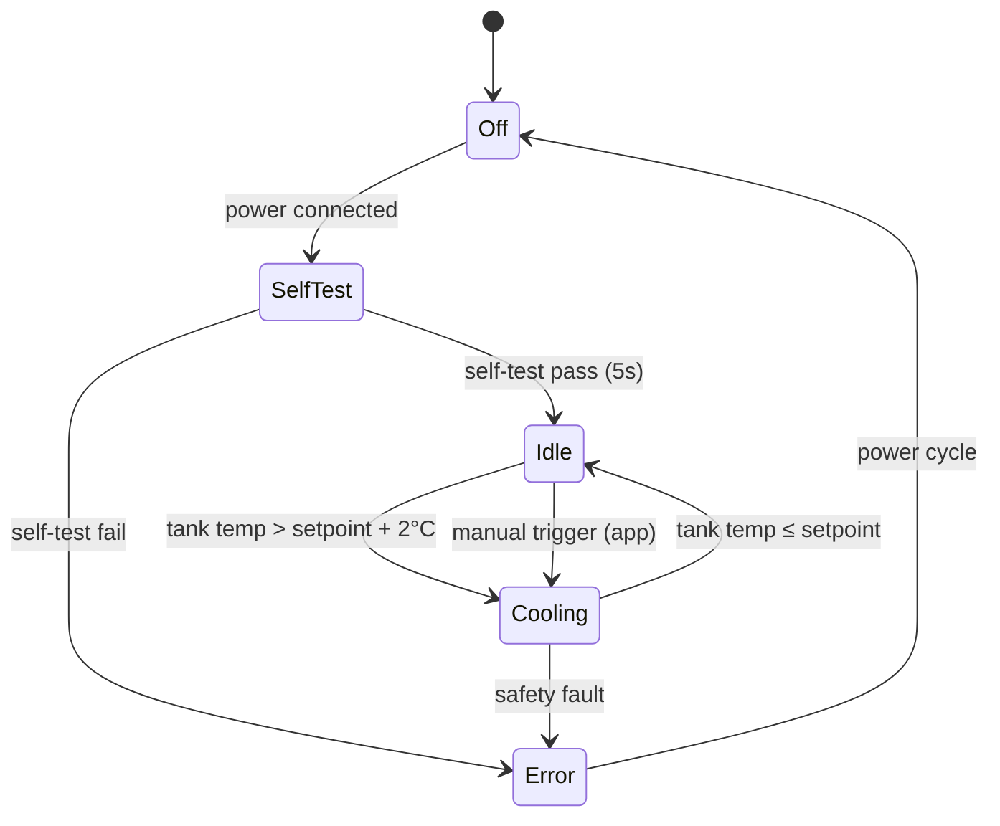

# System Description: AquaChill

| Field | Value |
|-------|-------|
| Version | 0.1 |
| Date | 2026-02-24 |
| Author | (example) |
| Status | Draft |
| Related docs | high_level_design_example.md |

---

## 1. Product Vision and Context

**Product statement:**
For apartment dwellers and small-office workers, AquaChill is a countertop water chiller that cools tap water from 20°C to 4°C in under 90 seconds using a miniature vapor-compression loop, stores 1.5L in an insulated tank, and connects via BLE to a companion app for temperature control and filter tracking. Unlike bulky bottled water coolers, it fits next to a kettle, uses tap water, and costs nothing per glass.

**Problem:**
Cold drinking water in homes and small offices today means either a fridge pitcher (slow to chill, takes shelf space, needs refilling) or a floor-standing water cooler (expensive, bulky, requires bottle delivery). AquaChill sits on the counter, chills on demand, and tracks its own filter life — no bottles, no fridge space, no waiting.

**Deployment context:**
- Environment: Indoor — kitchen countertop or office break room
- Setting: Home, small office (2–15 people)
- User type: Consumer — the person who buys it is the primary user
- Installation: Self-installed — place on counter, fill tank, plug in, pour
- Expected lifespan: 3–5 years (compressor + sealed refrigerant loop rated for 5+ years continuous duty)

---

## 2. User Scenarios

### Scenario 1: Morning Routine
**Persona:** Lena, 32, lives in a one-bedroom apartment. No fridge space for a pitcher.
**Situation:** Wakes up, wants cold water. Tank was filled the night before.
**Action:** Walks to the kitchen. AquaChill's blue LED indicates water is at 4°C (the compressor re-chilled overnight as water warmed past 6°C). Lena pushes the dispense lever, fills a glass.
**Outcome:** Cold water immediately, no waiting. The flow sensor registers 250 mL dispensed, decrementing the filter life counter.

### Scenario 2: Office Refill Cycle
**Persona:** Mark, office manager. AquaChill serves a 10-person team.
**Situation:** The tank runs low mid-afternoon. Mark lifts the lid and pours in tap water from a jug.
**Action:** The NTC thermistor detects the water temperature has risen to 18°C. The compressor starts automatically (blue LED pulses). In ~90 seconds, water reaches the 4°C setpoint. The compressor stops, LED goes solid blue.
**Outcome:** No button press needed. The PID loop handles the entire chill cycle automatically.

### Scenario 3: First Use — Unboxing to Cold Water
**Persona:** A buyer who just received the unit.
**Situation:** Unboxes the AquaChill, reads the quick-start card.
**Action:** Places unit on counter. Plugs in 24V adapter. Fills tank with tap water. The unit powers on — white LED blinks during a 5-second self-test (thermistor check, compressor check, fan check). Self-test passes — blue LED pulses, compressor starts. While waiting the 90 seconds, the user downloads the companion app, which discovers the device via BLE and walks through pairing (tap to confirm a 6-digit code shown on-screen, matched by a blink pattern on the unit's LEDs). App shows a live temperature readout dropping in real-time.
**Outcome:** Cold water in under 2 minutes from plugging in. App paired and functional.

### Scenario 4: Filter Replacement
**Persona:** Lena, 5 months after purchase.
**Situation:** App sends a push notification: "AquaChill filter at 10% — order a replacement." The unit's LED also blinks amber during dispense.
**Action:** Lena orders a replacement filter from the app (deep link to the store). When it arrives, she opens the filter bay on the back, pulls the old cartridge, clicks in the new one. The app detects the filter change (flow sensor sees a brief pressure transient on first pour) and resets the counter. Alternatively, Lena long-presses the physical button (3s) to reset manually.
**Outcome:** Filter tracked automatically. No guessing when to replace.

### Scenario 5: Error — Thermistor Failure
**Persona:** Mark, office.
**Situation:** The tank NTC thermistor develops an open circuit (wire fatigue).
**Action:** The MCU reads an out-of-range ADC value on the tank temperature channel. Firmware enters safe mode: compressor off, red LED solid, BLE broadcasts an error code. The app shows "Temperature sensor error — service required" with a support link.
**Outcome:** The compressor never runs without valid temperature feedback. No overcooling, no freeze risk. The unit is safe but non-functional until repaired.

---

## 3. System Architecture

```mermaid
graph TD
    subgraph Device["AquaChill Unit"]
        NTC1[Tank NTC Thermistor]
        NTC2[Condenser NTC Thermistor]
        FLOW[Flow Sensor]
        MCU[nRF52832<br/>PID, state machine,<br/>BLE GATT server]
        COMP[Compressor Driver<br/>+ Variable-Speed Compressor]
        FAN[Condenser Fan]
        LED[Status LEDs ×3]
        BTN[Button]
        PSU[24V PSU Brick<br/>+ On-board 3.3V LDO]
    end

    subgraph User
        APP[Companion App<br/>iOS + Android]
    end

    NTC1 -->|ADC (1 Hz)| MCU
    NTC2 -->|ADC (1 Hz)| MCU
    FLOW -->|GPIO pulse interrupt| MCU
    BTN -->|GPIO interrupt| MCU
    MCU -->|PWM 25kHz + enable GPIO| COMP
    MCU -->|PWM 25kHz| FAN
    MCU -->|3× GPIO| LED
    MCU <-->|BLE 5.0 GATT| APP
    PSU --> MCU
    PSU --> COMP
    PSU --> FAN
```

**Architecture narrative:**

AquaChill is a mains-powered, BLE-connected appliance. The core control loop is a PID controller running on an nRF52832 MCU that reads two NTC thermistors (tank water and condenser) at 1 Hz, computes compressor speed via PWM, and manages the condenser fan speed to maintain the target water temperature.

The signal chain: NTC thermistors → ADC → Steinhart-Hart conversion → PID controller → PWM output to compressor driver and fan. The flow sensor provides dispense event detection (GPIO pulse counting) for filter life tracking. A single button handles power/reset, and three LEDs indicate status (blue = cold/ready, pulsing blue = cooling, amber = filter low, red = error).

BLE connectivity is handled by the nRF52832's SoftDevice (S132). The MCU exposes a custom GATT service with characteristics for: current temperature (read/notify), target temperature (read/write), filter life remaining (read/notify), and cumulative energy usage (read). The companion app connects over BLE to display status, adjust the setpoint, and send filter replacement reminders. There is no cloud backend — all data stays between the device and the phone. If a cloud dashboard is wanted in V2, the app can relay data, but the device itself never needs internet.

Power comes from an external 24V/3A AC-DC adapter. An on-board LDO regulates 3.3V for the MCU, thermistors, and flow sensor. The compressor and fan run directly on 24V.

---

## 4. Subsystem Descriptions

### 4.1 Hardware Subsystem

**MCU / SoC:**
- Part: nRF52832 (QFAA — 512 KB flash, 64 KB RAM)
- Selection rationale: Proven BLE 5.0 stack (SoftDevice S132), sufficient ADC channels (2 for NTCs), hardware PWM (2 channels for compressor + fan), GPIO for flow sensor and LEDs. The BLE stack is mature and well-documented, reducing firmware risk for app communication. ESP32 was considered but its BLE stack is less reliable for GATT server use cases.
- Key specs: 64 MHz Cortex-M4, 512 KB flash, 64 KB RAM, 8-channel 12-bit ADC, 4× PWM (hardware), BLE 5.0 via SoftDevice

**Sensors:**

| Sensor | Measures | Interface | Sample Rate | Key Spec |
|--------|----------|-----------|-------------|----------|
| NTC thermistor ×2 (10kΩ at 25°C, B=3950) | Tank water temperature, condenser temperature | ADC with voltage divider (10kΩ reference resistor) | 1 Hz | ±0.5°C accuracy after Steinhart-Hart calibration, range -10°C to 80°C |
| Flow sensor (YF-S201 or equivalent hall-effect) | Water volume dispensed | GPIO interrupt (pulse counting, ~450 pulses/L) | Event-driven | ±5% volume accuracy, 1–30 L/min range |

**Actuators:**

| Actuator | Function | Interface | Key Spec |
|----------|----------|-----------|----------|
| Miniature variable-speed compressor (e.g., Danfoss BD35K or similar R134a micro-compressor) | Vapor-compression cooling — reject heat from tank water to ambient via condenser | 24V DC, MCU PWM via MOSFET driver (25 kHz, 30–100% duty for speed control) + enable GPIO | ~80–120W cooling capacity, 40–55 dBA at full speed |
| Condenser fan (60mm axial, 24V) | Airflow across condenser coils | 24V DC, MCU PWM (25 kHz) | ~25 CFM at full speed, <30 dBA standalone |

**Physical UI elements:**
- Buttons: 1× tactile pushbutton (front panel). Short press = wake/display status blink. Long press (3s) = reset filter counter. Long press (8s) = factory reset (clear BLE bonds, reset filter counter).
- LEDs: 3× (blue, amber, red) on front panel. Blue solid = water at setpoint. Blue pulsing = cooling in progress. Amber blink during dispense = filter life <15%. Red solid = error (compressor or sensor fault).
- Display: None — LED status + app provides all feedback.
- Other: Dispense lever (mechanical, spring-return) actuates a food-grade silicone valve. No electronic dispense control.

**PCB strategy:**
- Single board, 4-layer FR4, ~60 × 40 mm
- Layer stack: signal / GND / power (24V + 3.3V) / signal
- Top side: nRF52832 (QFN48 7×7mm), BLE antenna trace (inverted-F, with keep-out zone along board edge), MOSFET compressor driver, MOSFET fan driver, 3.3V LDO (AP2112K), LED drivers
- Bottom side: NTC voltage divider networks, flow sensor connector, decoupling capacitors, debug header
- Antenna: PCB trace antenna along one edge. Keep-out zone: 10mm clearance from ground plane and components. Board positioned inside enclosure with antenna edge facing outward (away from metal tank).
- Connectors: 2-pin JST for each NTC, 3-pin JST for flow sensor, 2-pin for compressor, 2-pin for fan, barrel jack for 24V input, 2×5 SWD header for programming/debug

**Enclosure:**
- Outer shell: ABS injection-molded, matte white, ~190 × 240 × 340 mm
- Inner tank: 1.5L stainless-steel, 25mm closed-cell foam insulation wrap
- Compressor bay: rear compartment with ventilation slots for condenser airflow
- Top: Removable lid for filling, food-grade silicone seal
- Front: Dispense lever, LED window, button
- Back: Filter bay (slide-out cartridge), ventilation grille
- Bottom: Rubber feet (4×), 24V barrel jack recess
- Weight: ~4.5 kg empty (tank 0.4 kg, compressor + condenser 2.2 kg, enclosure 1.2 kg, PCB + wiring 0.3 kg, insulation 0.4 kg)

### 4.2 Firmware Subsystem

**Architecture:**
- OS/framework: Zephyr RTOS on nRF52832 with Nordic SoftDevice S132 for BLE
- Rationale: The PID loop, BLE stack, flow counting, and LED management are concurrent tasks with different timing requirements. Zephyr provides preemptive threads, timer APIs, and native nRF52 + SoftDevice integration. Bare-metal would work but makes BLE event handling fragile when mixed with real-time PID.

**Major modules:**

| Module | Responsibility | Inputs | Outputs |
|--------|---------------|--------|---------|
| Temperature reader | Sample 2× NTC ADC channels at 1 Hz, apply Steinhart-Hart conversion, output calibrated °C values | ADC raw values | Tank temp (°C), condenser temp (°C) |
| PID controller | Compute compressor speed to maintain tank temp at setpoint. Anti-windup, derivative filter. Output clamped to 30–100% duty cycle (compressor minimum speed is 30%). | Tank temp, setpoint | Compressor PWM duty cycle |
| Compressor manager | Translate PID output to PWM + enable GPIO. Enforce minimum on-time (60s), minimum off-time (120s) to protect compressor. Manage soft-start ramp (0→30% over 2s). | PID duty cycle | PWM signal, enable GPIO |
| Fan controller | Set fan speed proportional to compressor speed. Fan runs for 30s after compressor stops (condenser cooldown). | Compressor state + speed | Fan PWM |
| Flow counter | Count GPIO pulses from flow sensor. Accumulate total volume dispensed. Decrement filter life. Detect dispense start/stop events. | GPIO interrupts | Volume dispensed (mL), filter life remaining (L), dispense event flag |
| BLE GATT server | Expose custom service (UUID prefix 0xAC01): tank_temp (read/notify, 1 Hz), target_temp (read/write), filter_life (read/notify), energy_kwh (read). Handle connection, pairing (passkey), reconnection. | All sensor data, app write commands | BLE advertisements, GATT notifications, setpoint updates |
| LED manager | Drive 3 LEDs based on system state. Pulsing effects via hardware PWM or timer-based toggle. | System state flags | GPIO outputs |
| Safety monitor | Check for: tank temp out of range (<-2°C or >30°C), condenser temp >70°C, ADC open/short circuit. On fault: stop compressor, set red LED, broadcast BLE error code. | All temperature readings, ADC diagnostics | Compressor kill signal, error flag, BLE error code |
| Filter tracker | Track cumulative volume through filter (persisted in flash). Trigger amber LED and BLE notification at 85% and 95% of rated filter life (e.g., 1000L). Reset on long-press or app command. | Flow counter total, button events, BLE write | Filter life %, alert flags |
| Energy estimator | Estimate energy consumption from compressor duty cycle × rated power × elapsed time. Cumulative kWh stored in flash. | Compressor state + duty cycle, RTC | Cumulative kWh |

**OTA update strategy:**
- Method: BLE DFU using Nordic's nRF Connect SDK bootloader (MCUboot). Dual-bank (A/B) image slots in flash.
- Delivery: App-mediated — companion app downloads firmware image from a hosted URL, transfers to device via BLE DFU service.
- Rollback: Automatic — if new image fails validation (CRC + signature check) or doesn't confirm within 60s of boot, MCUboot reverts to previous slot.
- Signing: Ed25519 signature on firmware image. Public key burned into bootloader at factory.

**On-device processing:**
- Steinhart-Hart conversion: raw ADC → resistance → temperature (°C). Coefficients calibrated per-unit at factory test.
- PID control: proportional + integral + derivative with anti-windup. Tuning parameters stored in flash, adjustable via BLE (hidden debug characteristic, not exposed in consumer app).
- Flow pulse counting + debounce (10ms window)
- Energy estimation: compressor_duty × rated_watts × elapsed_seconds, accumulated over time

All processing is local. The BLE link sends summarized data (current temp, filter life %, kWh) to the app. No raw sensor data leaves the device. No cloud dependency.

**Boot-to-ready:** ~3 seconds (power-on → Zephyr init → SoftDevice init → self-test → BLE advertising → PID loop active)

### 4.3 Mobile / Companion App Subsystem

**Platform:** iOS + Android — React Native with react-native-ble-plx for BLE

**Core screens and flows:**
1. **Onboarding / Pairing:** BLE scan → select AquaChill → passkey pairing (6-digit code displayed in app, confirmed by LED blink pattern on device) → connection established
2. **Dashboard:** Live tank temperature (large number), target temperature (adjustable slider, 2°C–10°C), compressor state indicator (cooling / idle), filter life bar
3. **Filter management:** Filter life remaining (liters and estimated days), replacement reminder settings, "Order replacement" deep link, manual reset button
4. **Energy stats:** Daily/weekly/monthly kWh chart, estimated cost per period (user sets $/kWh rate)
5. **Settings:** Temperature unit (°C/°F), notification preferences (filter alerts, error alerts), device info (firmware version, serial), factory reset

**Device communication:**
- Protocol: BLE 5.0 GATT with custom service

| Characteristic | UUID | Purpose | Direction | Format |
|---------------|------|---------|-----------|--------|
| Tank Temperature | 0xAC01-0001 | Current water temperature | Read / Notify (1 Hz) | int16, 0.1°C resolution |
| Target Temperature | 0xAC01-0002 | Desired setpoint | Read / Write | int16, 0.1°C resolution |
| Filter Life | 0xAC01-0003 | Remaining filter capacity | Read / Notify (on change) | uint16, liters remaining |
| Energy Usage | 0xAC01-0004 | Cumulative kWh | Read | uint32, 0.01 kWh resolution |

**Offline behavior:** App caches the last-known state. When disconnected, the dashboard shows stale data with a "Disconnected" banner and timestamp. Reconnection is automatic when the phone is in BLE range. No cloud fallback — the app only talks to the device directly.

### 4.4 Cloud / Backend Subsystem

**Not applicable for V1.** No cloud. No accounts. No data collection.

The companion app talks directly to the device over BLE. If a V2 cloud dashboard is needed (e.g., fleet management for office deployments), the app can relay data via HTTPS to a simple API — but the device firmware will not change. The nRF52832 has no Wi-Fi; any cloud path goes through the phone.

---

## 5. Interfaces

### Internal Interfaces (within device)

| Interface | From | To | Protocol | Data | Rate | Notes |
|-----------|------|----|----------|------|------|-------|
| Tank temp | NTC thermistor #1 | MCU ADC CH0 | Analog voltage (voltage divider, 0–3.3V) | Temperature-proportional voltage | 1 Hz (firmware-sampled) | 10kΩ NTC + 10kΩ reference resistor |
| Condenser temp | NTC thermistor #2 | MCU ADC CH1 | Analog voltage (voltage divider, 0–3.3V) | Temperature-proportional voltage | 1 Hz | Same circuit as tank NTC |
| Flow pulses | Hall-effect flow sensor | MCU GPIO (P0.13) | Active-low pulse, one per ~2.2 mL | Pulse count | Event-driven (up to ~220 pulses/s at max flow) | Debounced in firmware (10ms) |
| Compressor enable | MCU GPIO (P0.20) | N-channel MOSFET gate | Logic-level GPIO (3.3V) | On/off | State change only | MOSFET switches 24V to compressor enable line |
| Compressor speed | MCU PWM (P0.21) | Compressor driver input | 25 kHz PWM, 30–100% duty | Speed setpoint | Updated at 1 Hz (PID output) | Below 30% duty = compressor off (minimum speed limit) |
| Fan speed | MCU PWM (P0.22) | Fan driver (MOSFET) | 25 kHz PWM, 0–100% duty | Speed setpoint | Updated at 1 Hz | Tracks compressor speed + 30s cooldown |
| LEDs | MCU GPIO (P0.15, P0.16, P0.17) | LED anodes via current-limiting resistors | Logic-level GPIO | On/off/blink pattern | State-driven | Blue, amber, red |
| Button | Tactile switch | MCU GPIO (P0.18) | Active-low with internal pull-up | Press/release | Event-driven (interrupt) | Debounced in firmware (20ms) |
| Power 24V | Barrel jack | Compressor, fan, LDO input | Direct 24V DC rail | — | — | 3A max (compressor peak) |
| Power 3.3V | LDO (AP2112K) output | MCU, NTCs, flow sensor, LEDs | Regulated 3.3V rail | — | — | 300mA max (MCU peak ~15mA, rest negligible) |

### External Interfaces

| Interface | From | To | Protocol | Data | Rate | Notes |
|-----------|------|----|----------|------|------|-------|
| BLE | MCU (nRF52832 radio) | Companion app | BLE 5.0, GATT server, custom service 0xAC01 | Temp, setpoint, filter life, energy | Notify at 1 Hz (temp), on-change (filter, energy) | Advertising interval: 500ms (idle), 100ms (first 30s after boot for fast pairing) |
| Mains power | Wall outlet | 24V AC-DC adapter | IEC C8 inlet → 24V DC barrel plug | — | — | 24V / 3A, 72W max |

### Physical Connectors

| Connector | Purpose | Type | Notes |
|-----------|---------|------|-------|
| DC barrel jack (5.5×2.1mm) | 24V power input | Panel-mount, rear recess | Strain-relieved, positive center |
| SWD header (2×5 pin, 1.27mm) | Factory programming + debug | Board-mount, accessible through base plate removal | Not user-accessible. Tag-Connect alternative for production. |
| JST-PH 2-pin × 3 | NTC thermistors (×2), compressor | Board-to-wire | Keyed, color-coded |
| JST-PH 3-pin × 2 | Flow sensor, fan | Board-to-wire | Keyed |
| Filter bay connector | Water path, filter cartridge | Proprietary push-fit (bayonet quarter-turn) | Food-grade, tool-free replacement |

---

## 6. Power Architecture

**Power source:**
- Type: Mains AC via external 24V/3A AC-DC adapter (72W)
- Capacity: N/A (mains-powered, not battery)
- Charging: N/A

**Power states:**



| State | MCU | Compressor | Fan | BLE | LEDs | Typical Duration |
|-------|-----|-----------|-----|-----|------|----------------:|
| Off | Off | Off | Off | Off | Off | Until plugged in |
| SelfTest | Active (checking sensors, compressor relay, fan) | Brief test pulse (0.5s) | Brief test pulse (0.5s) | Advertising | White blink | 5 seconds |
| Idle | Active (sampling NTCs at 1 Hz, serving BLE) | Off | Off | Advertising / Connected | Blue solid | Minutes to hours |
| Cooling | Active (PID loop running) | Variable speed (30–100% duty) | Proportional to compressor | Advertising / Connected | Blue pulsing | 60–120 seconds per cycle |
| Error | Active (error reporting) | Off (killed by safety monitor) | Off | Advertising error code | Red solid | Until power cycle |

**Power budget (idle — dominant state for mains device, relevant for energy cost):**

| Component | Current (3.3V rail) | Current (24V rail) | Power |
|-----------|-------------------:|-------------------:|------:|
| MCU (active, BLE advertising) | 8 mA | — | 26 mW |
| NTC circuits (2×) | 0.3 mA | — | 1 mW |
| Flow sensor (idle) | 5 mA | — | 17 mW |
| LEDs (1 solid) | 10 mA | — | 33 mW |
| Compressor | — | 0 | 0 |
| Fan | — | 0 | 0 |
| LDO quiescent | — | 1.5 mA | 36 mW |
| **Total idle** | **~23 mA** | **~1.5 mA** | **~0.1 W** |

**Power budget (cooling — active chilling):**

| Component | Current (3.3V rail) | Current (24V rail) | Power |
|-----------|-------------------:|-------------------:|------:|
| MCU (active, PID + BLE) | 12 mA | — | 40 mW |
| NTC circuits (2×) | 0.3 mA | — | 1 mW |
| Flow sensor | 5 mA | — | 17 mW |
| LEDs (1 pulsing) | 5 mA avg | — | 17 mW |
| Compressor (variable speed) | — | 2–4 A | 48–96 W |
| Fan | — | 0.1–0.3 A | 2.4–7.2 W |
| LDO quiescent | — | 1.5 mA | 36 mW |
| **Total cooling** | **~22 mA** | **2.1–4.3 A** | **50–103 W** |

**Energy estimate:**
Usage profile: 10 dispense events per day → ~5 chill cycles of 90s each → 7.5 minutes of active cooling per day at ~80W average = 10 Wh/day active + ~2.4 Wh/day idle (0.1W × 24h) = ~12.4 Wh/day = **~4.5 kWh/year**. At $0.15/kWh = **$0.68/year** operating cost.

---

## 7. Connectivity Architecture

**Primary connectivity:**
- Technology: BLE 5.0 (nRF52832 SoftDevice S132)
- Rationale: Low firmware complexity (proven Nordic stack), no Wi-Fi credential management, instant pairing, phone is always nearby for a countertop appliance. Wi-Fi was considered but adds $3–5 BOM (separate module or ESP32 swap), requires Wi-Fi onboarding flow, and there's no cloud backend to talk to in V1.

**Fallback / secondary connectivity:** None. If BLE is unavailable, the device operates fully standalone — the app is a "nice to have" for temperature adjustment and filter tracking, not required for core function (chilling water).

**Protocol stack:**

| Layer | Technology |
|-------|-----------|
| Physical | BLE 5.0 (2.4 GHz, 1 Mbps PHY) |
| Link | Nordic SoftDevice S132 (handles L2CAP, ATT, GAP, GATT) |
| Application | Custom GATT service (4 characteristics, see §4.3) |
| Security | BLE Secure Connections (LE Secure Connections pairing, passkey entry, AES-CCM encryption) |

**Data transmission:**
- Frequency: Tank temperature notified at 1 Hz when connected; filter life and energy on change only
- Payload: 2–4 bytes per characteristic (int16 or uint32)
- Daily volume: Negligible — ~86,400 notifications/day × 2 bytes = ~170 KB/day if app stays connected continuously. In practice, app connects for a few minutes at a time.

**Provisioning and pairing:**
1. Device powers on → starts BLE advertising (device name "AquaChill-XXXX", last 4 of MAC)
2. User opens app → app scans for "AquaChill-*" devices → selects device
3. App initiates BLE Secure Connections pairing → device generates 6-digit passkey → LED blinks the digits (e.g., 3 blinks = "3") → user enters passkey in app
4. Pairing complete → bond stored on both sides → automatic reconnection on future app opens

**Offline behavior:**
The device is fully functional without the app. The PID loop, compressor control, filter tracking, and LED status all work independently. The app is only needed to: change the temperature setpoint (default 4°C is fine for most users), view filter life (LED amber blink provides basic indication), and view energy stats. If the phone is out of range, the device continues operating with last-known setpoint.

---

## 8. Key Technical Decisions and Trade-offs

### Decision 1: BLE-Only Connectivity (No Wi-Fi, No Cloud)
- **Options considered:** (A) BLE only, no cloud. (B) Wi-Fi + cloud dashboard. (C) BLE + Wi-Fi (phone relays to cloud).
- **Chosen:** A — BLE only
- **Rationale:** The device sits on a kitchen counter, always within BLE range of the user's phone. Wi-Fi adds $3–5 BOM (module or MCU swap to ESP32), requires a Wi-Fi onboarding flow (SSID/password entry — friction), and demands a cloud backend (servers, accounts, privacy policy, ongoing cost). For V1, all user-facing features (temp display, setpoint change, filter tracking) work over BLE with no cloud dependency.
- **Consequences:** No remote monitoring (can't check water temp from the office). No fleet management for multi-unit office deployments. No automatic firmware update push — OTA requires the app in BLE range.
- **Risks:** Office customers may want a dashboard. Mitigation: V2 can add Wi-Fi via an ESP32-C3 co-processor or MCU swap, with the app as a cloud relay. The BLE GATT interface stays the same.

### Decision 2: nRF52832 vs. ESP32-S3
- **Options considered:** (A) nRF52832 ($3.50, BLE only, proven SoftDevice). (B) ESP32-S3 ($2.50, BLE + Wi-Fi, ESP-IDF BLE stack).
- **Chosen:** A — nRF52832
- **Rationale:** BLE reliability is more important than Wi-Fi capability for V1. Nordic's SoftDevice has years of production use in consumer products; ESP32's BLE GATT server has known stability issues under load (connection drops, characteristic notification failures in community reports). The $1 premium is worth the firmware reliability gain.
- **Consequences:** No Wi-Fi path without a hardware change (add co-processor or swap MCU). Higher unit cost.
- **Risks:** If V2 needs Wi-Fi, the nRF52832 can't provide it — requires board respin. Mitigation: PCB has footprint space reserved for a future ESP32-C3 co-processor connected via UART.

### Decision 3: Variable-Speed Compressor vs. On/Off
- **Options considered:** (A) On/off compressor (simpler, cheaper, ~$5 less). (B) Variable-speed compressor with PWM driver.
- **Chosen:** B — Variable-speed
- **Rationale:** Noise is the top user complaint for countertop chillers. Variable-speed allows the PID loop to throttle down as water approaches setpoint, reducing noise in the last 30% of the chill cycle (when the user is most likely standing nearby, waiting). On/off would run at full speed until cutoff — louder and less efficient. The $5 additional cost (compressor + driver) is justified at the $149–179 retail price.
- **Consequences:** More complex firmware (PID must output a continuous duty cycle, not just on/off). Compressor requires minimum speed (30% duty) — below that, it must be off. Adds minimum on-time (60s) and off-time (120s) constraints.
- **Risks:** PID tuning for variable-speed compressor is harder than on/off hysteresis. Mitigation: start with conservative gains and tune on prototype units. The on/off fallback is always available as a firmware change.

### Decision 4: React Native App vs. Native
- **Options considered:** (A) React Native + react-native-ble-plx. (B) Native Swift (iOS) + Kotlin (Android).
- **Chosen:** A — React Native
- **Rationale:** One codebase, faster V1 delivery. react-native-ble-plx handles BLE GATT adequately for the simple 4-characteristic service. The app is a status display + settings screen, not a complex real-time interface.
- **Consequences:** BLE edge cases (background reconnection on iOS, Android battery optimization killing BLE scans) are harder to debug in React Native than native. May need native modules for advanced BLE features in V2.
- **Risks:** iOS background BLE limitations may prevent reliable background filter alerts. Mitigation: the device also indicates filter status via amber LED — the app notification is supplementary.

---

## 9. Constraints

### Regulatory
- Required certifications: UL (US), CE (EU), FCC Part 15 (unintentional radiator — nRF52 BLE is covered by the module's existing FCC ID), Bluetooth SIG (BLE use)
- UL 197 / IEC 60335-2-75 (commercial dispensing machines) or UL 399 / IEC 60335-2-24 (refrigerating appliances) — need to confirm which applies for a countertop chiller
- NSF/ANSI 42 or 53 for the water filter cartridge (lead + taste/odor reduction)
- Target markets: US, EU, UK, Canada, Australia
- RoHS + WEEE compliance

### Environmental
- Operating temperature: 10°C to 38°C ambient (indoor only — performance degrades above 35°C as condenser can't reject heat efficiently)
- Storage temperature: -10°C to 50°C
- Ingress protection: IPX0 (no water resistance rating — indoor countertop, splashes expected but not submersion). Internal electronics protected by enclosure design.
- Vibration: Compressor generates vibration — rubber isolation mounts on compressor + rubber feet on enclosure

### Cost

| Item | Target | Notes |
|------|-------:|-------|
| BOM (at 5k units) | <$65 | |
| BOM (at 20k units) | <$50 | Volume pricing on compressor, nRF52, enclosure tooling amortized |
| Retail price | $149–179 | Premium countertop appliance positioning |
| Target gross margin | 55–65% | At retail, after COGS |

**BOM estimate (5k units):**

| Component | Est. Cost |
|-----------|----------:|
| nRF52832 (QFN48) | $3.50 |
| NTC thermistors ×2 + reference resistors | $0.40 |
| Flow sensor (YF-S201 or equiv) | $2.50 |
| Miniature compressor (R134a, variable-speed) | $18.00 |
| Compressor driver (MOSFET + gate driver) | $1.50 |
| Condenser + evaporator (copper tube + fin assembly) | $6.00 |
| Condenser fan (60mm, 24V) | $1.50 |
| Stainless-steel tank (1.5L) | $4.00 |
| Tank insulation (closed-cell foam wrap) | $1.00 |
| Water filter cartridge (activated carbon, initial) | $3.00 |
| Dispense valve (food-grade silicone) | $1.50 |
| PCB (60×40mm, 4-layer) + assembly | $3.00 |
| LDO + passives + connectors | $1.50 |
| LEDs + button | $0.30 |
| 24V/3A AC-DC adapter (external) | $5.00 |
| Enclosure (injection-molded ABS, multi-part) | $6.00 |
| Tubing + fittings (food-grade silicone) | $1.50 |
| Packaging | $2.00 |
| Assembly + test | $4.00 |
| **Total COGS** | **~$66.20** |

Note: Slightly over the $65 target at 5k. At 20k, compressor (-$3), enclosure (-$2), and assembly (-$1) bring it under $60. Alternatively, switching from nRF52832 to ESP32-C3 saves $1.50 but introduces BLE risk (see Decision 2).

### Manufacturing
- Target annual volume: 5,000 (year 1), 20,000 (year 2)
- Assembly: SMT for PCB (single reflow pass), manual assembly for mechanical components (compressor mounting, tubing connections, tank installation, enclosure snap-fit)
- Refrigerant charging: requires certified charging station — outsource to compressor module supplier (pre-charged sealed unit preferred)
- Test requirements: Functional test (power on → self-test → chill cycle verification → BLE pairing test), leak test (refrigerant loop), electrical safety (hi-pot), firmware programming via SWD jig
- Filter flow test: verify no leaks, proper flow rate

### Schedule
- Key milestones: Thermal prototype (M1–M2), PCB v1 + firmware alpha (M3), Enclosure prototype (M4), BLE app beta (M4), Integrated prototype (M5), Certification submission (M6), Production units (M8)
- Hard deadlines: None identified
- Certification: UL/CE for mains appliance — 8–12 weeks, $10–20K. FCC covered by nRF52 module's existing certification.

### Dependencies
- Compressor module: sourced from Danfoss, Secop, or similar — 8–12 week lead time for samples, longer for production quantities
- nRF52832 module or chip: Nordic distributor (Digikey, Mouser) — standard availability
- React Native BLE library (react-native-ble-plx): open-source, MIT license, active maintenance
- NSF-certified filter cartridge: sourced from filter OEM — need to establish supply agreement

---

## 10. Open Questions and Risks

| # | Question / Risk | Category | Impact | Owner | Target Date | Status |
|---|----------------|----------|--------|-------|-------------|--------|
| 1 | Thermal performance: can the selected micro-compressor hit 20°C → 4°C in 90s for a full 1.5L tank? Depends on compressor capacity, condenser efficiency, and insulation. Needs thermal prototype. | Technical | H | Mech Lead | M2 | Open |
| 2 | Compressor noise: can we hit <45 dBA at 1m with vibration isolation + variable-speed operation? The compressor alone may be 50+ dBA. Needs acoustic testing on prototype. | Technical | H | Mech Lead | M3 | Open |
| 3 | BLE antenna performance inside enclosure: the nRF52 PCB antenna is near a steel tank and compressor motor. Range and reliability may suffer. Needs RF testing in enclosure prototype. | Technical | M | HW Lead | M4 | Open |
| 4 | Regulatory path: confirm whether UL 197 or UL 399 applies. This affects test requirements, timeline, and cost. | Regulatory | H | Quality Lead | M1 | Open |
| 5 | Filter cartridge sourcing: need NSF 42/53 certified cartridge that fits the enclosure form factor. Standard pitcher filters may not fit — may need custom cartridge design, which adds $5–10K tooling. | Cost / Schedule | M | Supply Chain | M2 | Open |
| 6 | Food-grade materials certification: all water-contact surfaces (tank, tubing, valve, filter housing) must meet FDA 21 CFR or EU 10/2011. Need material certificates from each supplier. | Regulatory | M | Quality Lead | M3 | Open |
| 7 | PID tuning for variable-speed compressor: the thermal dynamics (water mass + insulation + ambient temp variation) make this a non-trivial control problem. Needs iterative tuning on prototype with different water volumes and ambient temperatures. | Technical | M | FW Lead | M3 | Open |

---

## Appendix

### Glossary

| Term | Definition |
|------|-----------|
| PID | Proportional-Integral-Derivative controller — a feedback control algorithm that adjusts compressor speed based on the difference between measured and target water temperature |
| SoftDevice | Nordic Semiconductor's pre-compiled BLE protocol stack for nRF52 series. Runs as a separate binary alongside application firmware. |
| GATT | Generic Attribute Profile — the BLE standard for exposing structured data via services and characteristics |
| Setpoint | The target water temperature configured by the user (default 4°C, adjustable 2–10°C via app) |
| Chill cycle | One cooling event: compressor starts → water reaches setpoint → compressor stops. Typically 60–120 seconds depending on starting temperature and water volume. |
| Filter life | The remaining capacity of the activated carbon filter, measured in liters of water passed through it. Tracked by the flow sensor. |
| Duty cycle | The percentage of time the compressor runs within a PWM period. 30% = minimum speed, 100% = full speed. |

### Reference Documents

| Document | Location | Relevance |
|----------|----------|-----------|
| nRF52832 Product Specification | Nordic Semiconductor | MCU specs, ADC, PWM, SoftDevice integration |
| Danfoss BD35K compressor datasheet | Danfoss | Compressor specs, electrical requirements, cooling capacity curves |
| AP2112K LDO datasheet | Diodes Inc | 3.3V regulator specs, dropout voltage, thermal performance |
| NSF/ANSI 42 standard | NSF International | Water filter certification requirements |
| react-native-ble-plx documentation | GitHub | BLE library API for companion app |

### Revision History

| Version | Date | Author | Changes |
|---------|------|--------|---------|
| 0.1 | 2026-02-24 | (example) | Initial draft |
