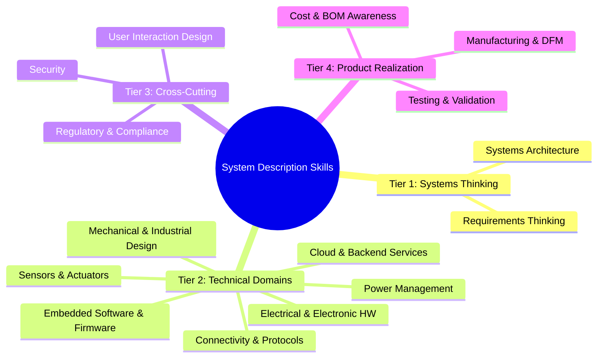

# Skills Map: Writing System Descriptions for IoT Products

This reference identifies the competency areas you need to write architecture-level system descriptions for IoT and smart connected devices. It is organized into four tiers, from foundational thinking to production realities.

Use this as a self-assessment. You don't need deep expertise in every area — but you need enough understanding to make informed architectural choices and ask the right questions of specialists.

---

## Tier 1: Systems-Level Thinking

These are the foundational skills. Without them, you produce feature lists, not system descriptions.

### 1. Systems Architecture and Decomposition

Breaking a product into subsystems, defining boundaries, and identifying interfaces between blocks.

**What it covers:**
- Block diagram design at multiple abstraction levels
- Subsystem boundary definition (what goes where)
- Interface identification between blocks
- Data flow and control flow mapping
- Deciding what runs on-device vs. in the cloud vs. in an app

**Why it matters for system descriptions:**
This IS the core skill. A system description is an architecture document. Every section in the template maps to an architectural element — subsystems, interfaces, power states, connectivity paths. If you can draw and explain the block diagram, you can write the system description.

**Self-assessment:**
- Can you draw a block diagram for a product you haven't built before?
- Can you explain why two functions belong in the same subsystem or in different ones?
- Can you identify which interfaces carry the most technical risk?

### 2. Requirements Thinking

Distinguishing needs from solutions, and tracing from user scenarios to technical decisions.

**What it covers:**
- Separating the "what" (requirement) from the "how" (implementation)
- Functional vs. non-functional requirements (performance, reliability, security)
- Traceability: linking every architectural choice back to a user need or constraint
- Prioritization: what is essential vs. what is desirable

**Why it matters for system descriptions:**
The system description bridges user needs and technical architecture. Every subsystem, interface choice, and power mode should trace back to a "why." Without requirements thinking, you produce a technical description that may solve the wrong problem.

**Self-assessment:**
- Can you rewrite "use BLE 5.0" as a requirement? (e.g., "support wireless communication within 10m at <15mW average power")
- For any architectural decision in your document, can you point to the user scenario that drives it?

---

## Tier 2: Technical Domains

These are the building blocks. Each maps to a subsystem or aspect of your block diagram.

### 3. Electrical and Electronic Hardware

MCU/SoC selection, sensor interfacing, power supply design, and PCB-level considerations.

**What it covers:**
- MCU/SoC families and selection criteria (ARM Cortex-M, ESP32, nRF, etc.)
- Peripheral interfaces: I2C, SPI, UART, ADC, GPIO
- Power supply topologies: LDO, buck, boost, battery charging ICs
- PCB strategy: single board, modular, flex-rigid
- Signal integrity basics for mixed-signal designs
- Antenna integration (chip, PCB trace, external)

**Why it matters for system descriptions:**
You need to describe hardware subsystems at block level — what components, what buses, what voltage domains. You don't need to design the schematic, but you need to know what belongs on the block diagram and why one MCU family fits better than another.

**Self-assessment:**
- Can you explain why you'd pick an nRF52 over an ESP32 for a specific product?
- Do you know the difference between I2C and SPI and when to use each?
- Can you estimate the component count for a simple sensor node?

### 4. Mechanical and Industrial Design

Enclosure design, thermal management, ingress protection, and physical interaction elements.

**What it covers:**
- Enclosure design approaches (injection molding, 3D printed, sheet metal)
- Thermal management: conduction, convection, heat sinks, thermal pads
- Ingress protection ratings (IP54, IP67, etc.) and what they require
- Button, LED, display, and connector integration
- Material selection (plastics, metals, gaskets)
- Antenna placement constraints from the enclosure

**Why it matters for system descriptions:**
Mechanical constraints shape electrical and firmware decisions. A sealed IP67 enclosure changes your thermal story, antenna placement, charging approach, and user interaction. The system description must capture these physical realities.

**Self-assessment:**
- Do you know what IP67 actually requires in terms of design?
- Can you identify when thermal management becomes a concern (power dissipation thresholds)?
- Do you understand how an enclosure affects RF performance?

### 5. Embedded Software and Firmware

RTOS vs. bare-metal, firmware architecture, OTA updates, and on-device processing.

**What it covers:**
- Operating environment: bare-metal, RTOS (FreeRTOS, Zephyr), embedded Linux
- Architecture patterns: state machines, event-driven, task-based
- Hardware abstraction layers (HAL) and driver models
- OTA update strategy: A/B partitions, differential updates, rollback
- On-device data processing and edge computing
- Boot sequence and initialization

**Why it matters for system descriptions:**
Firmware is the glue between hardware and cloud. The system description must specify what the firmware is responsible for, what it delegates to the cloud, and how it is updated in the field. The firmware architecture also determines power behavior (sleep modes, wake sources).

**Self-assessment:**
- Can you explain when to use an RTOS vs. bare-metal vs. embedded Linux?
- Do you understand how OTA updates work and what can go wrong?
- Can you describe a firmware architecture for a battery-powered sensor in terms of tasks and states?

### 6. Connectivity and Protocols

Wireless technologies, protocol selection, and communication architecture.

**What it covers:**
- Short-range: BLE, WiFi, Zigbee, Thread, Matter
- Long-range: LoRa/LoRaWAN, cellular (LTE-M, NB-IoT, 5G)
- Application protocols: MQTT, HTTP/REST, CoAP, WebSocket
- Protocol selection criteria: range, power consumption, bandwidth, cost, ecosystem
- Network topology: star, mesh, gateway-based
- Provisioning and pairing mechanisms

**Why it matters for system descriptions:**
Connectivity is often the most consequential architectural choice for IoT products. It determines the power budget, cloud architecture, latency characteristics, per-unit cost (module + subscription), and the user's pairing experience. Get this wrong and the ripple effects are everywhere.

**Self-assessment:**
- Can you compare BLE, WiFi, and LTE-M across power, cost, range, and bandwidth?
- Do you know what MQTT provides that HTTP doesn't (and vice versa)?
- Can you explain the trade-offs of mesh vs. star topology for a specific deployment?

### 7. Cloud and Backend Services

Device management, data pipelines, APIs, and the cloud side of IoT architecture.

**What it covers:**
- IoT platforms: AWS IoT Core, Azure IoT Hub, custom, or hybrid
- Device provisioning: certificate management, fleet onboarding
- Device twins/shadows: state synchronization between device and cloud
- Data pipeline: ingestion, processing, storage, analytics
- API design for companion apps and third-party integrations
- Alerting, monitoring, and fleet health dashboards

**Why it matters for system descriptions:**
The system description must define what happens in the cloud vs. on-device. This boundary is an architectural decision with major cost, latency, and privacy implications. It also determines what infrastructure the product depends on and what happens during cloud outages.

**Self-assessment:**
- Can you explain the device shadow/twin pattern and when it helps?
- Do you know the cost structure of at least one major IoT cloud platform?
- Can you describe the data path from a sensor reading to a user notification?

### 8. Power Management and Battery Design

Power budgeting, battery selection, charging, and energy-aware architecture.

**What it covers:**
- Power budget analysis: measuring and estimating current per subsystem and operating mode
- Battery chemistry: LiPo, LiFePO4, primary cells (CR2032, AA), and their characteristics
- Charging circuits: linear vs. switching, USB-C PD, wireless charging
- Power states: active, idle, sleep, deep sleep, off — and transition triggers
- Energy harvesting: solar, vibration, thermal
- Power sequencing and domain isolation

**Why it matters for system descriptions:**
Power architecture is a first-class subsystem in any battery-operated IoT device. It constrains how often you transmit, how much you process locally, how large the enclosure is, and what battery life you can promise. The power budget is often the document that forces honesty about the design.

**Self-assessment:**
- Can you estimate battery life from a power budget and a usage profile?
- Do you know typical current draws for BLE advertising, WiFi transmission, and deep sleep?
- Can you design a power state machine for a duty-cycled sensor node?

### 9. Sensor and Actuator Selection

Choosing sensors and actuators, understanding their specifications, and integrating them.

**What it covers:**
- Sensor types: environmental (temp, humidity, pressure), motion (IMU, accelerometer), optical (ambient light, proximity, camera), chemical (gas, particulate), biometric
- Key specs: accuracy, precision, resolution, drift, response time, operating range
- Actuator types: motors (DC, stepper, servo), haptics (LRA, ERM), LEDs, speakers, displays
- Signal conditioning: amplification, filtering, ADC resolution requirements
- Calibration approaches

**Why it matters for system descriptions:**
Sensor and actuator choices define what the product can perceive and do. The system description must capture the "sensing architecture" — what is measured, at what rate, with what precision, and how that data flows through the system. Poor sensor choices are expensive to fix after PCB layout.

**Self-assessment:**
- Can you read a sensor datasheet and extract the specs that matter for your application?
- Do you know the difference between accuracy and precision?
- Can you specify a sensor requirement in terms of the application need, not just the component?

---

## Tier 3: Cross-Cutting Concerns

These span all subsystems. They aren't separate blocks on the diagram — they're properties of the whole system.

### 10. Security (Device, Network, Data)

Securing the device, its communications, and the data it handles.

**What it covers:**
- Secure boot chain: hardware root of trust, verified boot stages
- Firmware signing and secure OTA delivery
- Communication security: TLS/DTLS, certificate pinning
- Key management: provisioning, rotation, storage (secure element vs. software)
- Data protection: encryption at rest, data minimization, GDPR/privacy considerations
- Threat modeling: identifying attack surfaces per subsystem

**Why it matters for system descriptions:**
Security must be designed in at the architecture level. Adding it later is expensive and often leaves gaps. The system description should identify trust boundaries, key storage locations, and the authentication model between device, cloud, and app. It doesn't need a full threat model, but it needs to show that security was considered per interface.

**Self-assessment:**
- Can you identify the trust boundaries in your system architecture?
- Do you know where cryptographic keys are stored on your device and why?
- Can you explain what "secure boot" means in practice for your MCU?

### 11. Regulatory and Compliance

Certifications, standards, and legal requirements that constrain the design.

**What it covers:**
- RF certification: FCC (US), CE/RED (EU), IC (Canada), MIC (Japan), and others
- Safety: UL, IEC 62368-1, IEC 60601 (medical)
- Environmental: RoHS, REACH, WEEE
- Battery: UN38.3 transport testing, IEC 62133
- Wireless: Bluetooth SIG qualification, WiFi Alliance certification
- Country-specific: regional RF requirements, import restrictions

**Why it matters for system descriptions:**
Regulatory requirements create hard constraints on frequency bands, power output, antenna design, battery type, and materials. An uncertifiable antenna design or an unapproved battery chemistry can force a full redesign. The system description must flag which certifications are needed and where they create design constraints.

**Self-assessment:**
- Do you know which certifications your target markets require?
- Can you identify which design choices affect certification (antenna, power levels, battery)?
- Do you know the rough timeline and cost for FCC and CE certification?

### 12. User Interaction Design (Physical + Digital)

How users interact with the hardware, the app, and the system as a whole.

**What it covers:**
- Physical UI: buttons, LEDs (color, patterns), displays (type, size), haptic feedback
- LED language: what each color/pattern means (pairing, error, charging, low battery)
- Companion app: core screens, interaction model, notifications
- Onboarding and pairing: first-time experience from unboxing to connected
- Error communication: how the device tells the user something is wrong
- Accessibility considerations

**Why it matters for system descriptions:**
The interaction model connects across hardware (buttons, LEDs), firmware (state machines, BLE services), and app (screens, flows). The system description must define these touchpoints and how they coordinate. A LED blinking pattern is a firmware feature, a hardware component choice, and a UX decision — all at once.

**Self-assessment:**
- Can you describe the complete onboarding flow from unboxing to first use?
- Do you know how many LED states your product needs and what each communicates?
- Can you explain what the user sees/hears/feels when the device encounters an error?

---

## Tier 4: Product Realization

Connecting the system description to the real world — manufacturing, cost, and validation.

### 13. Manufacturing and DFM (Design for Manufacturability)

Making the product producible at scale.

**What it covers:**
- Assembly process: SMT, through-hole, manual steps, test fixtures
- Design for assembly (DFA): minimizing manual steps, snap-fit vs. screws
- Component selection: availability, lead times, alternate sources
- Production testing: what is tested at the factory, what test fixtures are needed
- Tooling: injection mold costs, minimum order quantities
- Supply chain: key component sourcing, single-source risks

**Why it matters for system descriptions:**
Manufacturing constraints shape component selection and mechanical design. A system description that ignores DFM produces a prototype that cannot ship. Even at the architecture level, choices like "one PCB vs. two" or "custom connector vs. standard" have manufacturing implications worth capturing early.

**Self-assessment:**
- Can you estimate rough tooling costs for a plastic enclosure?
- Do you know which components in your BOM have single-source risk?
- Can you describe what happens at the factory test station for your product?

### 14. Cost and BOM Awareness

Understanding cost structure and making cost-informed architectural decisions.

**What it covers:**
- BOM cost estimation at concept stage (component costs, PCB, assembly)
- Cost drivers by subsystem: connectivity modules, batteries, displays, enclosures
- NRE (non-recurring engineering) vs. per-unit cost trade-offs
- Target cost allocation across subsystems
- Volume effects: price breaks, amortized tooling, certification costs

**Why it matters for system descriptions:**
Cost is a constraint, not an afterthought. The system description should flag where cost pressure exists and what trade-offs it forces. Choosing WiFi over cellular has a cost dimension. Choosing a color display over LEDs has a cost dimension. These are architectural decisions driven partly by cost.

**Self-assessment:**
- Can you estimate the BOM cost of a simple IoT device within 30%?
- Do you know what the most expensive component in a typical IoT product is?
- Can you articulate the cost trade-off behind at least one architectural decision?

### 15. Testing and Validation Strategy

How you prove the system works — at every level.

**What it covers:**
- Hardware verification: functional testing, environmental testing (thermal, vibration, drop)
- Firmware testing: unit tests, integration tests, hardware-in-the-loop
- System-level testing: end-to-end scenarios, load testing, long-run stability
- Compliance testing: pre-certification scans, EMC testing, safety testing
- Field trials: beta programs, early deployment, monitoring
- Regression strategy for OTA updates

**Why it matters for system descriptions:**
If you cannot describe how to validate a subsystem, you probably haven't described it well enough. Including a testing perspective in the system description forces clarity. It also surfaces risks early — if a requirement is hard to test, it may need to be redefined.

**Self-assessment:**
- For each subsystem, can you describe at least one test that proves it works?
- Do you know which tests require specialized equipment or facilities?
- Can you define pass/fail criteria for your product's key performance metrics?

---

## Using This Skills Map

**For writing system descriptions:**
1. Scan the 15 areas. Rate yourself: strong / adequate / need help.
2. For "need help" areas that are relevant to your product, either learn enough to make informed architectural choices, or identify a specialist to consult.
3. As you write each section of the system description template, refer back to the relevant skill areas to check you haven't missed important considerations.

**The goal is not mastery of all 15 areas.** It's having enough breadth to write a coherent system description and enough awareness to know when you need specialist input. A product manager writing a system description for a BLE sensor node doesn't need deep cloud architecture expertise — but they need to know the device-cloud boundary matters and what questions to ask.
